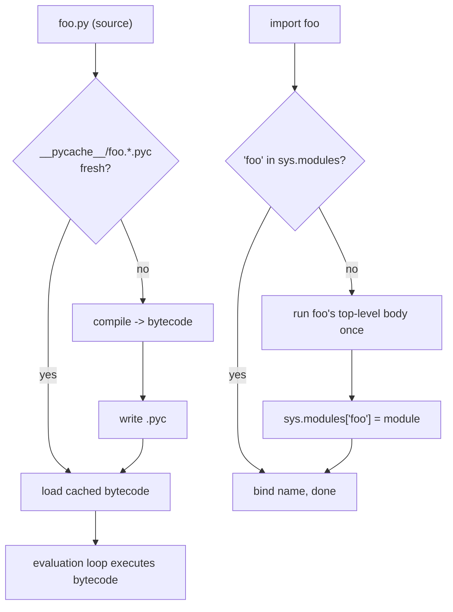

<!-- status: authored -->
# The execution & import model

## First principles

"Python is interpreted" is true but misleading. Running `python foo.py` is two
distinct phases:

1. **Compile.** CPython parses the whole file and compiles it to **bytecode** —
   a flat list of simple instructions (`LOAD_NAME`, `BINARY_OP`, `CALL`,
   `RETURN_VALUE`, …) for a stack machine. It caches that bytecode next to the
   source as a `.pyc` file inside `__pycache__/`, so the next run can skip
   compilation if the source has not changed.
2. **Execute.** A loop called the **evaluation loop** walks the bytecode one
   instruction at a time, pushing and popping a value stack. That loop is "the
   interpreter."

`import` is the same two phases plus caching and namespacing. `import json`:

- find `json` on `sys.path` (a list of directories, searched in order);
- if it is already in `sys.modules`, bind the name and stop;
- otherwise create a module object, run the file's **entire top-level body**
  once, store it in `sys.modules["json"]`, then bind the name `json` in the
  importing namespace.

Everything surprising about imports follows from **"the body runs once, top to
bottom, and the module object is cached."**

## The mechanism



- `__name__` is `"__main__"` **only** in the file you launched. In any imported
  file it is the module's dotted name. That is what
  `if __name__ == "__main__":` keys off.
- `dis.dis(obj)` shows the bytecode for a function, string, or code object.
- `python -X importtime foo.py` shows how long each import took — import-time
  work hides here.

## Practice

```bash
python code/foundations/01_execution_and_import_model/demo.py
```

The demo compiles a snippet and disassembles it, then writes a small `greeter.py`
to a scratch dir and imports it three times — its body prints once.

```python title="code/foundations/01_execution_and_import_model/demo.py"
--8<-- "code/foundations/01_execution_and_import_model/demo.py"
```

## Scenarios

```bash
python code/foundations/01_execution_and_import_model/scenarios.py
```

### 1 — A module body runs once

!!! example "🔨 Build"
    Load a config module, then, after the file changes, call
    `importlib.reload(mod)` — the new body runs and you see the new value.

!!! failure "💥 Break"
    Change the file on disk and just `import` it again. You get the **same
    cached module object** with the **old** values. The new body never ran.

!!! success "🔧 Fix"
    `importlib.reload(mod)`, or `del sys.modules["name"]` then re-import. In
    practice: don't rely on re-import to pick up changes — restart the process.

!!! quote "🧠 Why it behaved that way"
    After the first import, `sys.modules["name"]` holds the module object.
    Every later `import name` finds it there and skips compiling and running the
    file. (The demo also forces a fresh `.pyc` each write — a subtler cache one
    layer down.)

### 2 — The missing `if __name__ == "__main__"` guard

!!! example "🔨 Build"
    Put the entry logic in `main()` and call it only under
    `if __name__ == "__main__":`. Importing the file defines `main` but does not
    run it.

!!! failure "💥 Break"
    Call `main()` at module level instead. Now **importing** the file runs it —
    test collectors trigger it, and `multiprocessing` on spawn platforms
    recursively creates processes.

!!! success "🔧 Fix"
    Restore the guard. Module top level is for definitions; running is for the
    guard or an explicit call by the caller.

!!! quote "🧠 Why it behaved that way"
    Import executes the whole top-level body. `__name__` is `"__main__"` only for
    the launched file, so the guard is `True` there and `False` on import.

### 3 — Expensive work at import time

!!! example "🔨 Build"
    Wrap the costly table build in a function (with `functools.cache`). Import is
    instant; the cost is paid on first call.

!!! failure "💥 Break"
    Compute it at module level: `TABLE = sum(...)`. Every importer pays that
    cost at import — even one that never touches `TABLE` — and it blocks startup.

!!! success "🔧 Fix"
    Move it behind a function; cache if it should run once.

!!! quote "🧠 Why it behaved that way"
    The module body *is* code that runs on import. A top-level computation, file
    read, DB connect, or network call happens immediately and synchronously for
    whoever imports the module first.

### 4 — A local file shadows a stdlib module

!!! example "🔨 Build"
    `import tabnanny` gets the standard-library module — it has a `check`
    function.

!!! failure "💥 Break"
    Put a file named `tabnanny.py` earlier on `sys.path` (e.g. your project
    root). `import tabnanny` now imports **your file**; the stdlib API is gone,
    and unrelated code that imported it breaks in confusing ways.

!!! success "🔧 Fix"
    Rename your file. Never name a module after a stdlib one
    (`queue.py`, `random.py`, `email.py`, `secrets.py`, `types.py`, …).

!!! quote "🧠 Why it behaved that way"
    Import searches `sys.path` **in order** and takes the first hit. `sys.path`
    begins with the script directory / cwd, which sits ahead of the standard
    library.

## Pitfalls & idioms

- Re-importing never picks up source edits in a running process. Restart.
- `sys.path[0]` is the script's directory (or `""` = cwd for `-c` / REPL) — first
  in the search order.
- Keep module top level cheap: definitions, small constants. No I/O, no heavy
  compute, no side effects.
- `python -X importtime` / `-v` to debug slow or surprising imports.
- One compiled function's bytecode: `dis.dis(func)`; the constants it closes
  over: `func.__code__.co_consts`.
- `.pyc` files are keyed by source mtime+size (or hash). Deleting `__pycache__`
  is always safe.

## See also

- [Modules, packages & circular imports](26-modules-packages-imports.md) — the next layer: packages, `__init__.py`, import cycles
- [Names, objects & references](02-names-objects-references.md) — what "bind the name" means
- [Profiling: timeit, cProfile, dis](37-profiling-and-dis.md) — reading bytecode to reason about cost
- [venv, pip, pyproject.toml & wheels](27-environments-and-packaging.md) — where `sys.path` entries come from

## Check yourself

1. You edit a helper module while a long-running script is importing it on a
   loop. Why does nothing change until you restart?
2. What exactly is different about `__name__` between `python foo.py` and
   `import foo`?
3. A colleague reports that merely importing your module opens a database
   connection. Where is the bug and how do you fix it structurally?
4. `import json` suddenly fails with `AttributeError: module 'json' has no
   attribute 'loads'`. What is the first thing you check?
5. What does `python -X importtime app.py` tell you that a profiler of the
   running program does not?
