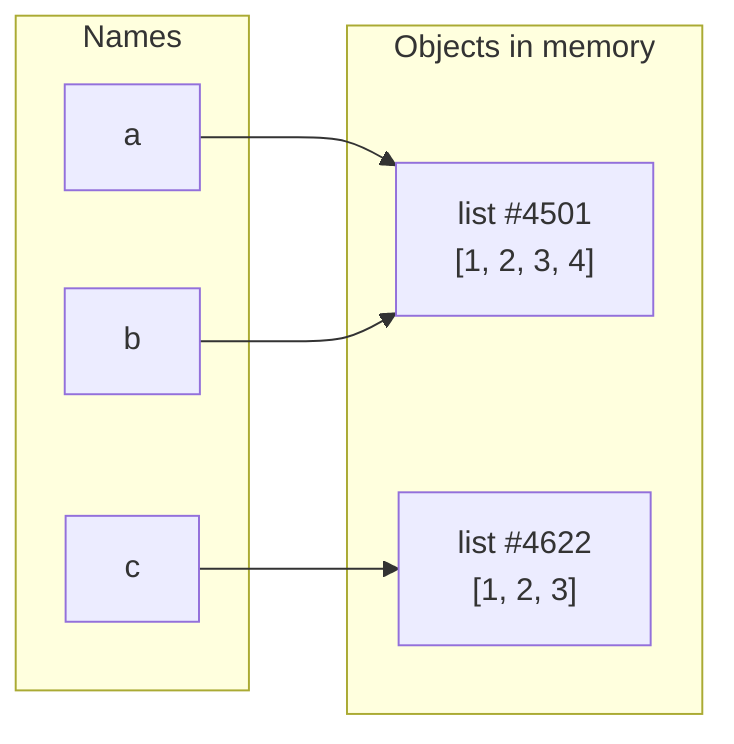

<!-- status: authored -->
# Names, objects & references

## First principles

Run this in your head before reading on:

```python
a = [1, 2, 3]
b = a
b.append(4)
print(a)          # ?
```

If you said `[1, 2, 3]`, your mental model has a copy in it that Python never
made. The output is `[1, 2, 3, 4]`.

Here is the model that predicts every case:

1. **Objects live in memory.** `[1, 2, 3]` creates one list object somewhere.
   It has an identity — a fixed address for its lifetime — that you can see with
   `id(x)`.
2. **Names are labels, not boxes.** `a = [1, 2, 3]` does not put the list "into"
   `a`. It sticks the label `a` onto the list object.
3. **Assignment moves labels; it never copies objects.** `b = a` sticks a second
   label on the *same* object. Now `a` and `b` name one list. `b.append(4)`
   mutates that one list, and `a` — being another name for it — sees the change.
4. **Rebinding a name (`b = something_else`) only moves that one label.** It does
   not touch the object or any other label.
5. **Function arguments are just assignment.** Calling `f(a)` binds the parameter
   name to the same object `a` names. No copy crosses the call boundary.

Two questions fall out of this, and Python gives you an operator for each:

| Question | Operator | Asks |
|---|---|---|
| Same *value*? | `==` | calls `__eq__` |
| Same *object*? | `is` | compares `id()` |

`==` can be `True` while `is` is `False` (two lists with equal contents). The
reverse is almost never interesting.

## The mechanism



`a = [1,2,3]; b = a` → both arrows point at `#4501`. `c = [1,2,3]` builds a
separate object `#4622`. So `a is b` is `True`; `a is c` is `False`; `a == c` is
`True`.

Three consequences worth internalising:

- **Mutation is visible through every name.** `a.append(4)` changes `#4501`;
  everyone pointing at it sees `[1, 2, 3, 4]`.
- **Rebinding is invisible to other names.** `b = []` now points `b` at a new
  object; `a` still points at `#4501`.
- **CPython caches some small immutables** (ints −5…256, some short strings) and
  reuses the objects. `256 is 256` is `True`; `257 is 257` may be `False`. This
  is an optimisation, not a language guarantee — never build logic on it.

## Practice

Generates nothing — pure language behaviour. Run it and match every line of
output to the model above:

```bash
python code/foundations/02_names_objects_references/demo.py
```

```python title="code/foundations/02_names_objects_references/demo.py"
--8<-- "code/foundations/02_names_objects_references/demo.py"
```

## Scenarios

```bash
python code/foundations/02_names_objects_references/scenarios.py
```

### 1 — Aliasing: two names, one list

!!! example "🔨 Build"
    Keep a snapshot of a list before mutating it: `snapshot = list(original)`
    makes a genuine second object, so later `original.append(...)` leaves
    `snapshot` alone.

!!! failure "💥 Break"
    Change one character — `snapshot = original` — and append to `original`.
    `snapshot` is now `[1, 2, 3, 4]`. You never touched `snapshot`; it changed
    anyway.

!!! success "🔧 Fix"
    `original[:]`, `list(original)`, or `copy.copy(original)` — any of them
    builds a new object. Choose deliberately based on whether you want a copy.

!!! quote "🧠 Why it behaved that way"
    `snapshot = original` copied the *reference*, not the list. Both names point
    at one object; `append` mutates that object; the other name sees it. There
    was never a second list to be "safe".

### 2 — Identity vs equality

!!! example "🔨 Build"
    Test for a sentinel with `x is None`. `None` is a singleton — exactly one
    object exists — so identity is the correct, fast check.

!!! failure "💥 Break"
    Use `is` for a value comparison: `x is threshold` where `threshold = 1000`.
    For `x = 1000` this returns `False`, because `1000` is outside CPython's
    small-int cache and the two `1000`s are different objects.

!!! success "🔧 Fix"
    `x == threshold`. Value comparison for values; `is` only for
    `None` / `True` / `False`.

!!! quote "🧠 Why it behaved that way"
    `is` compares `id()`. Small ints are cached and reused, so `is` *appears* to
    work in the REPL with tiny numbers — then silently breaks for 257, 1000, or
    any int computed at runtime. `==` calls `int.__eq__`, which compares
    mathematical value.

### 3 — Rebinding vs mutating an argument

!!! example "🔨 Build"
    A function that returns a new list — `return seq + [value]` — and leaves the
    caller's list untouched. The caller uses the return value.

!!! failure "💥 Break"
    Expect the caller's list to change because the function did `seq = [...]`
    "in place". It does not: after the call the caller's list is unchanged.
    Only the returned value carries the new data.

!!! success "🔧 Fix"
    To mutate in place, mutate the object: `seq[:] = [...]` or `seq.append(...)`.
    To return a transformed copy, `return` it and make the caller use it. Pick
    one contract; do not half-do both.

!!! quote "🧠 Why it behaved that way"
    `f(caller)` binds the parameter `seq` to the caller's object. `seq = [...]`
    rebinds that *local name* to a brand-new list — the caller's binding is
    untouched. `seq[:] = [...]` writes through into the shared object.

### 4 — The mutable default argument

!!! example "🔨 Build"
    `def push(value, into=None): into = [] if into is None else into`. Every
    call that omits `into` gets a fresh list.

!!! failure "💥 Break"
    `def push(value, into=[])`. Now `push(1)`, `push(2)`, `push(3)` return
    `[1]`, `[1, 2]`, `[1, 2, 3]` — the same list, accumulating across calls.
    `push(1) is push(2)` is `True`.

!!! success "🔧 Fix"
    The sentinel pattern: default to `None`, build the real default inside the
    body.

!!! quote "🧠 Why it behaved that way"
    Default values are evaluated **once**, when `def` runs, and stored on the
    function object (`push.__defaults__`). The `[]` is one object, shared by
    every call that does not override it. Building `[]` inside the body runs it
    per call.

## Pitfalls & idioms

- `x is "literal"` / `x is 42` — a `SyntaxWarning` and a latent bug. Use `==`.
- `x is None`, `x is True`, `x is False` — correct and idiomatic.
- Default arguments: never a `list`, `dict`, `set`, or any mutable. Use `None`.
- "Pass by value" vs "pass by reference" — Python is neither; it is
  *pass by assignment* (also called *pass by object reference*).
- Need a copy? `x.copy()` / `list(x)` / `dict(x)` for shallow;
  `copy.deepcopy(x)` when nested objects must be independent too
  (see [copy: shallow vs deep](41-copy-shallow-vs-deep.md)).

## See also

- [Mutability & the mutable-default trap](03-mutability-and-the-default-arg-trap.md) — the other half of this story
- [The data model & dunder methods](04-the-data-model-and-dunders.md) — how `==` is actually resolved
- [The memory model & weakref](36-memory-model-and-weakref.md) — reference counting and what `id()` really is
- [copy: shallow vs deep](41-copy-shallow-vs-deep.md)

## Check yourself

1. After `a = (1, 2); b = a; b += (3,)`, what is `a`? Why does this differ from
   the list case?
2. Why is `[] is []` `False` but `a = b = []; a is b` `True`?
3. `def f(cache={}): cache[len(cache)] = 1; return cache` — what does the third
   call return, and where does the dict live between calls?
4. You pass a list to a function and want it left untouched. What are two ways to
   guarantee that — one on the caller side, one on the callee side?
5. When is `is` genuinely the right operator?
