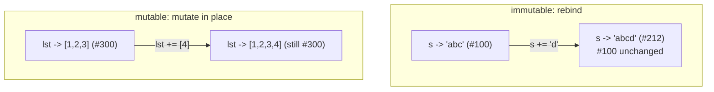

<!-- status: authored -->
# Mutability & the mutable-default trap

## First principles

Every Python object is one of two kinds:

- **Mutable** — its internal state can change after creation, keeping the same
  identity. `list`, `dict`, `set`, `bytearray`, and most objects you define.
- **Immutable** — it cannot change, ever. `int`, `float`, `bool`, `str`,
  `bytes`, `tuple`, `frozenset`, `None`.

"Changing" an immutable value is a lie the syntax tells you. `s += "x"` does not
edit the string `s` — it builds a **new** string and rebinds the name `s` to it.
The original object is untouched (and if another name still points at it, that
name still sees the old value). For a mutable object, `lst += [x]` really does
edit the one object in place, and every name pointing at it sees the change.

This single distinction explains a surprising amount:

| Consequence | Because |
|---|---|
| You can't use a `list` as a dict key | its hash could change; dicts forbid that |
| `def f(x=[])` accumulates across calls | the one default list is created once and shared |
| A `tuple` "changed" | one of its slots holds a mutable object that you mutated |
| Two instances share a list | it's a class attribute — one object — not a per-instance one |

## The mechanism



`x += y` is `x = x.__iadd__(y)` when `__iadd__` exists (it does for `list`):
the method mutates in place and returns `self`, then the assignment rebinds `x`
to that same object. For an immutable `x` there is no `__iadd__`, so Python falls
back to `x = x + y` — a new object.

Hashability is defined *in terms of* immutability: `hash(obj)` must stay constant
for the object's lifetime, so the mutable built-ins simply do not implement
`__hash__`.

## Practice

```bash
python code/foundations/03_mutability_and_the_default_arg_trap/demo.py
```

```python title="code/foundations/03_mutability_and_the_default_arg_trap/demo.py"
--8<-- "code/foundations/03_mutability_and_the_default_arg_trap/demo.py"
```

## Scenarios

```bash
python code/foundations/03_mutability_and_the_default_arg_trap/scenarios.py
```

### 1 — `+=` on a list inside a tuple

!!! example "🔨 Build"
    `row = (["a", "b"], "meta")`, then `row[0].append("c")`. The list grows; the
    tuple's slots never change. Fine.

!!! failure "💥 Break"
    `row[0] += ["c"]`. You get `TypeError: 'tuple' object does not support item
    assignment` — **and yet** `row[0]` is now `["a", "b", "c"]`. The error did
    not prevent the mutation.

!!! success "🔧 Fix"
    `row[0].append("c")` / `.extend([...])` — an explicit in-place call with no
    rebinding. Or make the outer container a `list`.

!!! quote "🧠 Why it behaved that way"
    `+=` runs `list.__iadd__` (extends the list, in place) **then** tries
    `STORE_SUBSCR` to put the result back into `row[0]`. The store into a tuple
    raises — but the extend already happened.

### 2 — Mutable default argument

!!! example "🔨 Build"
    `def record(k, v, store=None): store = {} if store is None else store`.
    Every call without `store` gets a fresh dict.

!!! failure "💥 Break"
    `def record(k, v, store={})`. `record("a",1)`, `record("b",2)`,
    `record("c",3)` all return `{"a":1,"b":2,"c":3}` — one dict, shared, growing.

!!! success "🔧 Fix"
    Sentinel `None`, build the container in the body.

!!! quote "🧠 Why it behaved that way"
    Default values are evaluated once, at `def` time, and stored on the function
    (`record.__defaults__`). Omitting the argument binds the parameter to that
    one object every call.

### 3 — A mutable object as a dict key

!!! example "🔨 Build"
    Count coordinates with a dict keyed by `tuple`s: `seen[(0, 0)] += 1`. Works.

!!! failure "💥 Break"
    Use a `list` as the key: `seen[[0, 0]] = 1` → `TypeError: unhashable type:
    'list'`.

!!! success "🔧 Fix"
    `tuple(key)` / `frozenset(key)` — an immutable equivalent.

!!! quote "🧠 Why it behaved that way"
    A dict finds items by `hash(key)`. A key whose hash could change would make
    its entry unreachable, so mutable built-ins have no `__hash__` and are
    rejected as keys immediately.

### 4 — A mutable class attribute

!!! example "🔨 Build"
    Create `self.items = []` in `__init__`. Each `Cart` gets its own list.

!!! failure "💥 Break"
    Write `items = []` in the class body instead. `a.add("apple")` makes
    `b.items` `["apple"]` too — `a.items is b.items`.

!!! success "🔧 Fix"
    Move the mutable state into `__init__` as `self.items = []`. Class-body
    attributes are fine for immutable constants only.

!!! quote "🧠 Why it behaved that way"
    `items = []` binds one list to the class. `self.items.append(x)` *reads*
    that attribute (found on the class) and mutates it — no assignment, so no
    per-instance attribute is ever created. Every instance keeps using the class
    list.

## Pitfalls & idioms

- Default arguments: `None` sentinel for any mutable. Never `[]`, `{}`, `set()`.
- Class body: immutable constants only. Mutable per-object state → `__init__`.
- Want a value object that *is* hashable? `@dataclass(frozen=True)` or a
  `NamedTuple` — see [dataclasses & __slots__](21-dataclasses-and-slots.md).
- `tuple` is only "immutable" one level deep. `(obj,)` where `obj` is mutable is
  still mutable through `obj`.
- To take a defensive copy of an argument: `list(x)` / `x.copy()` (shallow) or
  `copy.deepcopy(x)` — [copy: shallow vs deep](41-copy-shallow-vs-deep.md).
- `frozenset`, `bytes`, `str`, `int` — reach for these when you need a key or a
  set member.

## See also

- [Names, objects & references](02-names-objects-references.md) — the reference model this builds on
- [list, tuple, dict, set: internals & complexity](07-builtin-containers-and-complexity.md) — hashing and buckets in detail
- [The data model & dunder methods](04-the-data-model-and-dunders.md) — `__iadd__`, `__hash__`, `__eq__`
- [copy: shallow vs deep](41-copy-shallow-vs-deep.md)

## Check yourself

1. `a = ([],); a[0].append(1)` succeeds but `a[0] += [1]` raises. Both end with
   `a == ([1],)` or `([1, 1],)` — which, and why does one raise?
2. Why can't you put a `set` inside another `set`, but you can put a `frozenset`?
3. `def tally(word, counts={}):` — describe the exact bug and the two-line fix.
4. A `@dataclass` with a field `tags: list[str] = []` won't even define. What
   error, and what is the correct way to give it a default list?
5. When *is* a class-body attribute the right choice?
