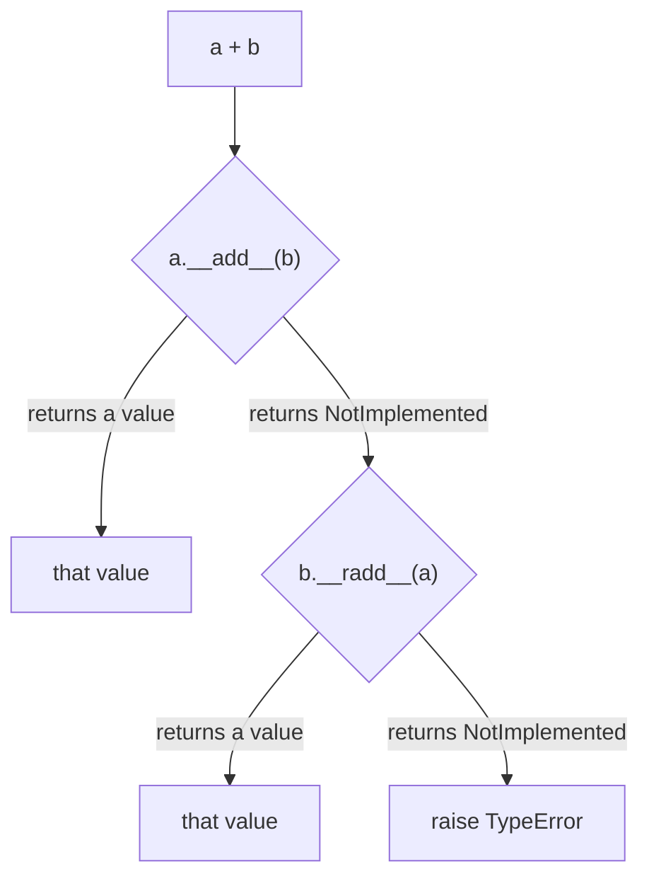

<!-- status: authored -->
# The data model & dunder methods

## First principles

Almost every piece of Python syntax is sugar over a method call on an object.
These methods have names wrapped in double underscores — "dunder" methods — and
collectively they are **the data model**: the set of hooks that let *your*
objects behave like built-in ones.

| You write | Python calls |
|---|---|
| `len(x)` | `x.__len__()` |
| `x[k]` | `x.__getitem__(k)` |
| `a + b` | `a.__add__(b)`, else `b.__radd__(a)` |
| `a == b` | `a.__eq__(b)` |
| `hash(x)` | `x.__hash__()` |
| `for i in x` | `iter(x)` → `x.__iter__()` |
| `with x:` | `x.__enter__()` / `x.__exit__(...)` |
| `repr(x)`, `print([x])` | `x.__repr__()` |
| `if x:`, `bool(x)` | `x.__bool__()`, else `x.__len__()` |
| `f(*x)`, `a, b = x` | `iter(x)` |

There is no separate "operator overloading" feature — operators were *always*
method calls. `1 + 2` is `int.__add__(1, 2)`.

Two rules the data model enforces that surprise people:

1. **`a == b` implies `hash(a) == hash(b)`.** So defining `__eq__` without
   `__hash__` makes your class unhashable (Python sets `__hash__ = None`).
2. **Binary operators negotiate.** `__add__` should `return NotImplemented`
   (the singleton) when it doesn't know the other type, so Python can try the
   other operand's `__radd__`. Raising instead breaks that.

## The mechanism



`repr()` vs `str()`: `repr` is the unambiguous, developer-facing form and the
**fallback everywhere** — the REPL, `print` of a container, logging `%r`,
debuggers. `str` is the human form and *defaults to* `__repr__` when you don't
define it. The reverse is not true: define only `__str__` and containers still
show `<Thing object at 0x…>`.

## Practice

```bash
python code/foundations/04_the_data_model_and_dunders/demo.py
```

A `Vector` that implements `__repr__`, `__eq__`, `__hash__`, `__add__`/`__radd__`,
`__mul__`, `__len__`, `__getitem__`, `__iter__`, `__bool__` — then every operator
and builtin is shown dispatching to it.

```python title="code/foundations/04_the_data_model_and_dunders/demo.py"
--8<-- "code/foundations/04_the_data_model_and_dunders/demo.py"
```

## Scenarios

```bash
python code/foundations/04_the_data_model_and_dunders/scenarios.py
```

### 1 — `__eq__` without `__hash__`

!!! example "🔨 Build"
    Define `__eq__` **and** a consistent `__hash__` (hash the same fields you
    compare). `{Point(0,0), Point(0,0)}` collapses to one element.

!!! failure "💥 Break"
    Define only `__eq__`. `{Point(0, 0)}` → `TypeError: unhashable type:
    'Point'`. The class lost its inherited `__hash__`.

!!! success "🔧 Fix"
    Add `__hash__`, or use `@dataclass(frozen=True)` / `NamedTuple`, which
    generate a matched pair.

!!! quote "🧠 Why it behaved that way"
    To preserve `a == b ⇒ hash(a) == hash(b)`, Python sets `__hash__ = None` on
    any class that overrides `__eq__` but not `__hash__`. Otherwise two "equal"
    objects with id-based hashes would land in different dict buckets.

### 2 — `__str__` without `__repr__`

!!! example "🔨 Build"
    Define `__repr__` returning `Money(cents=150)`. `repr([Money(150)])` is
    readable.

!!! failure "💥 Break"
    Define only `__str__`. `repr([Money(150)])` →
    `[<...Money object at 0x104…>]` — the default. Debug output is useless.

!!! success "🔧 Fix"
    Always define `__repr__`. Add `__str__` only if the human form should differ.

!!! quote "🧠 Why it behaved that way"
    Containers, the REPL, and loggers call `repr()` on elements. `str()` falls
    back to `__repr__`, never the other way around.

### 3 — `raise` vs `NotImplemented` in `__add__`

!!! example "🔨 Build"
    `__add__` returns `NotImplemented` for unknown types; `__radd__` handles the
    `0` that `sum()` starts from. `sum([Weight(10), Weight(5), Weight(2)])` works.

!!! failure "💥 Break"
    `__add__` does `raise TypeError` for non-`Weight`. `sum([...])` starts with
    `0 + Weight(10)`; `int.__add__` declines, Python calls `Weight.__radd__` →
    (falls to `__add__(0)`) → **raises**, aborting the negotiation.

!!! success "🔧 Fix"
    `return NotImplemented` instead of raising; add `__radd__` (treat `0` as
    identity).

!!! quote "🧠 Why it behaved that way"
    `a + b` tries `a.__add__(b)`, then `b.__radd__(a)` if the first returns
    `NotImplemented`, then raises `TypeError` only if both decline. Raising in
    `__add__` skips the reflected attempt entirely.

### 4 — Hashing a field you later mutate

!!! example "🔨 Build"
    Hash over a field you treat as immutable identity and never reassign.
    `tag in bag` stays `True`.

!!! failure "💥 Break"
    Hash over `self.name`, put the object in a set, then do `tag.name = "later"`.
    `tag in bag` is now `False` — the object is in the set but in the wrong
    bucket.

!!! success "🔧 Fix"
    `@dataclass(frozen=True)` so fields can't be reassigned, or hash only over
    genuinely constant data.

!!! quote "🧠 Why it behaved that way"
    The set chooses a bucket from `hash(item)` at insert time. Mutating a hashed
    field changes the hash; lookups now probe a different bucket and miss.

## Pitfalls & idioms

- Define `__repr__` on every non-trivial class. It pays for itself the first time
  you debug.
- `__eq__` and `__hash__` travel together. Easiest correct route:
  `@dataclass(frozen=True)` or `typing.NamedTuple`.
- Comparison/arith dunders: `return NotImplemented`, never `raise`, for types you
  don't handle.
- Full operator set from one or two methods: `functools.total_ordering` fills in
  `<`, `<=`, `>`, `>=` from `__eq__` + `__lt__`.
- `__getitem__` alone makes an object iterable (Python falls back to indexing
  from `0`) — but prefer an explicit `__iter__`.
- Container protocols: `__len__`, `__getitem__`, `__setitem__`, `__delitem__`,
  `__contains__`, `__iter__`. Inherit from `collections.abc` to get mixins and a
  conformance check — see [ABCs, Protocols & duck typing](22-abcs-protocols-duck-typing.md).

## See also

- [Mutability & the mutable-default trap](03-mutability-and-the-default-arg-trap.md) — `__hash__` and immutability
- [dataclasses & __slots__](21-dataclasses-and-slots.md) — generated `__init__`, `__repr__`, `__eq__`
- [Iterators & the iterator protocol](10-iterators-and-the-iterator-protocol.md) — `__iter__` / `__next__` in depth
- [Context managers & with](18-context-managers.md) — `__enter__` / `__exit__`
- [Inheritance, MRO & super()](20-inheritance-and-mro.md) — how dunder lookup skips the instance

## Check yourself

1. Why does `class P:  __eq__ = ...` (no `__hash__`) break `set()` but
   `class P:  __lt__ = ...` does not?
2. `sum([obj1, obj2])` raises `TypeError: unsupported operand type(s) for +:
   'int' and 'Obj'`. What method is missing and what should it do?
3. You define `__str__` but `logging.info("%r", obj)` still prints
   `<Obj object at 0x…>`. Why?
4. An object is in a `set`, but `obj in that_set` returns `False`. Give a
   mechanism that produces this.
5. What is the difference between returning `NotImplemented` and returning
   `None` from `__add__`?
