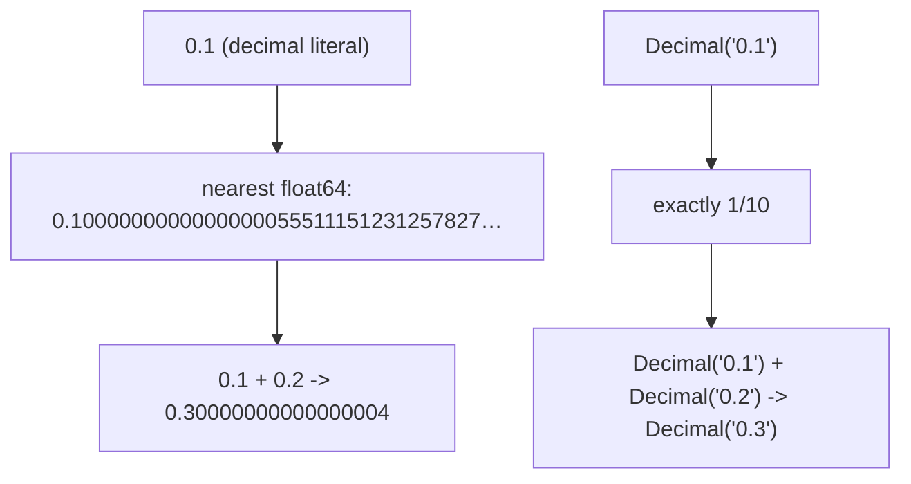

<!-- status: authored -->
# Numeric types: int, float, Decimal, Fraction

## First principles

Python gives you four numeric types, and the whole game is picking the right one:

| Type | What it is | Exact? | Use for |
|---|---|---|---|
| `int` | arbitrary-precision integer | yes, always | counting, indexing, IDs, money-as-cents |
| `float` | IEEE-754 64-bit **binary** fraction | **no** | measurements, science, anything approximate |
| `decimal.Decimal` | arbitrary-precision **base-10** | yes | money, tax, billing, anything a human audits |
| `fractions.Fraction` | exact numerator/denominator | yes | exact ratios, symbolic-ish math |

`int` never overflows — `2 ** 10000` just works. `bool` is a **subclass of
`int`**: `True == 1`, `sum([True, False, True]) == 2`.

The one that bites everyone: **`float` cannot represent most decimal fractions.**
`0.1` in binary is `0.0001100110011…` repeating, truncated to 53 bits. So the
stored value is *close to* 0.1 but not equal, and:

```python
>>> 0.1 + 0.2
0.30000000000000004
>>> 0.1 + 0.2 == 0.3
False
```

This is not a Python bug — it is how binary floating point works in every
language. The fixes: compare with `math.isclose`, or don't use `float` for
values that must be exact.

## The mechanism



- `/` always produces a `float` (`6 / 2 == 3.0`). `//` is **floor** division
  (rounds toward −∞), and `%` takes the **sign of the divisor**, so
  `-7 // 2 == -4` and `-7 % 2 == 1`. The invariant
  `a == (a // b) * b + (a % b)` always holds.
- `Decimal(0.1)` converts the *float's* inexact value — you must build from a
  **string**: `Decimal("0.1")`.
- `NaN` (`float("nan")`) is unordered: `nan == nan` is `False`. Test with
  `math.isnan`.

## Practice

```bash
python code/foundations/05_numeric_types/demo.py
```

```python title="code/foundations/05_numeric_types/demo.py"
--8<-- "code/foundations/05_numeric_types/demo.py"
```

## Scenarios

```bash
python code/foundations/05_numeric_types/scenarios.py
```

### 1 — Money in float

!!! example "🔨 Build"
    Hold currency as integer **cents**. Add `10` a thousand times → exactly
    `10_000`.

!!! failure "💥 Break"
    Add `0.10` a thousand times as `float`. Result is `100.00000000000007`;
    `total == 100.0` is `False`. Ledgers won't reconcile.

!!! success "🔧 Fix"
    Integer cents, or `Decimal("0.10")`.

!!! quote "🧠 Why it behaved that way"
    `0.10` isn't exactly representable in binary, so every `+=` stores a value a
    hair off, and a thousand of those errors compound.

### 2 — Guarding NaN with `==`

!!! example "🔨 Build"
    Drop missing measurements with `[v for v in data if not math.isnan(v)]`.

!!! failure "💥 Break"
    `[v for v in data if v != nan]` — intended to drop NaNs. `v != nan` is
    `True` for *everything*, so nothing is dropped and the NaNs poison every
    later `sum`/`mean`.

!!! success "🔧 Fix"
    `math.isnan(v)` (or `v != v`, which is `True` only for NaN).

!!! quote "🧠 Why it behaved that way"
    IEEE-754 makes NaN compare unequal to all values including itself. `== nan`
    never matches; `!= nan` always matches.

### 3 — Floor division with negatives

!!! example "🔨 Build"
    Ceil division for "pages needed": `-(-items // per_page)`.

!!! failure "💥 Break"
    `-1 // 60` expecting `0` (truncate toward zero) — you get `-1`, and
    `-1 % 60 == 59`. A "minutes and seconds" split comes out wrong for negative
    offsets.

!!! success "🔧 Fix"
    For truncation toward zero: `int(a / b)`; compute the remainder from that.

!!! quote "🧠 Why it behaved that way"
    `//` floors (toward −∞), and `%` is defined to keep
    `a == (a // b) * b + (a % b)`, which fixes the remainder's sign to the
    divisor's.

### 4 — `Decimal` from a float

!!! example "🔨 Build"
    `Decimal("0.1") + Decimal("0.2")` → `Decimal("0.3")`, exact.

!!! failure "💥 Break"
    `Decimal(0.1)` → `Decimal("0.1000000000000000055511151231257827021181583…")`.
    `Decimal(0.1) == Decimal("0.1")` is `False`.

!!! success "🔧 Fix"
    Construct from a string or from integers: `Decimal("0.1")`,
    `Decimal(1) / Decimal(10)`.

!!! quote "🧠 Why it behaved that way"
    `Decimal(float)` is an *exact* conversion of an *already-inexact* value.
    Same trap with `Fraction(0.1)`.

## Pitfalls & idioms

- Money: integer minor units, or `Decimal` with an explicit context. Never
  `float`.
- Comparing floats: `math.isclose(a, b, rel_tol=1e-9)` — never `==`.
- Detect NaN with `math.isnan`; detect infinity with `math.isinf`.
- `round(2.5) == 2` (banker's rounding — round half to even). `Decimal` lets you
  choose the rounding mode explicitly (`ROUND_HALF_UP`, …).
- `//` and `%` on negatives: floor and divisor-signed. `divmod(a, b)` returns
  both at once.
- Need a hashable exact number for a dict key? `Fraction` and `Decimal` are both
  hashable and immutable.
- `int("10_000")` and `int("0xFF", 16)` parse; `int(3.9) == 3` truncates.

## See also

- [Floating point, random & reproducibility](31-floating-point-and-random.md) — float internals, rounding, seeds
- [Mutability & the mutable-default trap](03-mutability-and-the-default-arg-trap.md) — `int`/`float` are immutable

## Check yourself

1. Why is `0.1 + 0.2 == 0.3` `False` but `Decimal("0.1") + Decimal("0.2") ==
   Decimal("0.3")` `True`?
2. `-5 // 2` and `-5 % 2` — what are the values, and what invariant ties them
   together?
3. You need to filter NaNs out of a list of floats. Why can't you write
   `x != float("nan")`?
4. A junior dev "fixes" a float rounding bug with `Decimal(price)` where `price`
   is a float. Why doesn't that help?
5. When is `float` the *right* choice over `Decimal`?
