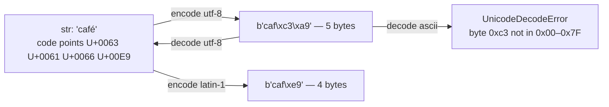

<!-- status: authored -->
# Strings, bytes & Unicode

## First principles

Two distinct types, and keeping them straight prevents a whole category of bugs:

- **`str`** — a sequence of Unicode **code points**. A code point is an abstract
  character identity like "LATIN SMALL LETTER E WITH ACUTE" (`U+00E9`). `str` has
  no inherent byte representation. `len("café")` is `4` — four code points.
- **`bytes`** — a sequence of integers `0–255`. Raw octets. `b"caf\xc3\xa9"`.
  Indexing gives an `int` (`b"ABC"[0] == 65`); slicing gives `bytes`.

An **encoding** is the rule mapping between them:

```
str  --.encode("utf-8")-->  bytes        # café  -> b'caf\xc3\xa9'  (5 bytes)
bytes --.decode("utf-8")-->  str          # b'caf\xc3\xa9'  -> café
```

- **UTF-8** is variable width: ASCII chars are 1 byte, most Latin/Greek/Cyrillic
  2, most CJK 3, emoji 4. It is the default you should use everywhere.
- **Latin-1** (ISO-8859-1) is 1 byte per char but only covers 256 characters.
- **UTF-16 / UTF-32** are fixed-ish width, used internally by some platforms.

The rule that matters: **bytes do not remember their encoding.** When you read a
file or a socket, *you* supply the encoding. Guess wrong and you get a
`UnicodeDecodeError` (if you're lucky) or silent *mojibake* (if you're not).

## The mechanism



One more subtlety: **the same visible text can be different code point
sequences.** "é" can be one code point (`U+00E9`, NFC) or two (`e` + combining
acute `U+0301`, NFD). They are `!=`, hash differently, and have different `len`.
`unicodedata.normalize("NFC", s)` picks a canonical form — do it at input.

## Practice

```bash
python code/foundations/06_strings_bytes_unicode/demo.py
```

```python title="code/foundations/06_strings_bytes_unicode/demo.py"
--8<-- "code/foundations/06_strings_bytes_unicode/demo.py"
```

## Scenarios

```bash
python code/foundations/06_strings_bytes_unicode/scenarios.py
```

### 1 — Encode with one codec, decode with another

!!! example "🔨 Build"
    `text.encode("utf-8")` then `.decode("utf-8")` — exact round trip.

!!! failure "💥 Break"
    Decode UTF-8 bytes as `ascii`. The first byte of `é` (`0xC3`) is outside
    ASCII's `0x00–0x7F` → `UnicodeDecodeError`. Decoding as `latin-1` instead
    would *not* raise — it would produce `café`.

!!! success "🔧 Fix"
    Agree on the encoding out of band, and pass it explicitly on both sides.

!!! quote "🧠 Why it behaved that way"
    `decode` blindly applies the named rule. Bytes carry no metadata about how
    they were produced.

### 2 — Truncating UTF-8 bytes to "limit length"

!!! example "🔨 Build"
    To cap at N **characters**, slice the `str` (`text[:6]`), then encode.

!!! failure "💥 Break"
    Slice the **bytes** (`raw[:4]`) to cap "length". Byte 4 is the middle of the
    2-byte `é`, so `decode` hits a lead byte with a missing continuation →
    `UnicodeDecodeError`.

!!! success "🔧 Fix"
    Slice the `str`, or decode with `errors="ignore"` / an incremental decoder to
    drop the dangling tail.

!!! quote "🧠 Why it behaved that way"
    A UTF-8 code point is 1–4 bytes. An arbitrary byte offset can land inside a
    multi-byte sequence.

### 3 — Normalization and equality

!!! example "🔨 Build"
    Normalize both operands to NFC before comparing or before a set/dict lookup.

!!! failure "💥 Break"
    Compare a precomposed `"café"` (NFC) with a decomposed one (NFD). `a != b`,
    and `b in {a}` is `False` — even though they render identically. User logins
    or dedup silently fail for accented names.

!!! success "🔧 Fix"
    `unicodedata.normalize("NFC", s)` at every input point.

!!! quote "🧠 Why it behaved that way"
    Unicode allows multiple encodings of the same grapheme. `str` equality is
    code-point-by-code-point, so different sequences are different strings.

### 4 — Mixing `str` and `bytes`

!!! example "🔨 Build"
    `payload.decode("ascii")` at the boundary, then work in `str`.

!!! failure "💥 Break"
    `"received: " + str(payload)` where `payload = b"Hi"` →
    `"received: b'Hi'"`. `str(bytes)` returns the **repr**, not the text, and the
    `b'…'` leaks into your output / your database.

!!! success "🔧 Fix"
    `payload.decode("ascii")`. (`b"a" + "b"` raises `TypeError` — at least that
    one is loud.)

!!! quote "🧠 Why it behaved that way"
    Python 3 has no implicit `str`/`bytes` coercion. `str(b"Hi")` is defined as
    `repr(b"Hi")`.

## Pitfalls & idioms

- Open text files with an explicit `encoding=` (and `newline=""` for CSV). Do not
  rely on the platform default — it differs across OSes.
- `.encode()` / `.decode()` at the very edges of the program; keep everything in
  between as `str`.
- Normalize (`NFC`) usernames, filenames, search keys on input.
- `str` is immutable: `s[0] = "x"` is a `TypeError`. Build with `"".join(parts)`,
  not repeated `+=` in a loop.
- f-strings: `f"{x:>10.2f}"`, `f"{n:_}"`, `f"{val!r}"`, `f"{x=}"` (debug).
- `"%r"` in logging, `!r` in f-strings — show the repr, quoting and escaping.
- `bytes` vs `bytearray`: the latter is the mutable version.
- `len(s)` is code points, not bytes and not user-perceived characters (a family
  emoji can be many code points).

## See also

- [Numeric types](05-numeric-types.md) — converting text ↔ numbers at the boundary
- [File I/O & pathlib](28-file-io-and-pathlib.md) — `encoding=`, text vs binary mode
- [Serialization: json, pickle, csv, struct](29-serialization-stdlib.md) — `json` is text, `pickle` is bytes

## Check yourself

1. `len("é")` can be `1` or `2` depending on what? How do you make it
   deterministic?
2. You read bytes off a socket and `"".join` them into a message with
   `str(chunk)`. Users report `b'...'` in their messages. Why, and the fix?
3. Why does slicing a UTF-8 `bytes` object to "truncate to 100 bytes" sometimes
   raise on decode?
4. `"café" == "café"` returns `False` in your test but they print identically.
   What is going on?
5. What is the difference between `"\xe9"`, `b"\xe9"`, and `"é"`?
