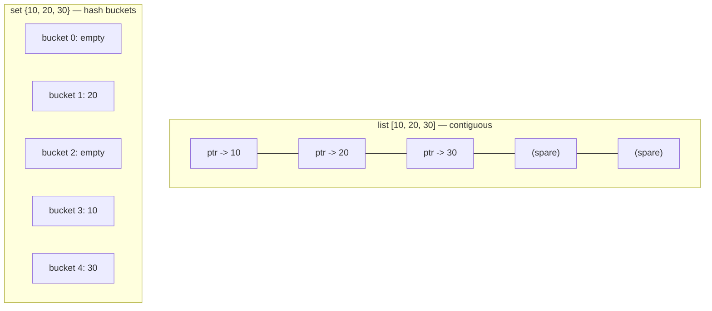

<!-- status: authored -->
# list, tuple, dict, set: internals & complexity

## First principles

Four built-in containers, two underlying data structures:

| Container | Structure | `x[i]` | `x in` | append / add | insert / pop front |
|---|---|---|---|---|---|
| `list` | contiguous array of pointers | O(1) | **O(n)** | O(1) amortised | **O(n)** |
| `tuple` | fixed contiguous array | O(1) | O(n) | — (immutable) | — |
| `dict` | hash table | — | **O(1)** avg | O(1) avg | — |
| `set` | hash table (keys only) | — | **O(1)** avg | O(1) avg | — |

- A **list** is a dynamic array: a block of memory holding pointers to objects.
  It over-allocates (grows in chunks) so `append` is O(1) *amortised*. Anything
  near the front — `insert(0, …)`, `pop(0)`, `remove(x)` — shifts every later
  element: O(n).
- A **tuple** is the same layout but fixed-size and immutable, so it is a little
  smaller and is **hashable** when its contents are (usable as a dict key).
- **dict** and **set** are hash tables. `hash(key)` picks a bucket; lookup checks
  that bucket. O(1) average, assuming a good hash and few collisions. `dict`
  keeps **insertion order**; `set` has **no order** at all.

The number-one performance bug in Python code: **`x in a_list` inside a loop** —
that is O(n²). Swap the list for a `set`.

## The mechanism



`30 in list` walks L0 → L1 → L2. `30 in set` computes `hash(30) % nbuckets`,
jumps straight to bucket 4. That difference is the whole topic.

## Practice

```bash
python code/foundations/07_builtin_containers_and_complexity/demo.py
```

Times `x in list` vs `x in set`, shows the list's chunked growth via
`sys.getsizeof`, and that `dict` iterates in insertion order.

```python title="code/foundations/07_builtin_containers_and_complexity/demo.py"
--8<-- "code/foundations/07_builtin_containers_and_complexity/demo.py"
```

## Scenarios

```bash
python code/foundations/07_builtin_containers_and_complexity/scenarios.py
```

### 1 — O(n²) membership

!!! example "🔨 Build"
    Track seen items in a `set`; `x in seen` is O(1). Finding duplicates in 5000
    items is instant.

!!! failure "💥 Break"
    Track them in a `list`. `x in seen` is O(n), the loop is O(n²), and the run
    is many times slower — grows quadratically as data grows.

!!! success "🔧 Fix"
    `seen = set()`.

!!! quote "🧠 Why it behaved that way"
    `in` on a list is a linear scan. `in` on a set/dict is a single hashed bucket
    probe. Membership-heavy code needs the hash table.

### 2 — Removing items from a list while iterating it

!!! example "🔨 Build"
    `[x for x in nums if keep(x)]` — build a new list; never mutate the one you
    iterate.

!!! failure "💥 Break"
    `for x in nums: if drop(x): nums.remove(x)`. Items get **skipped**: removing
    index `i` shifts index `i+1` down to `i`, but the loop's counter has already
    advanced past it.

!!! success "🔧 Fix"
    A comprehension / `filter`, or iterate a copy: `for x in nums[:]:`.

!!! quote "🧠 Why it behaved that way"
    The list iterator is just an incrementing index. `remove`/`del` shift later
    elements left, so the index and the data get out of sync.

### 3 — Building a sequence with `insert(0, …)`

!!! example "🔨 Build"
    `collections.deque` with `appendleft` — O(1) at both ends.

!!! failure "💥 Break"
    `lst.insert(0, i)` in a loop. Each insert shifts all existing elements right:
    O(n) per call, O(n²) total. 30k items takes 10–100× longer than the deque.

!!! success "🔧 Fix"
    `deque`, or `append` then `reverse()` once if you need a `list`.

!!! quote "🧠 Why it behaved that way"
    Contiguous storage means inserting at the front physically moves every other
    element. A deque is a linked list of blocks, so both ends are cheap.

### 4 — Deduplicating while preserving order

!!! example "🔨 Build"
    `list(dict.fromkeys(seq))` — dedups (keys are unique) and keeps first-seen
    order.

!!! failure "💥 Break"
    `list(set(seq))` — dedups but returns items in **bucket order**, unrelated to
    input order. Output looks scrambled and varies with the data.

!!! success "🔧 Fix"
    `dict.fromkeys` / `list(dict.fromkeys(seq))`.

!!! quote "🧠 Why it behaved that way"
    A set has no order concept; iteration order reflects hash values. A dict
    preserves insertion order.

## Pitfalls & idioms

- `x in list` in a loop → use a `set`/`dict`. This is the first thing to check
  when Python code is "mysteriously slow".
- Never `.remove()` / `del` from a list you're iterating. Rebuild it.
- Queue at both ends → `collections.deque`. `list.pop(0)` is O(n).
- Need a dict key from several values → a `tuple`, never a `list`.
- `dict.get(k, default)` for a read that might miss; `dict.setdefault` /
  `collections.defaultdict` for "get-or-create" — see
  [The collections module](08-the-collections-module.md).
- `sorted(s)` whenever you iterate a `set` and the output must be deterministic.
- `dict` and `set` comprehensions: `{k: v for …}`, `{x for …}`.
- Big membership set that never changes → `frozenset` (hashable, slightly
  optimised).

## See also

- [The collections module](08-the-collections-module.md) — `deque`, `Counter`, `defaultdict`
- [Mutability & the mutable-default trap](03-mutability-and-the-default-arg-trap.md) — why lists can't be keys
- [The data model & dunder methods](04-the-data-model-and-dunders.md) — `__hash__`, `__eq__`, `__contains__`
- [Profiling: timeit, cProfile, dis](37-profiling-and-dis.md) — measuring the O(n²) → O(n) win

## Check yourself

1. A script that processes 1k rows finishes instantly; at 100k rows it takes 20
   minutes. Name the most likely single cause.
2. `for item in items: if item.stale: items.remove(item)` — what's wrong and what
   are two fixes?
3. Why can a `tuple` be a dict key but not a `list`?
4. You need a FIFO queue. Why is `list` the wrong choice and what's the right
   one?
5. `list(set(["c", "a", "b"]))` gives `['b', 'c', 'a']` today. Can you rely on
   that ordering? What if you need order preserved?
