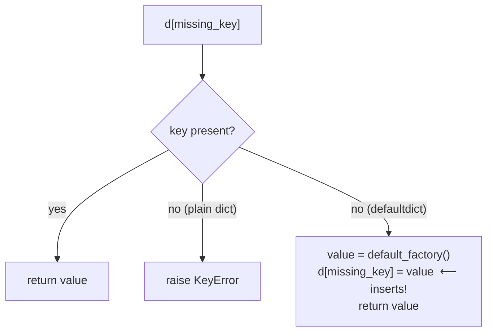

<!-- status: authored -->
# The collections module

## First principles

`collections` is a handful of containers built on `dict` and `list` that
encapsulate patterns you would otherwise hand-write (usually with a subtle bug
the first time):

| Type | Replaces | One-line reason |
|---|---|---|
| `defaultdict` | `if k not in d: d[k] = …` | auto-creates a default for missing keys |
| `Counter` | a dict of `d[k] = d.get(k, 0) + 1` | tallying, `most_common`, `+ - & |` arithmetic |
| `deque` | `list` used as a queue | O(1) `append`/`pop` at **both** ends; optional `maxlen` |
| `namedtuple` | a 2-tuple you keep forgetting the order of | immutable record with named fields |
| `ChainMap` | merging config dicts | a search stack of dicts, no copying |

Each has one sharp edge, and the scenarios are those edges.

## The mechanism



`defaultdict` works by defining `__missing__`, which `dict.__getitem__` calls on a
miss. It runs the factory **and stores the result**. That store is the behaviour
to keep in mind: reading a missing key changes the dict.

`Counter`'s operators (`+`, `-`, `&`, `|`) return a **new** `Counter` and keep
only positive counts. Its `.update()` / `.subtract()` methods mutate in place and
keep zeros and negatives.

## Practice

```bash
python code/foundations/08_the_collections_module/demo.py
```

```python title="code/foundations/08_the_collections_module/demo.py"
--8<-- "code/foundations/08_the_collections_module/demo.py"
```

## Scenarios

```bash
python code/foundations/08_the_collections_module/scenarios.py
```

### 1 — Reading a `defaultdict` inserts keys

!!! example "🔨 Build"
    For a pure "is it there?" question use `k in d` or `d.get(k, default)` —
    neither inserts.

!!! failure "💥 Break"
    `[u for u in users if counts[u] > 0]`. Indexing `counts[u]` for a missing `u`
    creates `u` with value `0`. After the loop, `len(counts)` has grown by every
    user you checked.

!!! success "🔧 Fix"
    `counts.get(u, 0)` in the condition.

!!! quote "🧠 Why it behaved that way"
    `defaultdict.__missing__` runs the factory *and stores* the value. `d[k]` is
    not a side-effect-free read for a `defaultdict`.

### 2 — `Counter.subtract` keeps zeros and negatives

!!! example "🔨 Build"
    `have - used` (the operator) → a new `Counter` with only the positive
    remainders.

!!! failure "💥 Break"
    `have.subtract(used)`. It mutates `have` in place, leaving `apple: 0` and
    `plum: -2`. `most_common()` and iteration now include entries you thought
    were gone.

!!! success "🔧 Fix"
    Use the `-` operator (or `+Counter()` to strip non-positives).

!!! quote "🧠 Why it behaved that way"
    `.subtract()` / `.update()` are in-place inventory-delta tools that preserve
    every key. The operators build a fresh Counter and drop counts ≤ 0 by design.

### 3 — `deque(maxlen=…)` drops silently

!!! example "🔨 Build"
    `deque(maxlen=3)` as a deliberate "last 3 events" ring buffer.

!!! failure "💥 Break"
    `deque(maxlen=100)` chosen as a guessed capacity for an audit log. Append
    250 events → 150 are silently discarded; `len` is `100`.

!!! success "🔧 Fix"
    `deque()` with no `maxlen` when losing old data is not acceptable.

!!! quote "🧠 Why it behaved that way"
    A full bounded deque evicts from the far end on every append. That is the
    feature for ring buffers and the footgun for "should be plenty".

### 4 — Mutating a `namedtuple`

!!! example "🔨 Build"
    `c._replace(port=9000)` returns a new `Config`.

!!! failure "💥 Break"
    `c.port = 9000` → `AttributeError: can't set attribute`.

!!! success "🔧 Fix"
    `_replace`, or use a non-frozen `@dataclass` / `SimpleNamespace` if you need
    real mutability.

!!! quote "🧠 Why it behaved that way"
    `namedtuple` subclasses `tuple`, which is immutable — no attribute assignment
    path exists.

## Pitfalls & idioms

- `defaultdict`: great for building; for *querying*, use `.get` / `in`, or
  convert to a plain `dict` once built (`dict(dd)`).
- `Counter(iterable)` tallies in one call. `Counter().most_common(n)` for a
  top-N. Negative/zero counts are legal — filter with `+c` if unwanted.
- `deque` for queues, sliding windows, "recent N", BFS frontiers. `maxlen` only
  when eviction is intended.
- `namedtuple` for quick immutable records; `typing.NamedTuple` for a typed,
  class-style version; `@dataclass` when you want mutability or methods —
  [dataclasses & __slots__](21-dataclasses-and-slots.md).
- `ChainMap(overrides, …, defaults)` beats `{**defaults, **overrides}` when the
  layers change often (no rebuild) or you need to know which layer a value came
  from.
- `OrderedDict` is now mostly legacy (plain `dict` is ordered); still useful for
  `move_to_end` and order-sensitive equality.

## See also

- [list, tuple, dict, set: internals & complexity](07-builtin-containers-and-complexity.md) — the structures underneath
- [dataclasses & __slots__](21-dataclasses-and-slots.md) — the mutable record option
- [functools](14-functools.md) — `lru_cache` overlaps with "memoise into a dict"

## Check yourself

1. `active = [u for u in users if sessions[u]]` where `sessions` is a
   `defaultdict(list)`. Why does `len(sessions)` equal `len(users)` afterwards?
2. You want "inventory minus orders, dropping anything sold out". `Counter` —
   operator or method? Why?
3. When is `deque(maxlen=N)` exactly right, and when is it a data-loss bug?
4. `point.x = 5` raises `AttributeError` on your `namedtuple`. What's the
   idiomatic way to get a point with a new `x`?
5. `{**defaults, **user}` vs `ChainMap(user, defaults)` — give one situation
   where the ChainMap is clearly better.
