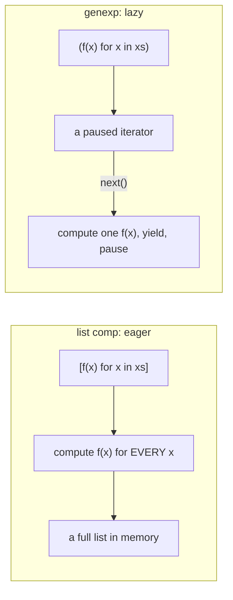

<!-- status: authored -->
# Comprehensions & generator expressions

## First principles

A **comprehension** is a single expression that builds a whole container:

```python
[expr for x in iterable if condition]      # list
{expr for x in iterable}                    # set
{key: val for x in iterable}                # dict
```

It runs **eagerly** — the entire container exists before the next line — and in
its **own scope**: the loop variable does not leak out (unlike a `for` loop).

A **generator expression** is the same syntax with **parentheses**:

```python
(expr for x in iterable if condition)
```

It is **lazy**: it yields one item at a time, on demand, computing nothing until
asked, and it is **single-pass** — once consumed, it is empty.

Rule of thumb:

- Need the result more than once, or need `len` / indexing / to keep it around →
  **comprehension** (list/dict/set).
- Feeding it straight into `sum`, `any`, `all`, `min`, `max`, `join`, `for`, or a
  large pipeline → **generator expression** (no wasted memory, early exit works).

## The mechanism



Because a genexp is an iterator, `any(f(x) for x in xs)` stops calling `f` the
moment one is truthy. `any([f(x) for x in xs])` builds the whole list first —
every `f` runs — then hands it over.

Nested clauses read **left to right = outer to inner**:
`[x for row in matrix for x in row]` is `for row in matrix: for x in row: …`.

## Practice

```bash
python code/foundations/09_comprehensions/demo.py
```

```python title="code/foundations/09_comprehensions/demo.py"
--8<-- "code/foundations/09_comprehensions/demo.py"
```

## Scenarios

```bash
python code/foundations/09_comprehensions/scenarios.py
```

### 1 — A generator expression is single-pass

!!! example "🔨 Build"
    `squares = [x*x for x in range(5)]` — a list; `sum(squares)` and
    `max(squares)` both work.

!!! failure "💥 Break"
    `squares = (x*x for x in range(5))` — a generator. `list(squares)` gives the
    values; a second `list(squares)` gives `[]`. `sum` then `max` → `max` sees
    nothing.

!!! success "🔧 Fix"
    Materialise with `[...]` when you need more than one pass.

!!! quote "🧠 Why it behaved that way"
    A generator is an iterator with an internal position and no rewind. After the
    first full pass it stays exhausted.

### 2 — Closures capturing the loop variable

!!! example "🔨 Build"
    `[lambda i=i: i for i in range(4)]` — the default value binds `i`'s current
    value at creation. `[f() for f in funcs] == [0, 1, 2, 3]`.

!!! failure "💥 Break"
    `[lambda: i for i in range(4)]`. Every lambda closes over the same variable
    `i`; called later, they all return `3`.

!!! success "🔧 Fix"
    `lambda i=i: i`, or `functools.partial(fn, i)`.

!!! quote "🧠 Why it behaved that way"
    A closure captures the **variable**, not its value at capture time. The
    comprehension has one `i`, rebound each step; the lambdas read it when
    *called*, by which point it holds the last value.

### 3 — Nested clause order

!!! example "🔨 Build"
    `[x for row in matrix for x in row]` — outer clause (`row`) first.

!!! failure "💥 Break"
    `[x for x in row for row in matrix]` → `NameError: name 'row' is not
    defined`. `row` is used by the first clause but only defined by the second.

!!! success "🔧 Fix"
    Order clauses the way you'd nest the `for` statements: outer to inner.

!!! quote "🧠 Why it behaved that way"
    Clauses run left to right. The first `for`'s iterable is evaluated in the
    enclosing scope, where `row` does not exist yet.

### 4 — A list comp inside `any()` defeats short-circuiting

!!! example "🔨 Build"
    `any(expensive(x) for x in range(100))` — the generator lets `any` stop at
    the first truthy result (5 calls).

!!! failure "💥 Break"
    `any([expensive(x) for x in range(100)])` — the list comprehension runs all
    100 `expensive` calls *before* `any` is even invoked.

!!! success "🔧 Fix"
    Drop the brackets: pass the generator expression.

!!! quote "🧠 Why it behaved that way"
    `any`/`all`/`next`/`in` short-circuit over an iterator. A list comp is not an
    iterator being consumed lazily — it is a finished list, fully computed.

## Pitfalls & idioms

- Don't wrap a genexp in `[]` just to pass it to `sum`/`any`/`all`/`join` — you
  lose laziness and early exit for nothing.
- Loop-variable closures: `lambda x=x:` or `partial`. Same bug outside
  comprehensions — see [Functions: args/kwargs, closures](12-functions-args-closures.md).
- A comprehension with side effects, or more than two `for`/`if` clauses, is
  usually clearer as a real loop.
- `{}` is an empty **dict**, not a set. Empty set is `set()`.
- `list(gen)`, `dict(pairs_gen)`, `set(gen)`, `"".join(str_gen)`,
  `sum(num_gen)` — the standard ways to drain a generator.
- Assignment expressions (`:=`) can appear in comprehensions:
  `[y for x in data if (y := f(x)) is not None]`.

## See also

- [Iterators & the iterator protocol](10-iterators-and-the-iterator-protocol.md) — what "single-pass" means
- [Generators & yield from](11-generators-and-yield-from.md) — genexps are generators; `yield` is the general form
- [itertools](15-itertools.md) — lazy building blocks that compose with genexps
- [Functions: args/kwargs, closures, nonlocal](12-functions-args-closures.md) — the closure-capture rule

## Check yourself

1. `total = sum(x**2 for x in range(10**7))` — why is this fine on memory but
   `sum([x**2 for x in range(10**7)])` less so?
2. `handlers = [lambda: name for name in names]` — every handler returns the same
   value. Why, and two fixes?
3. `[x for x in cols for cols in table]` raises `NameError`. Reorder it.
4. You pass `any([check(x) for x in items])` and profiling shows `check` runs for
   every item even though the first one matched. Explain and fix.
5. After `evens = [n for n in range(10) if n % 2 == 0]`, is `n` accessible? What
   about after the equivalent `for` loop?
