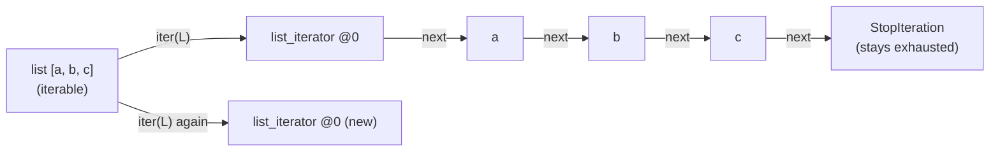

<!-- status: authored -->
# Iterators & the iterator protocol

## First principles

Two roles, often confused:

- An **iterable** is anything you can loop over. It implements `__iter__()`,
  which returns a **fresh iterator** each time. `list`, `dict`, `set`, `str`,
  `range`, open files, `Path.glob(...)` — all iterables.
- An **iterator** is the thing doing the walking. It implements `__next__()`
  (return the next item, or `raise StopIteration` when done) and `__iter__()`
  (return `self`). It holds the **position** — "where am I in the sequence".

`for x in obj:` is exactly:

```python
it = iter(obj)                 # obj.__iter__()
while True:
    try:
        x = next(it)           # it.__next__()
    except StopIteration:
        break
    ...                        # loop body
```

The consequence that bites: **an iterator is consumed.** Once `__next__` has
raised `StopIteration`, it is done forever — no rewind. A list can be looped a
hundred times because each loop calls `list.__iter__()` and gets a new iterator.
A generator, a file object, `iter(something)`, `zip(...)`, `map(...)`,
`enumerate(...)` — these **are** iterators, so they get one pass.

## The mechanism



`iter(list) is list` → `False` (fresh iterator). `iter(an_iterator) is
an_iterator` → `True` (returns self). That one-liner tells you which role an
object plays.

## Practice

```bash
python code/foundations/10_iterators_and_the_iterator_protocol/demo.py
```

```python title="code/foundations/10_iterators_and_the_iterator_protocol/demo.py"
--8<-- "code/foundations/10_iterators_and_the_iterator_protocol/demo.py"
```

## Scenarios

```bash
python code/foundations/10_iterators_and_the_iterator_protocol/scenarios.py
```

### 1 — Re-iterating a consumed iterator

!!! example "🔨 Build"
    `it = iter(rows); header = next(it); data = list(it)` — consume once,
    deliberately.

!!! failure "💥 Break"
    `n1 = sum(1 for _ in it); n2 = sum(1 for _ in it)`. `n1` is the count; `n2`
    is `0`. The second pass starts at the end.

!!! success "🔧 Fix"
    `rows = list(iter_source)` — a list is re-iterable.

!!! quote "🧠 Why it behaved that way"
    An iterator remembers its position and never resets. Only an iterable gives
    you a new iterator per `for`.

### 2 — `__iter__` returns `self`

!!! example "🔨 Build"
    A container whose `__iter__` returns `iter(self._items)` — a fresh iterator.
    Nested `for a in bag for b in bag` yields all 9 pairs.

!!! failure "💥 Break"
    A container whose `__iter__` returns `self` and tracks one `self._i`. The
    inner loop exhausts that shared position during the first outer step; you get
    2 pairs, not 9.

!!! success "🔧 Fix"
    Return a new iterator object from `__iter__` (or make the class a generator
    function's home — `def __iter__(self): yield from self._items`).

!!! quote "🧠 Why it behaved that way"
    Iterable and iterator are different jobs. Merging them means every loop over
    the object shares one cursor.

### 3 — A leaked `StopIteration` inside a generator (PEP 479)

!!! example "🔨 Build"
    Inside the generator, catch exhaustion: `try: a = next(it) except
    StopIteration: return`.

!!! failure "💥 Break"
    Let a bare `next(it)` hit the end. Instead of quietly ending the generator,
    Python 3.7+ raises `RuntimeError: generator raised StopIteration`.

!!! success "🔧 Fix"
    `next(it, sentinel)` with an explicit check, or the `try/except
    StopIteration: return`.

!!! quote "🧠 Why it behaved that way"
    PEP 479: a `StopIteration` bubbling out of a generator body used to silently
    truncate it, hiding bugs. It is now converted to `RuntimeError` so you see
    it.

### 4 — "Peeking" consumes the item

!!! example "🔨 Build"
    Peeked one item, then rebuilt the stream: `itertools.chain([peeked], it)`.

!!! failure "💥 Break"
    `peek = next(it)` to inspect the first row, then `for x in it:` — the loop
    starts at the **second** row. The first is gone.

!!! success "🔧 Fix"
    Prepend it back with `itertools.chain`, or use a look-ahead wrapper
    (`more_itertools.peekable`).

!!! quote "🧠 Why it behaved that way"
    `next` is destructive. A bare iterator has no non-consuming peek.

## Pitfalls & idioms

- `zip`, `map`, `filter`, `enumerate`, `reversed`, generator expressions, file
  objects — all **iterators** (one pass). `list(...)` them if you need to reuse.
- Don't `len()` an iterator — it has no length. `sum(1 for _ in it)` counts it
  (and consumes it).
- Custom iteration: prefer a **generator method** —
  `def __iter__(self): yield from ...` — over hand-writing `__next__`.
- `iter(callable, sentinel)`: call `callable()` until it returns `sentinel`.
  Great for `iter(lambda: f.read(4096), b"")`.
- `next(it, default)` to avoid `StopIteration` at the call site.
- `itertools.tee(it, n)` makes `n` independent iterators from one — but it
  buffers, so don't `tee` a huge stream you consume unevenly.

## See also

- [Generators & yield from](11-generators-and-yield-from.md) — the easy way to write an iterator
- [Comprehensions & generator expressions](09-comprehensions.md) — genexps are iterators
- [itertools](15-itertools.md) — `islice`, `chain`, `tee`, `count`, `groupby`
- [The data model & dunder methods](04-the-data-model-and-dunders.md) — `__iter__` / `__next__` among the protocols

## Check yourself

1. `data = zip(a, b)`. You loop over `data`, then loop again and get nothing.
   Why? Fix it.
2. What does `iter(x) is x` tell you about `x`?
3. Your custom collection works in a single `for` loop but nested loops over it
   misbehave. What did `__iter__` probably do wrong?
4. `RuntimeError: generator raised StopIteration` — what triggers this and what
   is the fix?
5. You need to check the first item of an iterator without losing it. How?
