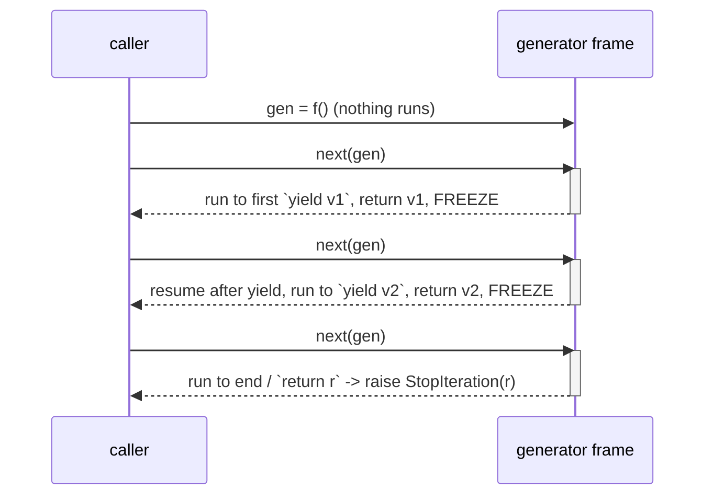

<!-- status: authored -->
# Generators & yield from

## First principles

A function that contains `yield` is a **generator function**. It behaves nothing
like a normal function:

- **Calling it runs no code.** You get back a *generator object* (which is an
  iterator) with the body paused before the first line.
- Each `next()` runs the body **up to the next `yield`**, produces that value,
  and **freezes the frame** — every local variable and the exact position in the
  code are preserved.
- The next `next()` **resumes** from right after that `yield`.
- `return value` ends the generator and stores `value` on `StopIteration.value`.
- `yield from subiterator` delegates: it yields every item the sub-iterator
  produces, forwards `send`/`throw`, and **evaluates to the sub-iterator's return
  value**.

Generators are how you write an iterator without the `__iter__`/`__next__`
boilerplate, and how you process data that is too big for memory or infinite —
one item at a time, computed on demand.

## The mechanism



A generator pipeline — `total(to_ints(read_lines()))` — moves one record through
all stages before touching the next, so peak memory is one record, not the whole
dataset.

## Practice

```bash
python code/foundations/11_generators_and_yield_from/demo.py
```

```python title="code/foundations/11_generators_and_yield_from/demo.py"
--8<-- "code/foundations/11_generators_and_yield_from/demo.py"
```

## Scenarios

```bash
python code/foundations/11_generators_and_yield_from/scenarios.py
```

### 1 — Validation in a generator body runs too late

!!! example "🔨 Build"
    An ordinary function validates the argument eagerly and *returns* an inner
    generator. `parse([])` raises `ValueError` at the call site.

!!! failure "💥 Break"
    Put the `if not rows: raise` in the same function as the `yield`. `parse([])`
    returns a generator with no error; the `ValueError` only fires on the first
    `next()` — possibly in completely different code.

!!! success "🔧 Fix"
    Split: eager wrapper function for checks, inner generator for the `yield`s.

!!! quote "🧠 Why it behaved that way"
    Calling a generator function executes none of its body — it just builds the
    paused generator. Everything, including your `raise`, waits for the first
    `next()`.

### 2 — A generator object is single-pass

!!! example "🔨 Build"
    Call the generator function again for a second pass:
    `list(squares_gen()), list(squares_gen())`.

!!! failure "💥 Break"
    `g = squares_gen()`, then `list(g)` twice. Second is `[]`.

!!! success "🔧 Fix"
    Materialise to a list if you need the data more than once.

!!! quote "🧠 Why it behaved that way"
    A generator is an iterator: one forward pass, no rewind. (Same rule as
    [iterators](10-iterators-and-the-iterator-protocol.md).)

### 3 — Cleanup skipped when you `break` early

!!! example "🔨 Build"
    Consume the generator fully (or to a natural end). Its `try/finally` runs.

!!! failure "💥 Break"
    `for x in gen: if x == 2: break`. The generator is left **suspended** — its
    `finally` (closing a file, releasing a lock) has not run and won't until GC.

!!! success "🔧 Fix"
    `with contextlib.closing(gen):` — `close()` throws `GeneratorExit` in, which
    runs the `finally`. Or consume it completely.

!!! quote "🧠 Why it behaved that way"
    A generator's `finally` / `with` runs on completion, `.close()`, or garbage
    collection. `break` does none of those promptly — it just stops asking for
    items.

### 4 — Getting a generator's return value

!!! example "🔨 Build"
    `count = yield from _load(rows)` — `yield from` evaluates to the delegate's
    return value.

!!! failure "💥 Break"
    Loop over the generator and read the last item, expecting it to be the
    `return` value. It's the last **yielded** value (`30`), not the `return`
    (`3`).

!!! success "🔧 Fix"
    `yield from`, or catch `StopIteration` and read `.value`.

!!! quote "🧠 Why it behaved that way"
    `return value` in a generator doesn't yield — it ends iteration and attaches
    `value` to the `StopIteration`. A `for` loop swallows that exception.

## Pitfalls & idioms

- Generator function = lazy iterator. Genexp `(x for x in xs)` = the same thing
  for simple cases.
- Validate arguments in an eager wrapper; keep `yield` in an inner function.
- `yield from iterable` replaces `for x in iterable: yield x` (and does more:
  forwards `send`/`throw`, surfaces the return value).
- Close generators that hold resources: `contextlib.closing`, or a `with` block
  if the generator is written as a `@contextmanager`.
- Don't `return` a value from a generator expecting callers to see it easily —
  most won't. Reserve it for `yield from` protocols.
- Pipelines: `sink(transform(source()))` — each stage a generator; constant
  memory.
- `.send(value)` and `.throw(exc)` exist (coroutine-style generators) but are
  rarely needed since `async`/`await` — see [asyncio](35-asyncio.md).

## See also

- [Iterators & the iterator protocol](10-iterators-and-the-iterator-protocol.md) — the interface generators implement
- [Comprehensions & generator expressions](09-comprehensions.md) — the shorthand
- [itertools](15-itertools.md) — composable lazy operators
- [Context managers & with](18-context-managers.md) — `@contextmanager` is a generator
- [The memory model & weakref](36-memory-model-and-weakref.md) — why streaming beats materialising

## Check yourself

1. `def f(): print("hi"); yield 1` — you call `f()` and see no output. Why?
2. Where should you put `if not path.exists(): raise FileNotFoundError` — in the
   generator function or a wrapper? Why?
3. A generator opens a file in a `with` and yields lines. A caller `break`s after
   10 lines. When does the file close?
4. `for x in gen: last = x` — is `last` the generator's `return` value? What is
   it, and how do you get the return value?
5. Rewrite `for item in source: yield item` in one line.
