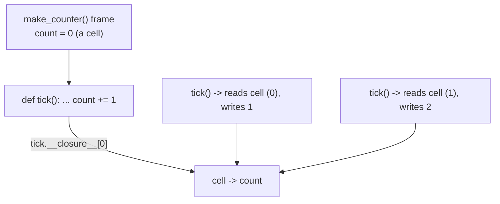

<!-- status: authored -->
# Functions: args/kwargs, closures, nonlocal

## First principles

A function is an **object** — you can bind it to names, pass it, return it, put
it in a list, give it attributes. `def` just creates that object and binds one
name to it.

**Parameters come in five kinds**, in this signature order:

```python
def f(pos_only, /, normal, *args, kw_only, **kwargs): ...
```

| Kind | How the caller passes it |
|---|---|
| positional-only (before `/`) | by position only |
| positional-or-keyword ("normal") | by position or by name |
| `*args` | extra positional arguments, as a tuple |
| keyword-only (after `*` or `*args`) | by name only |
| `**kwargs` | extra keyword arguments, as a dict |

**A closure** is a nested function together with the variables it uses from the
enclosing function. Crucially it captures the **variable** (an internal "cell"),
not a copy of its value — so if that variable changes later, the closure sees the
new value.

**Scope is decided at compile time.** Python scans the whole function body: if a
name is assigned *anywhere* in it, that name is local for the *entire* body.
`nonlocal name` (enclosing function) and `global name` (module) opt out.

## The mechanism



`tick` keeps the `count` cell alive after `make_counter` has returned. Without
`nonlocal`, `count += 1` would compile as "local `count` = local `count` + 1" and
fail on the read — `UnboundLocalError`.

## Practice

```bash
python code/foundations/12_functions_args_closures/demo.py
```

```python title="code/foundations/12_functions_args_closures/demo.py"
--8<-- "code/foundations/12_functions_args_closures/demo.py"
```

## Scenarios

```bash
python code/foundations/12_functions_args_closures/scenarios.py
```

### 1 — Late binding over a loop variable

!!! example "🔨 Build"
    `[lambda n=n: n*10 for n in range(4)]` — the default binds `n`'s value at
    creation. Calls return `[0, 10, 20, 30]`.

!!! failure "💥 Break"
    `[lambda: n*10 for n in range(4)]`. Every lambda closes over the same `n`;
    called after the loop, they all use `n == 3` → `[30, 30, 30, 30]`.

!!! success "🔧 Fix"
    `lambda n=n:` or `functools.partial(fn, n)`.

!!! quote "🧠 Why it behaved that way"
    Closures capture the variable, read at call time. A default argument is
    evaluated at `def` time; `partial` binds immediately.

### 2 — Assigning a captured name without `nonlocal`

!!! example "🔨 Build"
    `def add(x): nonlocal total; total += x`.

!!! failure "💥 Break"
    Drop the `nonlocal`. `total += x` → `UnboundLocalError: local variable
    'total' referenced before assignment`.

!!! success "🔧 Fix"
    `nonlocal total`.

!!! quote "🧠 Why it behaved that way"
    Because `total` is assigned in the body, the compiler makes it local for the
    whole function. The `+=` then reads a local that was never assigned.

### 3 — `**kwargs` swallows a typo

!!! example "🔨 Build"
    `def connect(*, timeout=1.0, retries=3)` — explicit, keyword-only params.

!!! failure "💥 Break"
    `def connect(**opts)` with `opts.get("timeout", 1.0)`. Caller writes
    `connect(timout=5.0)` (typo). No error; the default `1.0` is used and the
    real intent is lost.

!!! success "🔧 Fix"
    Declare the parameters explicitly. `connect(timout=5.0)` then raises
    `TypeError: unexpected keyword argument 'timout'`.

!!! quote "🧠 Why it behaved that way"
    `**kwargs` accepts any keyword by name with zero checking. Explicit
    parameters give you validation for free.

### 4 — Ambiguous positional arguments

!!! example "🔨 Build"
    `def canvas(*, width, height)` — callers must name them, so order can't be
    confused.

!!! failure "💥 Break"
    `def canvas(width, height)` and a caller who believes it's `(height,
    width)`. `canvas(1080, 1920)` runs fine and produces a silently transposed
    canvas.

!!! success "🔧 Fix"
    Put `*` before the parameters to make them keyword-only.

!!! quote "🧠 Why it behaved that way"
    Positional binding is by position with no name check. Two same-typed
    positionals are an accident waiting to happen; keyword-only removes the trap.

## Pitfalls & idioms

- Loop-variable closures: `lambda x=x:` or `partial`. (Same rule inside
  [comprehensions](09-comprehensions.md).)
- Reach for `nonlocal` sparingly — a small class or returning a new value is
  often clearer than a mutable closure.
- Prefer keyword-only parameters (`*`) for booleans and anything a caller could
  get in the wrong order: `def send(msg, *, urgent=False)`.
- `def f(x, data=None): data = [] if data is None else data` — never a mutable
  default ([Mutability](03-mutability-and-the-default-arg-trap.md)).
- `*args` / `**kwargs` for genuine pass-through (decorators, wrappers); explicit
  parameters everywhere else.
- Inspect: `f.__defaults__`, `f.__kwdefaults__`, `f.__closure__`,
  `f.__code__.co_varnames`, or `inspect.signature(f)`.
- `functools.partial` to pre-fill arguments; `operator.attrgetter` /
  `itemgetter` for common `key=` functions.

## See also

- [Decorators](13-decorators.md) — functions that take and return functions
- [functools](14-functools.md) — `partial`, `wraps`, `reduce`, `lru_cache`
- [Scope & namespaces (LEGB)](16-scope-legb.md) — the full lookup rule
- [Comprehensions & generator expressions](09-comprehensions.md) — the same closure trap
- [Mutability & the mutable-default trap](03-mutability-and-the-default-arg-trap.md)

## Check yourself

1. `funcs = [lambda: i for i in range(3)]; [f() for f in funcs]` → `[2, 2, 2]`.
   Explain and give two fixes.
2. `def counter(): n = 0; def bump(): n += 1; return bump` — what happens when
   you call the returned function, and why?
3. When would you make a parameter keyword-only?
4. `def log(msg, **fields)` and someone calls `log("hi", levl="warn")`. What
   happens to `levl`?
5. What does `add5.__closure__[0].cell_contents` return for
   `add5 = make_adder(5)`?
