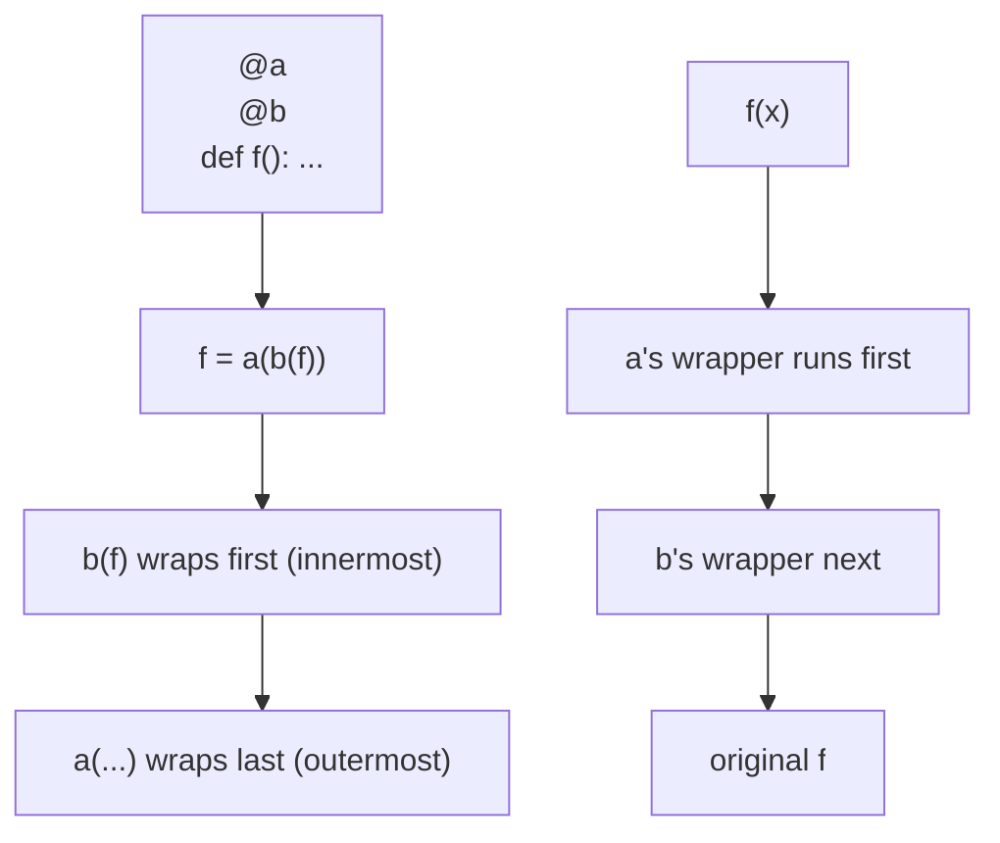

<!-- status: authored -->
# Decorators

## First principles

```python
@deco
def f(...): ...
```

is **exactly**:

```python
def f(...): ...
f = deco(f)
```

That's the whole idea. `deco` is any callable that takes a function and returns
a replacement — almost always a *wrapper* that calls the original with some code
before/after.

A **decorator with arguments** needs one more layer, because `@thing(x)` means
`f = thing(x)(f)`:

```python
def retry(times):            # factory: takes config
    def decorator(func):     # the actual decorator: takes the function
        def wrapper(*a, **kw):   # the replacement: takes the call
            ...
        return wrapper
    return decorator
```

Two facts to hold onto:

1. The decorator runs **at `def` time** (import time), once — not per call.
2. `@functools.wraps(func)` on the wrapper copies `__name__`, `__doc__`,
   `__wrapped__` etc. from the original. Without it, every introspection tool
   sees "wrapper".

## The mechanism



Stacking order matters: the decorator nearest the `def` is applied first and sits
innermost; the top one runs first on each call. `@cache` on top memoises the
final result; `@cache` on the bottom memoises the raw result and re-runs every
layer above it.

## Practice

```bash
python code/foundations/13_decorators/demo.py
```

```python title="code/foundations/13_decorators/demo.py"
--8<-- "code/foundations/13_decorators/demo.py"
```

## Scenarios

```bash
python code/foundations/13_decorators/scenarios.py
```

### 1 — Forgetting `functools.wraps`

!!! example "🔨 Build"
    `@functools.wraps(func)` on the wrapper. `greet.__name__ == "greet"`,
    docstring preserved.

!!! failure "💥 Break"
    Omit it. `greet.__name__ == "wrapper"`, `greet.__doc__ is None`. Tracebacks,
    docs tools, and `inspect.signature` all lie.

!!! success "🔧 Fix"
    Add `@functools.wraps(func)` above the wrapper `def`.

!!! quote "🧠 Why it behaved that way"
    The decorated name is bound to the wrapper — a different object. `wraps`
    copies the identifying metadata across.

### 2 — Factory used without calling it

!!! example "🔨 Build"
    `@_limit(3)` — call the factory, get a decorator.

!!! failure "💥 Break"
    `@_limit` (no parens). `echo = _limit(echo)`, so `_limit` gets `echo` as its
    `max_len`. Here the factory validates and raises `TypeError`; without that
    check, `echo` would silently become the inner `decorator` function.

!!! success "🔧 Fix"
    `@_limit(3)`.

!!! quote "🧠 Why it behaved that way"
    `@name` passes the function to `name`. A factory expects *config*, not the
    function, and returns the real decorator — you must invoke it.

### 3 — Decorator returns nothing

!!! example "🔨 Build"
    `return wrapper` at the end of the decorator.

!!! failure "💥 Break"
    Forget the `return`. The decorator returns `None`, so the decorated name is
    `None` → `TypeError: 'NoneType' object is not callable`.

!!! success "🔧 Fix"
    Return the wrapper (or the original function, if you only wanted a side
    effect at def time).

!!! quote "🧠 Why it behaved that way"
    `f = deco(f)`. Whatever `deco` returns *is* `f` now.

### 4 — Stacking order

!!! example "🔨 Build"
    `@_cache` above `@_add_tax` → the cache stores the taxed price (`12.0`).

!!! failure "💥 Break"
    Swap them. `@_cache` now sits below `@_add_tax`, so it caches the **pre-tax**
    price (`10.0`) and tax is recomputed on every call.

!!! success "🔧 Fix"
    Put the layer you want memoised (or authed, or logged) in the right position.

!!! quote "🧠 Why it behaved that way"
    `@a @b def f` = `a(b(f))`. Innermost wraps first; outermost runs first per
    call.

## Pitfalls & idioms

- Always `@functools.wraps(func)` on the wrapper.
- Factory decorators: remember the `()` — `@retry()` not `@retry`. (You can
  support both, but it's fiddly.)
- Return a callable. Every code path.
- Preserve the signature for callers that introspect it —
  `functools.wraps` handles `__wrapped__`; `inspect.signature` follows it.
- Decorate at the right layer; think about call order when stacking.
- Common ready-made decorators: `functools.lru_cache` / `cache`,
  `functools.cached_property`, `functools.singledispatch`,
  `contextlib.contextmanager`, `dataclasses.dataclass`, `staticmethod`,
  `classmethod`, `property`.
- Class decorators (`deco` receives the class) and decorating methods both work
  the same way — `Class = deco(Class)`, `method = deco(method)`.

## See also

- [Functions: args/kwargs, closures, nonlocal](12-functions-args-closures.md) — closures are how wrappers keep state
- [functools](14-functools.md) — `wraps`, `lru_cache`, `cached_property`, `singledispatch`
- [Context managers & with](18-context-managers.md) — `@contextmanager`
- [Classes & OOP from first principles](19-classes-and-oop.md) — `@property`, `@classmethod`, `@staticmethod`

## Check yourself

1. Expand `@app.route("/x")` above `def view(): ...` into plain assignment(s).
2. After decorating, `help(my_func)` shows the wrapper's name and no docstring.
   One-line fix?
3. `@timed` works but `@timed()` fails with `TypeError`. What's the difference,
   and which one is `timed` written to be?
4. You stack `@log` and `@require_auth`. Which order logs unauthorized attempts,
   and which order keeps them out of the logs?
5. A decorator prints `"registered"` when the module is imported, before any call
   happens. Why?
