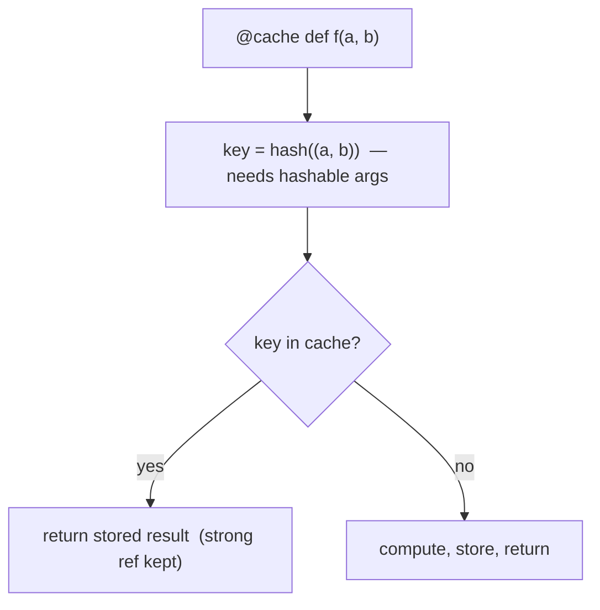

<!-- status: authored -->
# functools

## First principles

`functools` is the standard library's toolbox for **operating on functions**:

| Tool | Does |
|---|---|
| `cache` / `lru_cache(maxsize)` | memoise a pure function keyed by its **hashable** arguments |
| `partial(f, *a, **kw)` | new callable with some arguments pre-filled |
| `reduce(f, iterable[, init])` | fold a 2-arg function across an iterable |
| `singledispatch` | choose an implementation by the **type of the first argument** |
| `cached_property` | a `property` computed once, then stored on the instance |
| `total_ordering` | synthesise `<, <=, >, >=` from `__eq__` + one of them |
| `wraps` / `update_wrapper` | copy identifying metadata onto a wrapper (see [Decorators](13-decorators.md)) |

The two that cause the most trouble are `cache` (silent memory growth, needs
hashable args) and `cached_property` (goes stale). Both scenarios below.

## The mechanism



`cache` keeps a `dict` from argument-tuple to result. It holds **strong
references** to both — so a cache with `maxsize=None` on a long-lived function
never releases anything, and `@lru_cache` on a **method** keeps every `self` it
was ever called with alive.

`cached_property` is a descriptor that, on first access, computes the value and
writes it into `instance.__dict__[name]`. That entry then **shadows** the
descriptor, so subsequent accesses read the stored value directly and your method
never runs again.

## Practice

```bash
python code/foundations/14_functools/demo.py
```

```python title="code/foundations/14_functools/demo.py"
--8<-- "code/foundations/14_functools/demo.py"
```

## Scenarios

```bash
python code/foundations/14_functools/scenarios.py
```

### 1 — `cache` needs hashable arguments

!!! example "🔨 Build"
    `@cache def score(items: tuple)` — a tuple hashes, so the second identical
    call is a hit.

!!! failure "💥 Break"
    `score([1, 2, 3])` with a `list` argument → `TypeError: unhashable type:
    'list'` on the first call.

!!! success "🔧 Fix"
    `score(tuple(data))`, or don't cache functions that take mutable containers.

!!! quote "🧠 Why it behaved that way"
    The cache key is `hash(args)`. Mutable built-ins have no `__hash__`.

### 2 — `cached_property` goes stale

!!! example "🔨 Build"
    Use a plain `@property` when the value derives from mutable state. Always
    current.

!!! failure "💥 Break"
    `@cached_property total`. Access it (caches `6`), then `rows.append(4)`.
    `total` is still `6`.

!!! success "🔧 Fix"
    Plain `@property`, or invalidate with `del obj.total` when the inputs change.

!!! quote "🧠 Why it behaved that way"
    The first access stores the result in `instance.__dict__["total"]`, which
    shadows the descriptor. The method is never called again.

### 3 — `reduce` on an empty iterable with no initializer

!!! example "🔨 Build"
    `reduce(add, rows, 0)` — the initializer makes the empty case return `0`.

!!! failure "💥 Break"
    `reduce(add, [])` → `TypeError: reduce() of empty iterable with no initial
    value`.

!!! success "🔧 Fix"
    Pass the identity element (`0`, `1`, `""`) as the third argument — or use
    `sum` / `math.prod` / `"".join`.

!!! quote "🧠 Why it behaved that way"
    With no initializer, `reduce` uses the first element as the seed. An empty
    sequence has no first element and nothing to return.

### 4 — `partial` prepends positional arguments

!!! example "🔨 Build"
    `partial(int, base=16)` — fixes the *keyword* argument. `from_hex("ff") ==
    255`.

!!! failure "💥 Break"
    `partial(int, 16)` — fixes the first *positional*, so `from_hex("ff")`
    becomes `int(16, "ff")` → `TypeError`.

!!! success "🔧 Fix"
    Bind non-leading parameters by keyword.

!!! quote "🧠 Why it behaved that way"
    `partial` stores positional args to **prepend** and keyword args to **merge**.

## Pitfalls & idioms

- `@cache` only pure functions with hashable args. Bound `maxsize` on long-lived
  processes. Never on methods — use `cached_property` or cache a module-level
  helper.
- `cached_property` only for values that truly never change for the life of the
  instance.
- `functools.reduce` is often less readable than a loop or `sum`/`min`/`max`/
  `any`/`all`/`math.prod`. Reach for those first.
- `partial` for `key=` functions, callbacks, and pre-configured clients.
  `operator.itemgetter` / `attrgetter` / `methodcaller` cover many `key=` needs.
- `singledispatch` for open type-based dispatch without a chain of `isinstance`;
  `singledispatchmethod` for methods.
- `total_ordering` saves boilerplate but is slightly slower than writing all six
  — fine for most code.
- `cache_info()` / `cache_clear()` on an `lru_cache`d function for observability
  and test isolation.

## See also

- [Decorators](13-decorators.md) — `functools.wraps`, and `cache` is a decorator
- [Functions: args/kwargs, closures, nonlocal](12-functions-args-closures.md) — `partial` vs closures
- [The collections module](08-the-collections-module.md) — hand-rolled memo dicts
- [Descriptors](24-descriptors.md) — how `cached_property` works
- [dataclasses & __slots__](21-dataclasses-and-slots.md) — `cached_property` interacts with `__slots__`

## Check yourself

1. `@lru_cache` on `def load(path)` in a web server that runs for weeks. What's
   the risk, and the fix?
2. A `@cached_property` returns the wrong number after you mutate the object.
   Why, and two ways to handle it?
3. `reduce(operator.add, items)` crashes only in production, only sometimes.
   Likely input, and fix?
4. You want `parse_json = partial(json.loads)` but with `parse_constant` fixed.
   `partial(json.loads, my_fn)` doesn't work — why, and what does?
5. What does `functools.wraps` copy, and which line of a decorator needs it?
