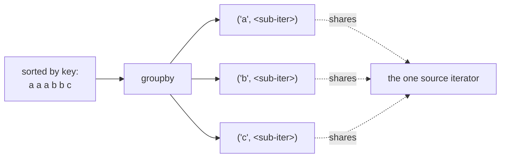

<!-- status: authored -->
# itertools

## First principles

`itertools` is a set of **lazy iterator building blocks**. Every function returns
an iterator, so they compose into pipelines that stream one item at a time —
constant memory, and infinite sequences are fine as long as something downstream
stops.

| Group | Members |
|---|---|
| infinite | `count(start, step)`, `cycle(iterable)`, `repeat(x[, n])` |
| slicing / stopping | `islice`, `takewhile`, `dropwhile`, `compress`, `filterfalse` |
| combining | `chain`, `chain.from_iterable`, `zip_longest`, `pairwise`, `starmap` |
| grouping / scanning | `groupby` (consecutive keys!), `accumulate(iter[, func])` |
| products | `product`, `permutations`, `combinations`, `combinations_with_replacement` |
| copying | `tee(iter, n)` — buffers; `batched(iter, n)` (3.12+) |

Two behaviours to burn in:

1. **`groupby` groups only *consecutive* equal keys** — like SQL `GROUP BY`
   needs an `ORDER BY`. Sort by the key first.
2. **`zip` stops at the shortest input**, silently. Use `strict=True` (3.10+) or
   `zip_longest`.

## The mechanism



Each `groupby` sub-iterator is a **view over the same source**, positioned at that
group. Advancing to the next group pulls the source past the previous one — so a
sub-iterator you saved is empty by the time you read it.

## Practice

```bash
python code/foundations/15_itertools/demo.py
```

```python title="code/foundations/15_itertools/demo.py"
--8<-- "code/foundations/15_itertools/demo.py"
```

## Scenarios

```bash
python code/foundations/15_itertools/scenarios.py
```

### 1 — `groupby` without sorting first

!!! example "🔨 Build"
    `groupby(sorted(words))` — every key's items are consecutive, so each group
    is complete.

!!! failure "💥 Break"
    `groupby(words)` on unsorted input. `"ant"`, `"arc"`, `"auk"` form three
    separate `'a'` groups; in a dict they overwrite each other, so `'a'` ends up
    with one word.

!!! success "🔧 Fix"
    `sorted(data, key=k)` before `groupby(..., key=k)`.

!!! quote "🧠 Why it behaved that way"
    `groupby` starts a new group whenever the key changes between consecutive
    items. It has no global view.

### 2 — `groupby` sub-iterator lifetime

!!! example "🔨 Build"
    `[(k, list(g)) for k, g in groupby(data, key=k)]` — materialise each group
    *before* the loop advances.

!!! failure "💥 Break"
    `groups = list(groupby(data, key=k))` then `[list(g) for _, g in groups]`.
    Every group is `[]`.

!!! success "🔧 Fix"
    Consume `g` (`list(g)`) inside the same loop/comprehension iteration.

!!! quote "🧠 Why it behaved that way"
    `list(groupby(...))` walks straight to the last group marker, dragging the
    shared source with it and leaving every earlier sub-iterator exhausted.

### 3 — `chain` vs `chain.from_iterable`

!!! example "🔨 Build"
    `chain.from_iterable(rows)` → `[1, 2, 3, 4, 5]`.

!!! failure "💥 Break"
    `chain(rows)` → `[[1, 2], [3, 4], [5]]`. `chain` got **one** argument (the
    outer list) and iterated it once.

!!! success "🔧 Fix"
    `chain.from_iterable(rows)` (lazy) or `chain(*rows)` (unpacks now).

!!! quote "🧠 Why it behaved that way"
    `chain(*iterables)` concatenates each *argument*. One list-of-lists is one
    argument.

### 4 — `zip` stops at the shortest

!!! example "🔨 Build"
    `zip_longest(headers, row, fillvalue=None)` — missing fields become `None`.

!!! failure "💥 Break"
    `dict(zip(headers, short_row))` — trailing columns silently vanish, no
    warning.

!!! success "🔧 Fix"
    `zip(..., strict=True)` to raise on mismatch, or `zip_longest` when short
    inputs are expected.

!!! quote "🧠 Why it behaved that way"
    `zip` yields tuples until the first input runs out, then stops.

## Pitfalls & idioms

- Always `sorted(..., key=k)` before `groupby(..., key=k)`.
- Consume each `groupby` group before moving on.
- `chain.from_iterable` to flatten one level lazily.
- `zip(a, b, strict=True)` whenever the inputs *should* be the same length.
- Bound every infinite iterator: `islice(count(), n)`,
  `takewhile(pred, cycle(...))`.
- `pairwise(seq)` for deltas/sliding pairs; `itertools.batched(seq, n)` (3.12+)
  or an `islice` loop for fixed-size chunks.
- `accumulate(seq, func)` for running totals / running max / prefix products.
- `tee` buffers everything between the slowest and fastest branch — don't `tee` a
  huge stream you drain unevenly; and don't touch the original iterator after
  `tee`ing it.
- The `itertools` docs "recipes" section is a standard reference — `more-itertools`
  packages many of them.

## See also

- [Iterators & the iterator protocol](10-iterators-and-the-iterator-protocol.md) — what these all return
- [Generators & yield from](11-generators-and-yield-from.md) — writing your own lazy operators
- [Comprehensions & generator expressions](09-comprehensions.md) — often clearer for simple cases
- [The collections module](08-the-collections-module.md) — `Counter`, `deque` complement `itertools`

## Check yourself

1. `groupby` on your data returns the same key three times. What did you forget?
2. `[list(g) for k, g in list(groupby(data))]` gives all empty lists. Why?
3. `list(chain(list_of_rows))` returns the rows, not their cells. Fix it two
   ways.
4. `zip(headers, row)` drops the last two columns of a malformed CSV row and
   nobody notices for a month. What flag or function prevents this?
5. How do you take the first 10 items of `itertools.count()` without an infinite
   loop?
