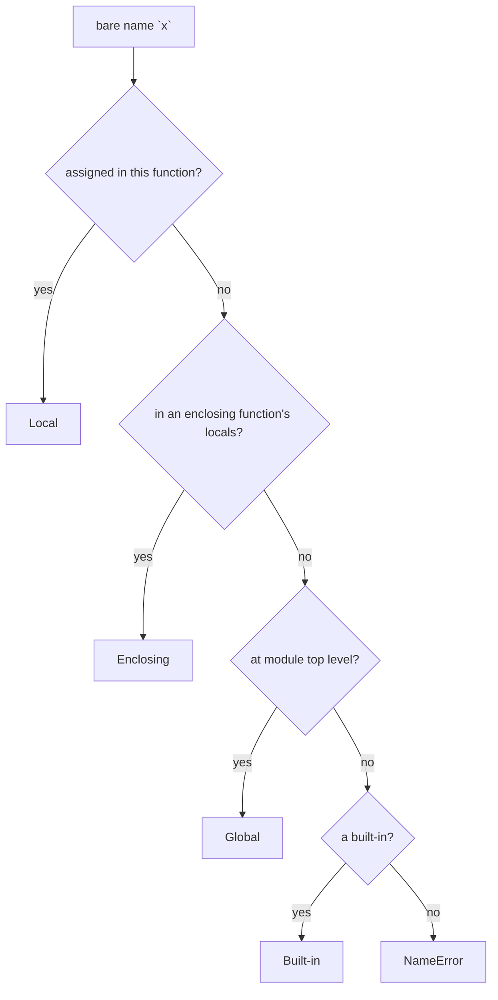

<!-- status: authored -->
# Scope & namespaces (LEGB)

## First principles

A **namespace** is a mapping from names to objects. To resolve a bare name,
Python searches namespaces in a fixed order — **LEGB**:

| | Namespace | Contains |
|---|---|---|
| **L** | Local | names assigned in the current function |
| **E** | Enclosing | locals of any enclosing function(s) |
| **G** | Global | names at the module's top level |
| **B** | Built-in | `print`, `len`, `list`, `sum`, `range`, … |

First match wins. There is **no "block" scope** — `if`, `for`, `while`, `with`,
`try` do not create namespaces. Only **functions**, **modules**, **classes**, and
**comprehensions/genexps** do.

Two rules that cause most scope bugs:

1. **Assigning a name anywhere in a function makes it Local for the whole
   function.** Reading it before that assignment → `UnboundLocalError`. Use
   `global` / `nonlocal` to rebind an outer name instead.
2. **A class body is not an enclosing scope for its methods.** Method code goes
   straight L→E→G→B and never sees class-body names; reach them via `self.` or
   `ClassName.`.

## The mechanism



`sum = 0` inside a function puts `sum` in **Local**, so the built-in `sum` becomes
unreachable *in that function*. `CONFIG["k"] = 1` only *reads* `CONFIG` (then
mutates the object), so it finds the global fine; `CONFIG = {}` is an assignment
and makes a shadowing local.

## Practice

```bash
python code/foundations/16_scope_legb/demo.py
```

```python title="code/foundations/16_scope_legb/demo.py"
--8<-- "code/foundations/16_scope_legb/demo.py"
```

## Scenarios

```bash
python code/foundations/16_scope_legb/scenarios.py
```

### 1 — Shadowing a built-in

!!! example "🔨 Build"
    Name the accumulator `total`, not `sum`. `sum(items)` still works.

!!! failure "💥 Break"
    `sum = 0` then later `sum([1, 2])` → `TypeError: 'int' object is not
    callable`. The local `sum` shadows the built-in for the whole function.

!!! success "🔧 Fix"
    Rename the variable.

!!! quote "🧠 Why it behaved that way"
    The assignment makes `sum` Local. Name resolution finds Local before
    Built-in.

### 2 — Class-body name in a method

!!! example "🔨 Build"
    `return self.RETRIES * 10`.

!!! failure "💥 Break"
    `return RETRIES * 10` (bare) → `NameError: name 'RETRIES' is not defined`.

!!! success "🔧 Fix"
    `self.RETRIES` or `Settings.RETRIES`.

!!! quote "🧠 Why it behaved that way"
    The class body runs once to build the class, in its own namespace. That
    namespace is not on a method's LEGB path.

### 3 — Reassigning a global

!!! example "🔨 Build"
    `_STATE["loaded"] = True` inside a function — mutates the global object, no
    declaration needed.

!!! failure "💥 Break"
    `_COUNT = _COUNT + 1` inside a function → `_COUNT` is Local, the read fails →
    `UnboundLocalError`, and the module's `_COUNT` is untouched.

!!! success "🔧 Fix"
    `global _COUNT` to rebind it. (Better: pass state in and return it, or use a
    class.)

!!! quote "🧠 Why it behaved that way"
    Method calls on a looked-up object don't rebind the name. Assignment does —
    and assignment anywhere makes the name Local.

### 4 — Comprehension variable doesn't leak

!!! example "🔨 Build"
    Get the last item with `items[-1]`, not by reading the comprehension's loop
    variable.

!!! failure "💥 Break"
    `[f(x) for x in items]` then `print(x)` → `NameError`. In Python 3 the
    comprehension has its own scope.

!!! success "🔧 Fix"
    Capture what you need explicitly.

!!! quote "🧠 Why it behaved that way"
    Python 3 comprehensions and generator expressions run in a hidden function
    scope. A plain `for` loop does **not** — its variable does leak (and holds
    the last value, or is undefined if the iterable was empty).

## Pitfalls & idioms

- Never shadow built-ins: `list`, `dict`, `set`, `id`, `type`, `sum`, `min`,
  `max`, `input`, `str`, `bytes`, `next`, `filter`, `map`, `object`.
- `global` / `nonlocal` are code smells at scale — prefer returning values,
  parameters, or a small class holding the state.
- Class attributes: `self.ATTR` in methods; `ClassName.ATTR` from outside.
- `for` leaks its variable; comprehensions don't. Don't rely on either.
- `globals()`, `locals()`, `vars(obj)` for introspection; `locals()` is a
  snapshot — writing to it usually does nothing.
- A late `import` inside a function creates a **local** name for that module.
- Default argument values are evaluated in the *defining* scope at `def` time —
  see [Functions](12-functions-args-closures.md).

## See also

- [Functions: args/kwargs, closures, nonlocal](12-functions-args-closures.md) — `UnboundLocalError`, `nonlocal`
- [The execution & import model](01-execution-and-import-model.md) — module globals, `sys.modules`
- [Classes & OOP from first principles](19-classes-and-oop.md) — class vs instance namespaces
- [Comprehensions & generator expressions](09-comprehensions.md) — their own scope

## Check yourself

1. `def f(): print(x); x = 1` — what error, and why isn't it just a `NameError`?
2. Inside a method, `return TIMEOUT` (a class attribute) raises `NameError`. Fix
   it.
3. When can you modify a module-level `dict` from a function *without* `global`,
   and when do you need it?
4. After `total = sum(v for v in data)`, is `v` defined? After the equivalent
   `for` loop?
5. Why is naming a local variable `id` or `list` a bug waiting to happen?
