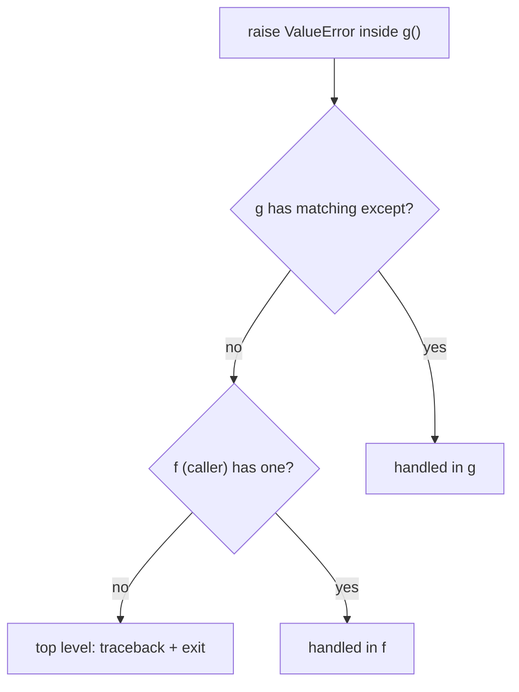

<!-- status: authored -->
# Exceptions: EAFP, chaining, groups

## First principles

An exception is an **object**. `raise` starts it moving up the call stack. Each
frame either has a matching `except` (it's caught, propagation stops) or doesn't
(it keeps rising). Reach the top uncaught → the interpreter prints a traceback
and exits.

```python
try:
    ...          # attempt
except SomeError as e:
    ...          # runs if SomeError (or a subclass) was raised
else:
    ...          # runs only if the try block raised nothing
finally:
    ...          # runs no matter what — exception, return, or normal exit
```

**EAFP** — "easier to ask forgiveness than permission" — is the Pythonic style:
attempt the operation and handle the failure, rather than pre-checking every
precondition (**LBYL**, "look before you leap"), which is racy and verbose.

The hierarchy matters for `except` clauses:

```
BaseException
 ├─ SystemExit, KeyboardInterrupt, GeneratorExit   ← do NOT catch these casually
 └─ Exception
     ├─ ArithmeticError, LookupError (KeyError, IndexError), OSError, ValueError, ...
     └─ your custom exceptions (subclass Exception)
```

Catch the **narrowest** exception that represents a *recoverable* condition.
`except Exception:` also catches your `NameError`s and `TypeError`s — real bugs —
and hides them.

## The mechanism



`raise New() from original` sets `New.__cause__ = original`, so the traceback
shows the full chain ("The above exception was the direct cause of the
following"). Without `from`, Python still records `__context__` implicitly, but
`__cause__` stays `None` and `raise New() from None` hides the context entirely.

## Practice

```bash
python code/foundations/17_exceptions/demo.py
```

```python title="code/foundations/17_exceptions/demo.py"
--8<-- "code/foundations/17_exceptions/demo.py"
```

## Scenarios

```bash
python code/foundations/17_exceptions/scenarios.py
```

### 1 — A too-broad `except` hides a bug

!!! example "🔨 Build"
    `except ValueError:` — only the parse failure you anticipated.

!!! failure "💥 Break"
    `except Exception:` around code with a typo (`.strp()`). The `AttributeError`
    is swallowed and the function returns a plausible `0.0`. The bug ships.

!!! success "🔧 Fix"
    Catch `ValueError` only; let programming errors propagate.

!!! quote "🧠 Why it behaved that way"
    `except Exception` matches every subclass of `Exception`, which includes
    `AttributeError`, `NameError`, `TypeError` — the exceptions that mean *you
    wrote a bug*, not *the input was bad*.

### 2 — `return` inside `finally`

!!! example "🔨 Build"
    `finally` does cleanup only. The `IOError` propagates to the caller.

!!! failure "💥 Break"
    `finally: return "ok"`. The exception is **silently discarded** — the
    function returns `"ok"`. (Modern Python emits a `SyntaxWarning` for this.)

!!! success "🔧 Fix"
    Never `return` / `break` / `continue` from `finally`.

!!! quote "🧠 Why it behaved that way"
    `finally` runs on every exit path, and a control-flow statement in it
    replaces whatever was happening — including an in-flight exception.

### 3 — Re-raising without chaining

!!! example "🔨 Build"
    `raise LoadError("bad config") from exc`. `LoadError.__cause__` is the
    original `KeyError`.

!!! failure "💥 Break"
    `raise LoadError("bad config")` (no `from`). `__cause__` is `None`; the
    specific missing key is not in the explicit chain.

!!! success "🔧 Fix"
    `from exc`, and put the useful detail (`str(exc)`) in the message.

!!! quote "🧠 Why it behaved that way"
    `from` sets `__cause__` and makes the traceback show the causal link.
    Translating exceptions without it throws away debugging information.

### 4 — A half-applied side effect

!!! example "🔨 Build"
    Validate *before* mutating; compute the new value, then commit last. A failed
    `withdraw(150)` leaves the account untouched.

!!! failure "💥 Break"
    Decrement the balance first, then check and raise. The failed withdrawal
    leaves `balance == -50` and no log entry — inconsistent state.

!!! success "🔧 Fix"
    Check first; compute without committing; apply at the end. Or wrap the
    operation so failure rolls back (context manager / transaction).

!!! quote "🧠 Why it behaved that way"
    An exception interrupts the function partway. Whatever you already changed
    stays changed — there is no automatic rollback.

## Pitfalls & idioms

- Catch the narrowest exception. Never bare `except:` (it catches
  `KeyboardInterrupt` and `SystemExit` too).
- `except (TypeError, ValueError) as e:` to group; `raise` (bare) to re-raise the
  current one unchanged.
- Translate exceptions *with* `from`: `raise DomainError(...) from e`.
- `finally` for cleanup; prefer a `with` block / context manager
  ([Context managers](18-context-managers.md)).
- Custom exceptions: subclass `Exception` (not `BaseException`), give them a
  clear name, keep a small hierarchy.
- Don't use exceptions for ordinary control flow across large distances — but
  EAFP for local "try the fast path" is idiomatic.
- Python 3.11+: `ExceptionGroup` and `except*` for concurrent/aggregated errors
  (`asyncio.TaskGroup` raises these).
- `contextlib.suppress(FileNotFoundError)` for "ignore this specific error".

## See also

- [Context managers & with](18-context-managers.md) — deterministic cleanup and rollback
- [The execution & import model](01-execution-and-import-model.md) — uncaught exceptions at the top level
- [asyncio](35-asyncio.md) — `TaskGroup`, `ExceptionGroup`, `except*`
- [Logging](39-logging.md) — `logger.exception()` records the traceback
- [Testing with pytest & hypothesis](38-testing-with-pytest.md) — `pytest.raises`

## Check yourself

1. Why is `except Exception:` around a whole function usually a bug magnet?
2. `finally: return cleanup()` — what happens if the `try` block raised?
3. What's the difference in the traceback between `raise B()` and `raise B()
   from a` inside an `except A` handler?
4. Your `transfer()` function decrements one account then credits another. The
   credit fails. What's the state, and how do you design around it?
5. When is EAFP better than LBYL, and when does LBYL still make sense?
