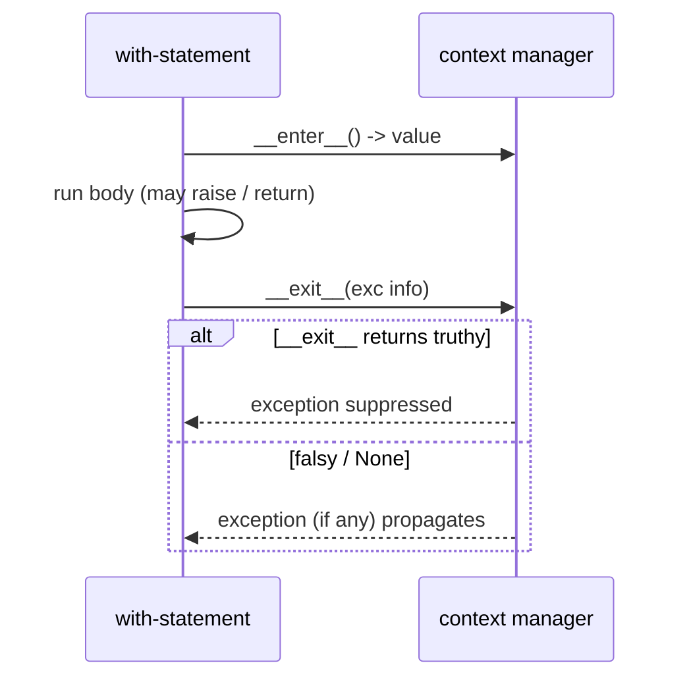

<!-- status: authored -->
# Context managers & with

## First principles

```python
with cm as x:
    body
```

is:

```python
x = cm.__enter__()
try:
    body
finally:
    cm.__exit__(exc_type, exc_value, traceback)
```

`__exit__` is **guaranteed** to run — on normal fall-through, on `return`/`break`,
and when the body raises. That is the whole value proposition: deterministic
cleanup, no matter how the block ends.

`__exit__` receives the exception (or three `None`s if there wasn't one) and
returns a **truthy value to suppress it**, falsy (`False`/`None`) to let it
propagate.

`@contextlib.contextmanager` turns a **one-`yield` generator** into a context
manager:

```python
@contextmanager
def resource():
    r = acquire()
    try:
        yield r          # <- the `with` body runs here
    finally:
        release(r)       # <- MUST be in finally
```

Everything before `yield` is `__enter__`; everything after is `__exit__`. When
the body raises, the exception is **thrown into the generator at the `yield`** —
so cleanup only happens if it's in a `finally`.

## The mechanism



## Practice

```bash
python code/foundations/18_context_managers/demo.py
```

```python title="code/foundations/18_context_managers/demo.py"
--8<-- "code/foundations/18_context_managers/demo.py"
```

## Scenarios

```bash
python code/foundations/18_context_managers/scenarios.py
```

### 1 — Manual close leaks on exception

!!! example "🔨 Build"
    `with open(...) as f:` — closed whether the body succeeds, returns, or
    raises.

!!! failure "💥 Break"
    `f = open(...); process(f); f.close()`. `process` raises → `f.close()` is
    never reached → the descriptor leaks until GC.

!!! success "🔧 Fix"
    `with`.

!!! quote "🧠 Why it behaved that way"
    `with` puts the cleanup in a `finally`-equivalent. A bare `.close()` line is
    just a line — skipped by any early exit.

### 2 — `@contextmanager` without `try/finally`

!!! example "🔨 Build"
    `try: yield finally: cleanup()`. Cleanup runs even when the body raises.

!!! failure "💥 Break"
    `yield; cleanup()`. The body raises → the exception is thrown in at the
    `yield` → it propagates past `cleanup()`, which never runs.

!!! success "🔧 Fix"
    Wrap the `yield` in `try/finally`.

!!! quote "🧠 Why it behaved that way"
    `__exit__` for a generator CM works by `gen.throw(exc)` at the `yield`.
    Unprotected code after `yield` is skipped.

### 3 — `__exit__` suppresses exceptions

!!! example "🔨 Build"
    `def __exit__(self, *exc): return False`.

!!! failure "💥 Break"
    `return True`. Every exception raised in the `with` body silently vanishes.

!!! success "🔧 Fix"
    Return `False` / `None` unless you deliberately handled a specific exception.

!!! quote "🧠 Why it behaved that way"
    A truthy `__exit__` return means "I handled it, suppress it." Returning a
    stray truthy value (or `True` by habit) eats real errors.

### 4 — Reusing a one-shot context manager

!!! example "🔨 Build"
    Call the factory each time: `with make_cm() as x:` inside the loop.

!!! failure "💥 Break"
    `cm = make_cm()`, then `with cm:` twice → `RuntimeError: generator didn't
    yield` (or `AttributeError` on newer Python).

!!! success "🔧 Fix"
    A fresh context manager per `with`.

!!! quote "🧠 Why it behaved that way"
    `@contextmanager` wraps a generator; a generator runs once. (`threading.Lock`
    is reusable but not reentrant — nested `with lock` deadlocks; use `RLock`.)

## Pitfalls & idioms

- Use `with` for every file, socket, lock, DB connection/transaction, temp
  directory, `subprocess.Popen`.
- Custom CM: a class with `__enter__`/`__exit__`, or `@contextmanager` +
  `try/finally` around one `yield`.
- `__exit__` returns `False`/`None` — suppress only on purpose.
- Dynamic / variable number of resources: `contextlib.ExitStack` and
  `stack.enter_context(...)`.
- Handy ready-mades: `contextlib.suppress(Exc)`, `contextlib.closing(obj)`,
  `contextlib.redirect_stdout(buf)`, `contextlib.nullcontext()`,
  `contextlib.chdir(path)` (3.11+).
- `with a, b:` nests `b` inside `a`; parenthesised multi-line form since 3.10.
- Async: `async with` / `__aenter__` / `__aexit__` — see [asyncio](35-asyncio.md).

## See also

- [Exceptions: EAFP, chaining, groups](17-exceptions.md) — `finally`, rollback
- [Generators & yield from](11-generators-and-yield-from.md) — `@contextmanager` is a generator
- [Decorators](13-decorators.md) — `@contextmanager` is a decorator
- [File I/O & pathlib](28-file-io-and-pathlib.md) — the canonical `with open(...)`
- [The GIL, threads & race conditions](33-gil-threads-races.md) — `with lock:`

## Check yourself

1. Rewrite `f = open(p); data = f.read(); f.close()` safely, and explain what
   breaks in the original if `.read()` raises.
2. In a `@contextmanager`, why must the teardown be in a `finally` and not just
   after the `yield`?
3. Your `with` block's exception disappears without a trace. What did `__exit__`
   probably return?
4. You need to open a list of files whose length isn't known until runtime. What
   from `contextlib` handles that?
5. Why can't you reuse the object returned by a `@contextmanager` function across
   two `with` statements?
