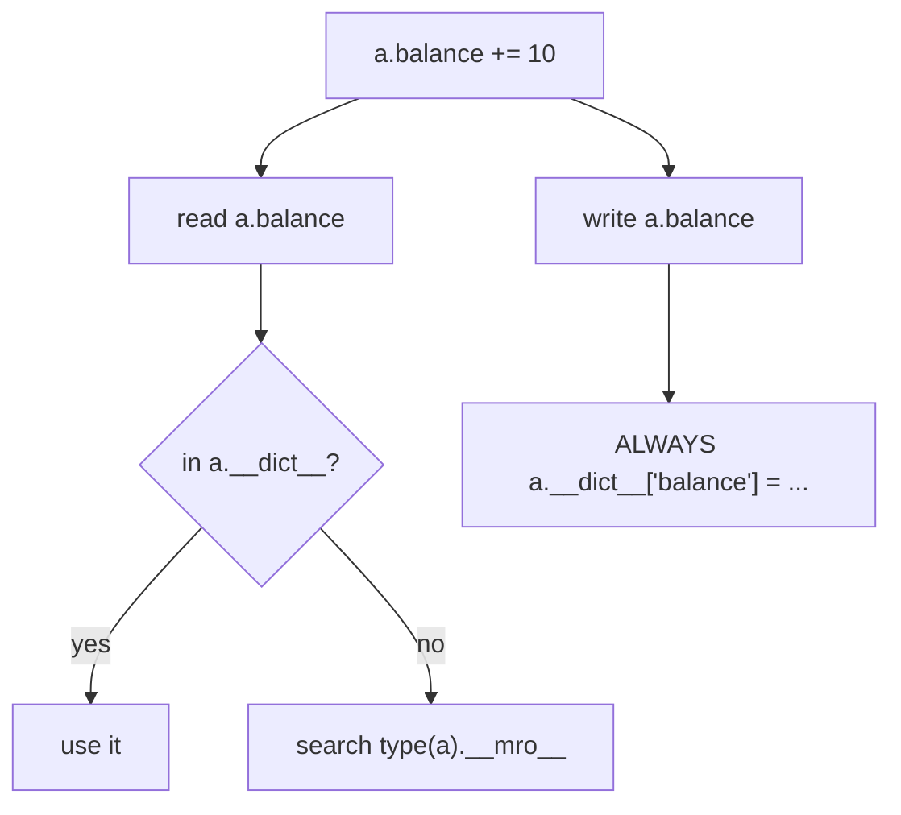

<!-- status: authored -->
# Classes & OOP from first principles

## First principles

A `class` statement creates one object that is both:

1. a **factory** — `Account("Ada")` runs `Account.__new__` (builds a blank
   instance) then `Account.__init__(instance, "Ada")` (fills it in);
2. a **namespace** — its `__dict__` holds the methods and class attributes.

Every instance has its **own `__dict__`** for instance attributes. Attribute
lookup for `obj.x`:

```
obj.__dict__["x"]  →  found? use it
      ↓ no
type(obj).__mro__  →  search each class's __dict__  →  found? use it
      ↓ no
AttributeError
```

`self` is **not magic** — it is an ordinary first parameter. `obj.method(a)` is
*exactly* `type(obj).method(obj, a)`. The instance is always passed as the first
positional argument.

| Decorator | First argument | Use |
|---|---|---|
| (none) | `self` — the instance | normal method |
| `@classmethod` | `cls` — the class | alternative constructors, class-level ops |
| `@staticmethod` | nothing special | a plain function that lives in the class namespace |
| `@property` | `self` | a method accessed like an attribute (`obj.x`, not `obj.x()`) |

## The mechanism



Reads walk instance → class → bases. **Writes go straight to the instance
`__dict__`** (unless a data descriptor like `property` intercepts). That
asymmetry is why `self.counter += 1` on a class attribute creates a per-instance
shadow instead of updating the shared value.

## Practice

```bash
python code/foundations/19_classes_and_oop/demo.py
```

```python title="code/foundations/19_classes_and_oop/demo.py"
--8<-- "code/foundations/19_classes_and_oop/demo.py"
```

## Scenarios

```bash
python code/foundations/19_classes_and_oop/scenarios.py
```

### 1 — `self.x += 1` on a class attribute

!!! example "🔨 Build"
    Rebind on the class: `type(self)._created += 1`. The shared counter tracks
    all instances.

!!! failure "💥 Break"
    `self._created += 1`. The read finds the class attr (`0`); the write creates
    an instance attr (`1`). Every instance ends at `1`; the class counter stays
    `0`.

!!! success "🔧 Fix"
    `type(self)._created += 1` (or `ClassName._created += 1`, or a
    `@classmethod`).

!!! quote "🧠 Why it behaved that way"
    `self.x += 1` is `self.x = self.x + 1`. Reads consult the class; assignment
    always targets the instance `__dict__`, shadowing the class attribute.

### 2 — Forgetting `self`

!!! example "🔨 Build"
    `def doubled(self): return self.n * 2`.

!!! failure "💥 Break"
    `def doubled():` → `obj.doubled()` raises `TypeError: doubled() takes 0
    positional arguments but 1 was given`.

!!! success "🔧 Fix"
    Add the `self` parameter (or `@staticmethod` if it genuinely needs no
    instance).

!!! quote "🧠 Why it behaved that way"
    `obj.doubled()` passes `obj` as the first argument. The method must accept
    it.

### 3 — Assigning to a read-only property

!!! example "🔨 Build"
    Add `@full_name.setter`. `p.full_name = "Grace Hopper"` works.

!!! failure "💥 Break"
    Property with a getter only. `p.full_name = "..."` → `AttributeError:
    property 'full_name' has no setter`.

!!! success "🔧 Fix"
    Provide a setter, or leave it read-only deliberately and don't assign.

!!! quote "🧠 Why it behaved that way"
    `property` is a **data descriptor** (`__get__` + `__set__`), so it takes
    priority over the instance dict on both read and write. Its `__set__` with no
    setter raises.

### 4 — Returning from `__init__`

!!! example "🔨 Build"
    `__init__` only sets attributes; returns nothing.

!!! failure "💥 Break"
    `return (x, y)` from `__init__` → `TypeError: __init__() should return None,
    not 'tuple'`.

!!! success "🔧 Fix"
    Don't return. For a "construct and compute" pattern, use a `@classmethod`
    factory or override `__new__`.

!!! quote "🧠 Why it behaved that way"
    `__new__` creates the object; `__init__` initialises it in place. Producing a
    value is not its role.

## Pitfalls & idioms

- Mutable class attributes are shared across all instances — put per-object state
  in `__init__` ([Mutability](03-mutability-and-the-default-arg-trap.md)).
- Class attributes for genuine constants and defaults; rebind counters via the
  class.
- `@property` for computed/validated attributes; don't hide expensive work or
  side effects behind one.
- `@classmethod` for alternative constructors (`Model.from_json`,
  `datetime.fromtimestamp`); `@staticmethod` sparingly (often a module function
  is clearer).
- Prefer `@dataclass` for plain data-holding classes — it writes `__init__`,
  `__repr__`, `__eq__` for you ([dataclasses & __slots__](21-dataclasses-and-slots.md)).
- `vars(obj)` / `obj.__dict__` to inspect instance state;
  `ClassName.__mro__` for the lookup order.
- "Prefer composition over inheritance" — hold a collaborator as an attribute
  rather than subclassing, unless there is a true "is-a" relationship.

## See also

- [Inheritance, MRO & super()](20-inheritance-and-mro.md) — extending classes
- [dataclasses & __slots__](21-dataclasses-and-slots.md) — generated boilerplate
- [The data model & dunder methods](04-the-data-model-and-dunders.md) — `__repr__`, `__eq__`, `__hash__`
- [Descriptors](24-descriptors.md) — how `property`, `classmethod`, methods work
- [Scope & namespaces (LEGB)](16-scope-legb.md) — class body vs method scope

## Check yourself

1. `class C: seen = set()` and every instance does `self.seen.add(x)` in
   `__init__`. Why do all instances share one set — and how is that different
   from `self.count += 1` on `count = 0`?
2. `obj.render()` raises `TypeError: render() takes 0 positional arguments but 1
   was given`. What's missing?
3. Why does `p.name = "x"` raise `AttributeError` when `name` is a `@property`
   with only a getter?
4. Where does construction actually happen — `__new__` or `__init__` — and what
   is each responsible for?
5. When would you reach for `@classmethod` vs `@staticmethod` vs a plain
   module-level function?
