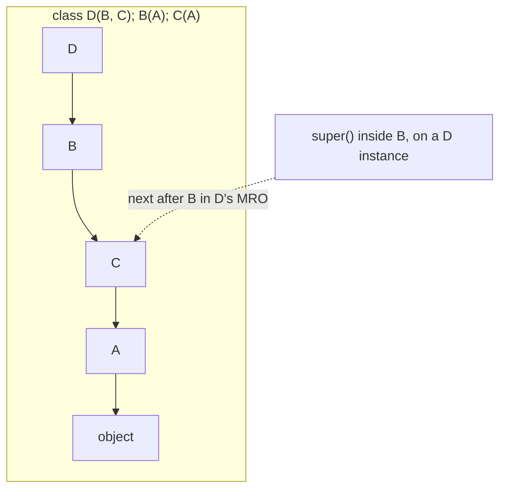

<!-- status: authored -->
# Inheritance, MRO & super()

## First principles

A subclass gets attributes it doesn't define by searching the **method resolution
order** — `Cls.__mro__`, a single flat list of classes computed once by the **C3
linearization** from all the bases.

```python
D.__mro__  ==  (D, B, C, A, object)   # for  class D(B, C), B(A), C(A)
```

`obj.method()` finds `method` at the first class in `type(obj).__mro__` that
defines it.

**`super()` is the most misunderstood builtin.** It does **not** mean "my parent
class". It means:

> the next class *after the current one* in the MRO of `type(self)`.

In single inheritance that happens to be the parent. In multiple inheritance it
can be a **sibling**. That is exactly what makes cooperative `__init__` work: if
every class calls `super().__init__(...)`, each class in the diamond runs once, in
MRO order.

## The mechanism



`super()` inside `B` routes to `C`, not `A` — because the instance is a `D`, and
`C` comes after `B` in `D`'s MRO. Hardcoding `A.__init__(self)` in `B` breaks the
chain and can call `A` twice.

## Practice

```bash
python code/foundations/20_inheritance_and_mro/demo.py
```

```python title="code/foundations/20_inheritance_and_mro/demo.py"
--8<-- "code/foundations/20_inheritance_and_mro/demo.py"
```

## Scenarios

```bash
python code/foundations/20_inheritance_and_mro/scenarios.py
```

### 1 — Overriding `__init__` without `super()`

!!! example "🔨 Build"
    `Dog.__init__` calls `super().__init__(name)` then sets its own attributes.

!!! failure "💥 Break"
    `Dog.__init__` only sets `self.tricks`. `dog.name` → `AttributeError`; the
    parent's `self.name = name` never ran.

!!! success "🔧 Fix"
    `super().__init__(name)`.

!!! quote "🧠 Why it behaved that way"
    A subclass `__init__` **replaces** the parent's. It only extends it if you
    explicitly call up.

### 2 — Hardcoded base call in a diamond

!!! example "🔨 Build"
    Every class calls `super().__init__()`. In `Child(Left, Right)`, the chain
    runs `Child → Left → Right → Base`, each once.

!!! failure "💥 Break"
    `Left` and `Right` each call `Base.__init__(self)` directly. `Base` runs
    **twice**, and the MRO order is ignored.

!!! success "🔧 Fix"
    `super().__init__()` in every class of the hierarchy.

!!! quote "🧠 Why it behaved that way"
    `super()` walks the MRO of the actual instance's class. A hardcoded parent
    call jumps out of that walk.

### 3 — Inconsistent MRO

!!! example "🔨 Build"
    `P(X, Y)` and `Q(X, Y)` — same base order. `class R(P, Q)` linearizes fine.

!!! failure "💥 Break"
    `Q(Y, X)` — opposite order. `class R(P, Q)` → `TypeError: Cannot create a
    consistent method resolution order`.

!!! success "🔧 Fix"
    Keep base classes in a consistent order everywhere.

!!! quote "🧠 Why it behaved that way"
    C3 needs one ordering compatible with every base's ordering. "X before Y" and
    "Y before X" can't both hold.

### 4 — Overridable method called from `__init__`

!!! example "🔨 Build"
    Set state in `__init__`; compute derived values in a method/`@property`
    called *after* construction.

!!! failure "💥 Break"
    `Report.__init__` calls `self._compute()`. `WeightedReport` overrides
    `_compute` to use `self.weights`, which its `__init__` sets *after*
    `super().__init__()`. The call dispatches to the subclass override too early
    → `AttributeError: 'WeightedReport' object has no attribute 'weights'`.

!!! success "🔧 Fix"
    Don't call overridable methods from `__init__`; compute lazily.

!!! quote "🧠 Why it behaved that way"
    `self.method()` always dispatches to the most-derived override, even mid-way
    through construction when the subclass isn't fully set up.

## Pitfalls & idioms

- Call `super().__init__(...)` in every `__init__` that overrides one.
- Use `super()` — never a hardcoded base — so multiple inheritance stays
  cooperative. Accept `**kwargs` and pass them up in mixins.
- Keep base-class ordering consistent across the codebase.
- Don't call methods that subclasses might override from within `__init__`.
- Check `Cls.__mro__` when a method resolves to something unexpected.
- Prefer **composition** (hold a collaborator) over inheritance unless it's a
  genuine "is-a".
- Mixins: small, single-purpose, `super()`-cooperative, no state of their own
  where possible.
- `isinstance(x, (A, B))` accepts a tuple of types; `issubclass` likewise.
  `abc`/`Protocol` for interface checks ([ABCs, Protocols & duck typing](22-abcs-protocols-duck-typing.md)).

## See also

- [Classes & OOP from first principles](19-classes-and-oop.md) — the single-class model
- [The data model & dunder methods](04-the-data-model-and-dunders.md) — dunder lookup uses the type, not the instance
- [ABCs, Protocols & duck typing](22-abcs-protocols-duck-typing.md) — interfaces without deep hierarchies
- [Metaclasses & __init_subclass__](25-metaclasses.md) — hooking subclass creation
- [dataclasses & __slots__](21-dataclasses-and-slots.md) — inheritance with dataclasses

## Check yourself

1. `super()` in class `B` (where `class D(B, C)`) — which class does it route to
   for a `D` instance, and why isn't it `B`'s base?
2. A subclass sets some attributes but `obj.parent_attr` raises `AttributeError`.
   What's the one missing line?
3. In a diamond, your base class's `__init__` runs twice. What did the
   intermediate classes do wrong?
4. `class F(D, E)` raises `TypeError: Cannot create a consistent MRO`. What does
   that tell you about `D` and `E`?
5. Why is calling `self.render()` inside `__init__` risky when subclasses may
   override `render`?
