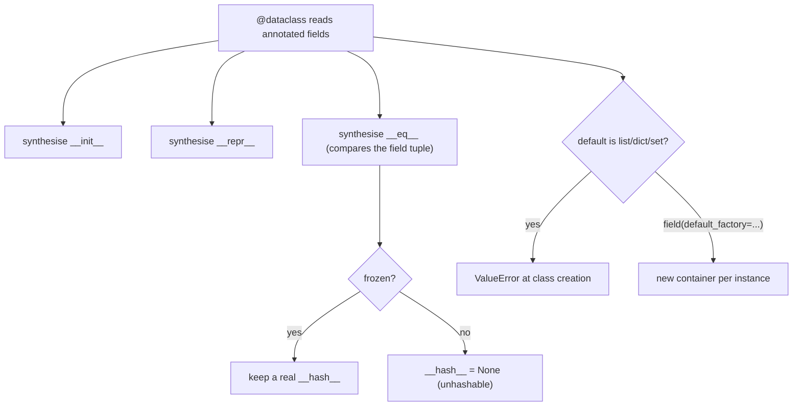

<!-- status: authored -->
# dataclasses & __slots__

## First principles

`@dataclass` reads the class's **annotated class-level fields** and **generates**
the boilerplate you'd otherwise hand-write:

```python
@dataclass
class Point:
    x: int
    y: int
    label: str = "origin"
# -> __init__(self, x, y, label="origin"), __repr__, __eq__ for free
```

Options:

| Argument | Effect |
|---|---|
| `frozen=True` | instances immutable (`__setattr__` raises) **and** hashable |
| `order=True` | generates `<`, `<=`, `>`, `>=` from the field tuple |
| `slots=True` (3.10+) | adds `__slots__` — fixed attribute names, no `__dict__` |
| `kw_only=True` | all fields keyword-only |

Two hard rules:

1. **No mutable defaults.** `tags: list = []` raises `ValueError` at class
   creation — one list would be shared by every instance. Use
   `field(default_factory=list)`.
2. **`eq` without `frozen` → unhashable.** Same rule as any class (topic 04):
   the generated `__eq__` sets `__hash__ = None` unless `frozen=True`.

**`__slots__`** (directly, or via `slots=True`) declares the exact set of allowed
instance attributes. No per-instance `__dict__` → less memory, and assigning an
undeclared name (a typo) raises `AttributeError` instead of silently creating
junk.

## The mechanism



## Practice

```bash
python code/foundations/21_dataclasses_and_slots/demo.py
```

```python title="code/foundations/21_dataclasses_and_slots/demo.py"
--8<-- "code/foundations/21_dataclasses_and_slots/demo.py"
```

## Scenarios

```bash
python code/foundations/21_dataclasses_and_slots/scenarios.py
```

### 1 — Mutable default without `default_factory`

!!! example "🔨 Build"
    `items: list[str] = field(default_factory=list)` — fresh list per instance.

!!! failure "💥 Break"
    `items: list = []` → `ValueError: mutable default <class 'list'> for field
    items is not allowed` at class-definition time.

!!! success "🔧 Fix"
    `field(default_factory=list)` (or `dict`, `set`, a lambda…).

!!! quote "🧠 Why it behaved that way"
    One generated `__init__` is shared by all instances; a literal `[]` default
    would be one shared list. Dataclass refuses rather than let that bug through.

### 2 — Mutating a frozen dataclass

!!! example "🔨 Build"
    `replace(money, cents=750)` → a new `Money`; original untouched.

!!! failure "💥 Break"
    `money.cents = 750` → `FrozenInstanceError`.

!!! success "🔧 Fix"
    `dataclasses.replace(obj, field=value)`.

!!! quote "🧠 Why it behaved that way"
    `frozen=True` generates a `__setattr__` that always raises — so instances are
    safe as dict keys / cache entries / shared values.

### 3 — Non-frozen dataclass is unhashable

!!! example "🔨 Build"
    `@dataclass(frozen=True)` — `{Tag("a"), Tag("a")}` collapses to one.

!!! failure "💥 Break"
    Plain `@dataclass`. `{Tag("a")}` → `TypeError: unhashable type: 'Tag'`.

!!! success "🔧 Fix"
    `frozen=True` (or `eq=False` to keep identity hashing).

!!! quote "🧠 Why it behaved that way"
    Generated `__eq__` + no `frozen` ⇒ `__hash__ = None`, preserving `a == b ⇒
    hash(a) == hash(b)`.

### 4 — `__slots__` catches attribute typos

!!! example "🔨 Build"
    `@dataclass(slots=True)`. `c.retires = 5` (typo) → `AttributeError`, pointed
    right at the mistake.

!!! failure "💥 Break"
    Plain `@dataclass`. `c.retires = 5` silently creates a dead attribute;
    `c.retries` is still the old value.

!!! success "🔧 Fix"
    `slots=True`.

!!! quote "🧠 Why it behaved that way"
    Without `__slots__`, any assignment lands in `__dict__`. `__slots__`
    restricts assignments to the declared names.

## Pitfalls & idioms

- Reach for `@dataclass` for any "bag of typed fields" class instead of
  hand-writing `__init__`/`__repr__`/`__eq__`.
- Mutable field default → `field(default_factory=...)`. Always.
- Want it hashable / usable as a key / safely shared → `frozen=True` + `replace`.
- `slots=True` for large numbers of instances (memory) and to catch typos.
  Caveats: no `__dict__` for ad-hoc attributes, `@cached_property` needs the name
  in slots, multiple inheritance with slots is fiddly.
- `__post_init__(self)` for validation and derived fields (runs after the
  generated `__init__`).
- `field(compare=False)` / `repr=False` / `init=False` to fine-tune per field.
- Alternatives: `typing.NamedTuple` (immutable, tuple-like, lighter),
  `pydantic.BaseModel` (validation/coercion, third-party), `attrs` (superset,
  third-party).
- `dataclasses.asdict` / `astuple` for serialization; `dataclasses.fields(obj)`
  to introspect.

## See also

- [Classes & OOP from first principles](19-classes-and-oop.md) — what's being generated
- [The data model & dunder methods](04-the-data-model-and-dunders.md) — `__eq__`/`__hash__` rule
- [Mutability & the mutable-default trap](03-mutability-and-the-default-arg-trap.md) — why bare `[]` defaults are banned
- [The memory model & weakref](36-memory-model-and-weakref.md) — `__slots__` and memory
- [functools](14-functools.md) — `cached_property` with `slots`

## Check yourself

1. `tags: list[str] = []` in a dataclass won't even define. What error, and the
   correct default?
2. You need `Money` instances as dict keys. Which `@dataclass` argument, and how
   do you then "change" one?
3. `{Config(...)}` raises `TypeError: unhashable type`. Why, and the one-word
   fix?
4. What does `slots=True` buy you, and what does it cost?
5. Where do you put validation logic for a dataclass, and when does it run?
