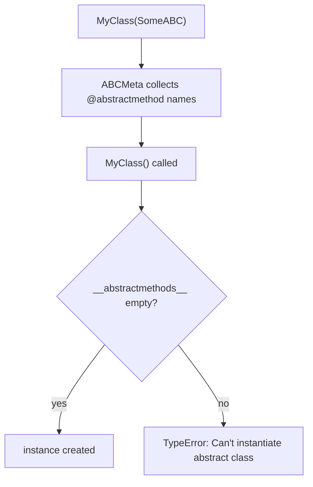

<!-- status: authored -->
# ABCs, Protocols & duck typing

## First principles

Python cares about **what an object can do**, not what it's declared to be. Three
ways to express "can do X":

| Approach | Enforced | `isinstance`? | Inheritance needed? |
|---|---|---|---|
| **Duck typing** | at call time (it just fails) | no | no |
| **`abc.ABC` + `@abstractmethod`** | at instantiation | yes | yes (subclass or `register`) |
| **`typing.Protocol`** | by the static type checker | only with `@runtime_checkable` (shallow) | no — structural |

- **Duck typing**: `def load(src): return src.read()`. Pass a file, a
  `StringIO`, a mock — anything with `.read()`. No check, no ceremony. This is the
  default.
- **ABC**: a base class you cannot instantiate until every `@abstractmethod` is
  implemented. `ABCMeta` gathers unimplemented abstract names into
  `__abstractmethods__` and blocks construction if it's non-empty. `isinstance`
  works; `collections.abc` also gives you **mixin methods** (implement
  `__getitem__` + `__len__`, get `__iter__`, `__contains__`, `index`, `count`).
- **Protocol**: "structural typing" for mypy/pyright — *any* class with the right
  methods satisfies it, no base class. `@runtime_checkable` enables `isinstance`,
  but it only checks that the method **names exist** — not signatures.

## The mechanism



## Practice

```bash
python code/foundations/22_abcs_protocols_duck_typing/demo.py
```

```python title="code/foundations/22_abcs_protocols_duck_typing/demo.py"
--8<-- "code/foundations/22_abcs_protocols_duck_typing/demo.py"
```

## Scenarios

```bash
python code/foundations/22_abcs_protocols_duck_typing/scenarios.py
```

### 1 — Incomplete ABC subclass

!!! example "🔨 Build"
    Implement every `@abstractmethod`. `MemRepo()` constructs fine.

!!! failure "💥 Break"
    Skip one (`put`). `HalfRepo()` → `TypeError: Can't instantiate abstract
    class HalfRepo with abstract method put`.

!!! success "🔧 Fix"
    Implement all abstract methods.

!!! quote "🧠 Why it behaved that way"
    `ABCMeta` tracks unimplemented abstract names and refuses construction while
    any remain — the check is at instantiation, not first use.

### 2 — `isinstance` against a non-`runtime_checkable` Protocol

!!! example "🔨 Build"
    `@runtime_checkable class ClosableRT(Protocol)`. `isinstance(handle,
    ClosableRT)` → `True`.

!!! failure "💥 Break"
    Plain `Protocol`. `isinstance(handle, Closable)` → `TypeError: Instance and
    class checks can only be used with @runtime_checkable protocols`.

!!! success "🔧 Fix"
    Add `@runtime_checkable`.

!!! quote "🧠 Why it behaved that way"
    Protocols are a static-checking tool; runtime `isinstance` is opt-in and
    still only structural.

### 3 — `runtime_checkable` is a name-only check

!!! example "🔨 Build"
    A `RealSender` with `send(self, message)` passes `isinstance` **and** works.

!!! failure "💥 Break"
    `WrongSender.send(self)` (no `message` param) also passes
    `isinstance(x, Sender)` — the check only sees the name `send` — then
    `x.send("hello")` raises `TypeError`.

!!! success "🔧 Fix"
    Trust the static checker for signatures; at runtime, test the behaviour you
    depend on.

!!! quote "🧠 Why it behaved that way"
    `@runtime_checkable` verifies attribute *existence*, not shape.

### 4 — Subclassing `dict` vs `UserDict` / `MutableMapping`

!!! example "🔨 Build"
    Subclass `UserDict` (or `MutableMapping`), override `__setitem__`. `update`,
    `__init__`, everything routes through it.

!!! failure "💥 Break"
    `class LowerDict(dict)` overriding `__setitem__`. `d["Name"]=...` is
    lowercased, but `d.update({...})` and `LowerDict(TITLE=...)` **bypass** your
    override — the dict is now inconsistent.

!!! success "🔧 Fix"
    Subclass `collections.abc.MutableMapping` or `collections.UserDict`.

!!! quote "🧠 Why it behaved that way"
    The built-in `dict`'s C methods write to internal storage directly, not
    through your Python `__setitem__`. `MutableMapping` funnels every operation
    through the few methods you implement.

## Pitfalls & idioms

- Default to **duck typing**. Add an ABC/Protocol only when you have multiple
  implementations and want the interface documented and checked.
- **ABC** when you own the hierarchy and want shared mixin behaviour + a hard
  "you must implement this".
- **Protocol** when implementations shouldn't have to import or inherit from you
  (e.g. accepting "anything file-like").
- Don't subclass `dict`/`list`/`str` to change behaviour — use `UserDict` /
  `UserList` / `UserString` or the `collections.abc` bases.
- `collections.abc` for `isinstance(x, Iterable)`, `Sequence`, `Mapping`,
  `Hashable`, `Callable`, `Sized`, …
- `@abstractmethod` composes with `@property`, `@classmethod`, `@staticmethod`.
- A `try: x.method() except AttributeError:` is often clearer than an
  `isinstance` gate (EAFP — see [Exceptions](17-exceptions.md)).

## See also

- [Inheritance, MRO & super()](20-inheritance-and-mro.md) — ABCs use `ABCMeta`
- [The data model & dunder methods](04-the-data-model-and-dunders.md) — the protocols the `abc` classes formalise
- [Type hints, typing & mypy](23-type-hints-and-typing.md) — where Protocols really pay off
- [Metaclasses & __init_subclass__](25-metaclasses.md) — `ABCMeta` is a metaclass
- [Iterators & the iterator protocol](10-iterators-and-the-iterator-protocol.md) — `collections.abc.Iterable`/`Iterator`

## Check yourself

1. You want to accept "anything with a `.read()` method". ABC, Protocol, or
   nothing at all — and why?
2. `MyHandler()` raises `TypeError: Can't instantiate abstract class`. What's
   the fix, and when is the error raised?
3. `isinstance(x, MyProtocol)` raises `TypeError`. What decorator is missing, and
   what does it *not* check?
4. `class UpperList(list)` overriding `append` — why does `+=` / `extend` /
   slicing still store lowercase?
5. When does an ABC give you more than a Protocol?
