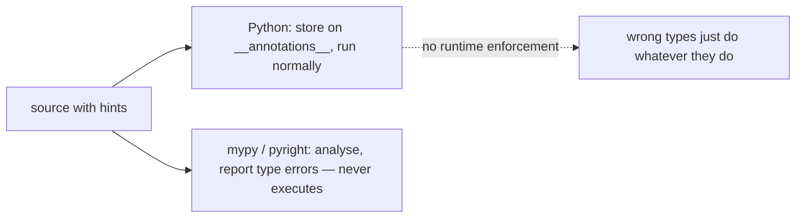

<!-- status: authored -->
# Type hints, typing & mypy

## First principles

A type annotation is **metadata**. Python stores it and does **nothing else**:

```python
def add(a: int, b: int) -> int:
    return a + b

add("x", "y")   # -> "xy"   no error, the annotation is ignored at runtime
```

The value comes from a **separate static type checker** — `mypy`, `pyright`,
`pyre` — that reads the annotations and reports mismatches *before* you run the
code. If you never run a checker, hints are just documentation.

Key pieces of `typing`:

| Hint | Means |
|---|---|
| `list[int]`, `dict[str, int]`, `tuple[int, ...]` | parameterised containers (built-in since 3.9) |
| `X | None` / `Optional[X]` | "X or None" — **not** "argument is optional" |
| `X | Y` / `Union[X, Y]` | either type |
| `Any` | opt out of checking |
| `TypeVar("T")` | a generic type variable — link input and output types |
| `Literal["r", "w"]` | one of a fixed set of values |
| `TypedDict` | a dict with a fixed set of typed keys |
| `Protocol` | structural interface ([ABCs & Protocols](22-abcs-protocols-duck-typing.md)) |
| `Callable[[int], str]` | a function taking `int`, returning `str` |

`from __future__ import annotations` (PEP 563) stores every annotation as a
**string** (cheap, allows forward references). Read them back with
`typing.get_type_hints(obj)`, never raw `obj.__annotations__`.

## The mechanism



## Practice

```bash
python code/foundations/23_type_hints_and_typing/demo.py
# and, if you have it:  mypy code/foundations/23_type_hints_and_typing/demo.py
```

```python title="code/foundations/23_type_hints_and_typing/demo.py"
--8<-- "code/foundations/23_type_hints_and_typing/demo.py"
```

## Scenarios

```bash
python code/foundations/23_type_hints_and_typing/scenarios.py
```

### 1 — Trusting an annotation at runtime

!!! example "🔨 Build"
    `n = int(n)` at the boundary — coerce/validate; don't rely on the hint.

!!! failure "💥 Break"
    `def take(n: int): return list(range(n))` called with `"3"`. No signature
    error; `range("3")` raises `TypeError` deep inside.

!!! success "🔧 Fix"
    Validate/coerce explicitly at trust boundaries (or use pydantic, which reads
    the hints and enforces them).

!!! quote "🧠 Why it behaved that way"
    The interpreter never compares an argument to its annotation.

### 2 — Annotation says `list`, default says `None`

!!! example "🔨 Build"
    `into: list[int] | None = None`, then `into = [] if into is None else into`.

!!! failure "💥 Break"
    `into: list[int] = None`. mypy flags it; at runtime `into` is `None` →
    `into.append(...)` raises `AttributeError`.

!!! success "🔧 Fix"
    `Optional[list[int]] = None` + build the list in the body.

!!! quote "🧠 Why it behaved that way"
    The annotation is a promise the runtime doesn't keep; the actual default
    value is what runs.

### 3 — Raw `__annotations__` are strings

!!! example "🔨 Build"
    `get_type_hints(func)` → `{'a': int, 'b': str, ...}` (real classes).

!!! failure "💥 Break"
    `func.__annotations__` under `from __future__ import annotations` →
    `{'a': 'int', ...}` — every value is a `str`.

!!! success "🔧 Fix"
    `typing.get_type_hints(obj)`.

!!! quote "🧠 Why it behaved that way"
    PEP 563 defers annotation evaluation by storing the source text.
    `get_type_hints` evaluates it in the correct namespace.

### 4 — `Optional` ≠ optional parameter

!!! example "🔨 Build"
    `def greet(name: str | None = None)` — optional *type* **and** a default.
    `greet()` works.

!!! failure "💥 Break"
    `def greet(name: Optional[str])` — no default. `greet()` → `TypeError:
    missing 1 required positional argument`.

!!! success "🔧 Fix"
    Add `= None`.

!!! quote "🧠 Why it behaved that way"
    `Optional[str]` describes the value ("str or None"). Whether the argument can
    be omitted is decided entirely by the presence of a default.

## Pitfalls & idioms

- Run a type checker (`mypy`, `pyright`) — hints without one are just comments.
- `X | None` for "maybe absent"; the default (`= None`) is separate.
- Validate external data explicitly; don't trust that inputs match their hints.
- `get_type_hints` to introspect annotations, not `__annotations__`.
- `Any` is contagious — it silences checking on everything it touches. Prefer
  `object` + narrowing, or a precise type.
- `# type: ignore[code]` with the specific error code, not a bare `# type:
  ignore`.
- `typing.cast(T, x)` asserts a type to the checker with zero runtime effect —
  use sparingly.
- Built-in generics (`list[int]`) over `typing.List[int]` on 3.9+.
- `TypedDict` for JSON-shaped dicts; `@dataclass` / `NamedTuple` /
  `pydantic.BaseModel` when you'd rather have an object.

## See also

- [Functions: args/kwargs, closures, nonlocal](12-functions-args-closures.md) — defaults vs types
- [ABCs, Protocols & duck typing](22-abcs-protocols-duck-typing.md) — `Protocol` for structural typing
- [dataclasses & __slots__](21-dataclasses-and-slots.md) — dataclasses read annotations
- [The execution & import model](01-execution-and-import-model.md) — PEP 563 and import cost
- [Mutability & the mutable-default trap](03-mutability-and-the-default-arg-trap.md)

## Check yourself

1. `def scale(x: float) -> float` returns a wrong answer when called with a
   string — no `TypeError`. Why? Where should the check live?
2. `def f(items: list[str] = None)` — what does mypy say, and what breaks at
   runtime?
3. Under `from __future__ import annotations`, `func.__annotations__["n"]` is
   `'int'` (a string). How do you get the class `int`?
4. `def connect(host: Optional[str])` — a caller does `connect()` and gets a
   `TypeError`. Why isn't it "optional"?
5. What does `mypy` do that `python` never does?
