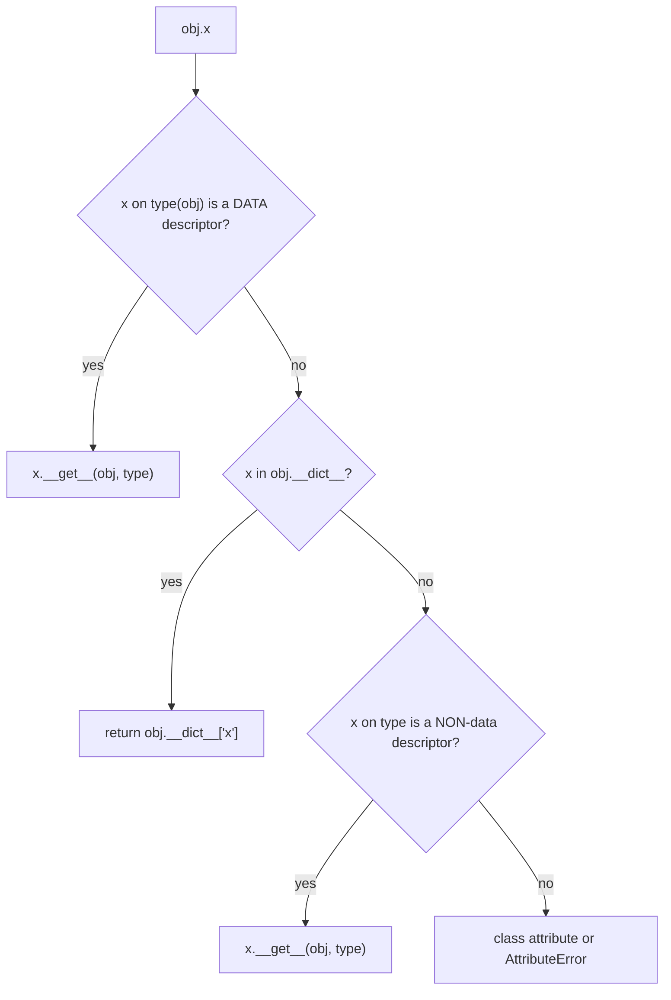

<!-- status: authored -->
# Descriptors

## First principles

A **descriptor** is an object that customises what `instance.attr` *does*. It
lives as a **class attribute** and defines one or more of:

```python
__get__(self, instance, owner)      # read  instance.attr
__set__(self, instance, value)      # write instance.attr = value
__delete__(self, instance)          # del   instance.attr
__set_name__(self, owner, name)     # called once at class creation: "you are `name`"
```

Two categories, and the difference decides lookup priority:

- **Data descriptor** — defines `__set__` or `__delete__`. **Wins over the
  instance `__dict__`** on read and write. `property` is one.
- **Non-data descriptor** — defines only `__get__`. **The instance `__dict__`
  shadows it.**

Attribute lookup order for `obj.x`:

```
data descriptor on type   →   instance __dict__   →   non-data descriptor on type   →   class attr   →   AttributeError
```

You already use descriptors constantly: **plain functions are non-data
descriptors** — `obj.method` is `type(obj).__dict__["method"].__get__(obj, type(obj))`,
which returns a *bound method*. `property`, `classmethod`, `staticmethod`,
`functools.cached_property` are all descriptors too.

## The mechanism



## Practice

```bash
python code/foundations/24_descriptors/demo.py
```

```python title="code/foundations/24_descriptors/demo.py"
--8<-- "code/foundations/24_descriptors/demo.py"
```

## Scenarios

```bash
python code/foundations/24_descriptors/scenarios.py
```

### 1 — Descriptor stores state on itself

!!! example "🔨 Build"
    `__set__` writes to `instance.__dict__[self.name]`. Each `Box` keeps its own
    value.

!!! failure "💥 Break"
    `__set__` does `self._value = value`. There's one descriptor object for the
    whole class, so `Box(2)` overwrites `Box(1)`'s value.

!!! success "🔧 Fix"
    Store per-instance: `instance.__dict__[self.name] = value` (name from
    `__set_name__`), or a `WeakKeyDictionary` keyed by the instance.

!!! quote "🧠 Why it behaved that way"
    `v = Field()` is a class attribute — a single object shared by every
    instance.

### 2 — Non-data descriptor shadowed

!!! example "🔨 Build"
    Descriptor with `__get__` **and** `__set__` (a data descriptor). `m.kind =
    "manual"` is blocked; `m.kind` stays `"computed"`.

!!! failure "💥 Break"
    `__get__`-only. `m.kind = "manual"` lands in `m.__dict__` and shadows the
    descriptor forever after.

!!! success "🔧 Fix"
    Add `__set__` (even one that raises `AttributeError`) to make it a data
    descriptor.

!!! quote "🧠 Why it behaved that way"
    Instance `__dict__` beats a non-data descriptor; a data descriptor beats the
    instance `__dict__`.

### 3 — Shared hardcoded storage key

!!! example "🔨 Build"
    `__set_name__` derives `self.key = "_" + name`, unique per attribute.

!!! failure "💥 Break"
    Both `width` and `height` descriptors store into `instance._value`. Setting
    `height` clobbers `width`.

!!! success "🔧 Fix"
    Use `__set_name__` to get a per-attribute key.

!!! quote "🧠 Why it behaved that way"
    A descriptor instance doesn't know its own attribute name unless
    `__set_name__` tells it.

### 4 — Descriptor on the instance

!!! example "🔨 Build"
    Define the descriptor in the class body. `__get__` fires.

!!! failure "💥 Break"
    `t.x = Descriptor()`. It's just an instance attribute — `__get__` is never
    called; `t.x` returns the descriptor object itself.

!!! success "🔧 Fix"
    Put descriptors in the class body, not on instances.

!!! quote "🧠 Why it behaved that way"
    The protocol only fires for attributes found on the **type** during lookup.

## Pitfalls & idioms

- 90% of the time you want a `property` or `functools.cached_property`, not a
  hand-rolled descriptor. Reach for a custom one when you need the same
  managed-attribute behaviour on **many** attributes or **across classes**
  (validation, unit conversion, ORM fields, lazy loading).
- Always implement `__set_name__`; store per-instance in `instance.__dict__` (if
  the class has one) or a `WeakKeyDictionary`.
- Add `__set__` to make a descriptor authoritative (data descriptor).
- `__get__` handling `instance is None` should return `self`, so
  `TheClass.the_descriptor` gives you the descriptor for introspection.
- `cached_property` is a *non-data* descriptor on purpose — that's how the cached
  value in `__dict__` takes over after first access
  ([functools](14-functools.md)).
- `__slots__` classes have no `__dict__`; descriptors must store elsewhere.

## See also

- [Classes & OOP from first principles](19-classes-and-oop.md) — `property`, attribute lookup
- [functools](14-functools.md) — `cached_property` is a descriptor
- [The data model & dunder methods](04-the-data-model-and-dunders.md)
- [Metaclasses & __init_subclass__](25-metaclasses.md) — the other class-customisation hook
- [dataclasses & __slots__](21-dataclasses-and-slots.md)

## Check yourself

1. Why does `obj.method` give you a bound method rather than the plain function?
2. A validation descriptor works for one instance but all instances share the
   same value. What's wrong, and where should the value live?
3. `m.status = "x"` succeeds and permanently hides your computed `status`
   descriptor. What kind of descriptor did you write, and how do you fix it?
4. What is `__set_name__` for, and what breaks without it when a class has two
   descriptors of the same type?
5. When is a custom descriptor the right tool over a `property`?
