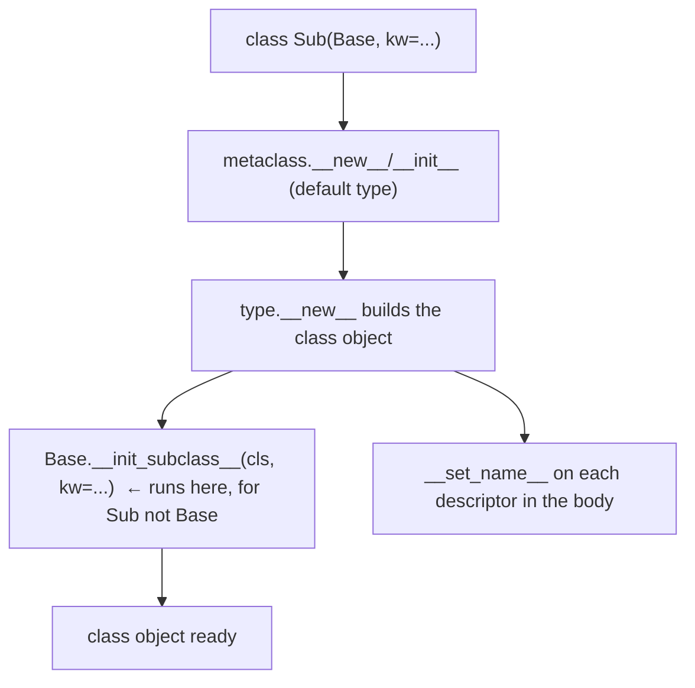

<!-- status: authored -->
# Metaclasses & __init_subclass__

## First principles

A class is an object. Its type is its **metaclass**, which defaults to `type`.
Running a `class` statement is essentially:

```python
MyClass = type("MyClass", (Base,), namespace_dict)
```

A **metaclass** customises **class creation** — its `__new__` / `__init__` run
once, when the class is defined, and can inspect or rewrite the namespace, inject
attributes, register the class, or forbid it.

You almost never need one. In order of preference:

1. **A class decorator** — `MyClass = deco(MyClass)`. Simplest, composable.
2. **`__init_subclass__`** — a classmethod on a base, called automatically for
   **every subclass** (not the base itself). Handles "register plugins",
   "validate subclasses", "accept class keyword args". No metaclass required, so
   it composes with `ABC`, `Enum`, etc.
3. **`__set_name__`** — for descriptors that need their attribute name
   ([Descriptors](24-descriptors.md)).
4. **A metaclass** — only when you must control the class object itself before it
   exists, or the whole `class` statement's behaviour.

Class **keyword arguments** flow to `__init_subclass__`:

```python
class Plugin:
    def __init_subclass__(cls, /, *, key, **kwargs):
        super().__init_subclass__(**kwargs)
        registry[key] = cls

class Json(Plugin, key="json"):   # `key="json"` -> __init_subclass__
    ...
```

## The mechanism



## Practice

```bash
python code/foundations/25_metaclasses/demo.py
```

```python title="code/foundations/25_metaclasses/demo.py"
--8<-- "code/foundations/25_metaclasses/demo.py"
```

## Scenarios

```bash
python code/foundations/25_metaclasses/scenarios.py
```

### 1 — Metaclass conflict with `ABC`

!!! example "🔨 Build"
    Base is an `ABC`; registration via `__init_subclass__`. No metaclass, no
    conflict.

!!! failure "💥 Break"
    `class Base(ABC, metaclass=Registry)` → `TypeError: metaclass conflict`.
    `ABC` already uses `ABCMeta`.

!!! success "🔧 Fix"
    `__init_subclass__`.

!!! quote "🧠 Why it behaved that way"
    A class has exactly one metaclass, derived from its bases; every base's
    metaclass must be compatible. Two unrelated metaclasses can't merge.

### 2 — `__init_subclass__` kwargs not forwarded

!!! example "🔨 Build"
    `def __init_subclass__(cls, /, *, route, **kwargs): super().__init_subclass__(**kwargs)`.

!!! failure "💥 Break"
    `def __init_subclass__(cls):` (no params). `class Home(Handler, route="/")` →
    `TypeError: __init_subclass__() got an unexpected keyword argument 'route'`.

!!! success "🔧 Fix"
    Declare the keywords you consume; forward the rest with `**kwargs`.

!!! quote "🧠 Why it behaved that way"
    Class-header keyword arguments are passed to `__init_subclass__` and to
    `type.__new__`.

### 3 — Registering abstract intermediates

!!! example "🔨 Build"
    Opt in with a class keyword: `class Square(Polygon, register=True)`.
    Intermediate abstract layers don't opt in.

!!! failure "💥 Break"
    Register unconditionally. `Polygon` — an abstract layer you can't
    instantiate — ends up in the registry.

!!! success "🔧 Fix"
    Explicit opt-in (`register=True`, or a decorator).

!!! quote "🧠 Why it behaved that way"
    `__init_subclass__` fires for every subclass at every depth. Checking
    `__abstractmethods__` doesn't help — `ABCMeta` sets it *after*
    `__init_subclass__` runs.

### 4 — Metaclass as a base class

!!! example "🔨 Build"
    `class Service(metaclass=Meta)`. `Service().tag` works.

!!! failure "💥 Break"
    `class Service(Meta)`. `Meta` becomes a base, so `Service` is a class
    factory. `Service()` → `TypeError` (it wants `type`'s arguments).

!!! success "🔧 Fix"
    `metaclass=Meta` keyword, not a positional base.

!!! quote "🧠 Why it behaved that way"
    Positional entries in the class header are **base classes**. The metaclass
    goes in the `metaclass=` keyword.

## Pitfalls & idioms

- "If you're wondering whether you need a metaclass, you don't." Try a class
  decorator or `__init_subclass__` first.
- `__init_subclass__` runs for subclasses, never the defining class; always
  `super().__init_subclass__(**kwargs)`.
- Registry patterns want explicit opt-in so abstract/base layers don't sneak in.
- `metaclass=` is a keyword; bases are positional.
- A metaclass propagates to all subclasses and conflicts with other metaclassed
  bases — a real cost.
- Legitimate metaclass uses: `abc.ABCMeta`, `enum.EnumMeta`,
  ORM/serialization frameworks, `type`-level `__prepare__` for ordered/namespace
  tricks.
- `type(obj)` (one arg) → the class; `type(name, bases, ns)` (three args) →
  a new class.

## See also

- [Inheritance, MRO & super()](20-inheritance-and-mro.md) — metaclass compatibility rules
- [ABCs, Protocols & duck typing](22-abcs-protocols-duck-typing.md) — `ABCMeta` in practice
- [Descriptors](24-descriptors.md) — `__set_name__`, the other creation hook
- [Decorators](13-decorators.md) — class decorators as the lighter alternative
- [The execution & import model](01-execution-and-import-model.md) — class bodies run at import

## Check yourself

1. `class Model(Base, metaclass=MyMeta)` where `Base` is an `ABC` →
   `TypeError: metaclass conflict`. What's the metaclass-free fix?
2. `class Route(Handler, path="/x")` → `TypeError: __init_subclass__() got an
   unexpected keyword argument 'path'`. What's missing in `__init_subclass__`?
3. Your plugin registry contains an abstract base class you never meant to
   register. Why, and how do you exclude it?
4. What's the difference between `class C(Meta)` and `class C(metaclass=Meta)`?
5. Name two standard-library features that are implemented with a metaclass.
