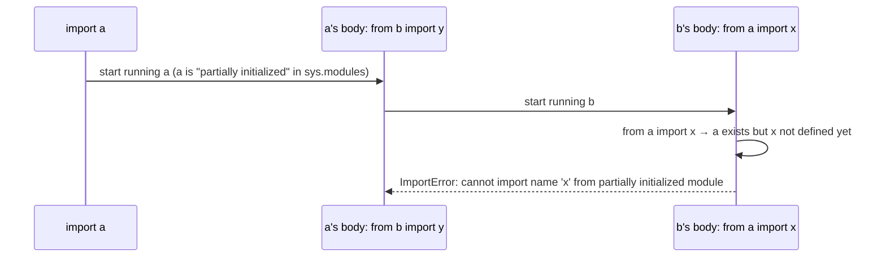

<!-- status: authored -->
# Modules, packages & circular imports

## First principles

- A **module** is one `.py` file. Importing it runs its body **once**, top to
  bottom, and caches the module object in `sys.modules`
  ([The execution & import model](01-execution-and-import-model.md)).
- A **package** is a directory, normally with `__init__.py` (its body runs when
  the package is first imported). A directory without `__init__.py` is a
  *namespace package* — usable but with fewer guarantees.
- `import a.b.c` runs `a`, `a.b`, `a.b.c` and binds **only `a`** in your
  namespace. You then reach the rest as `a.b.c`.
- `from a.b import c` binds `c`.
- **Relative imports** (`from . import x`, `from ..pkg import y`) resolve against
  `__package__` — they only work when the file is imported *as part of a
  package*, not run directly as a script.
- `__all__` in a module is the export list for `from module import *`.

**Circular imports** are the classic failure: `a` imports `b`, `b` imports `a`.
While `a`'s body is still running, `b` runs and tries `from a import name` — but
`a` is only half-initialised and `name` doesn't exist yet.

## The mechanism



## Practice

```bash
python code/foundations/26_modules_packages_imports/demo.py
```

```python title="code/foundations/26_modules_packages_imports/demo.py"
--8<-- "code/foundations/26_modules_packages_imports/demo.py"
```

## Scenarios

```bash
python code/foundations/26_modules_packages_imports/scenarios.py
```

### 1 — Circular import with `from x import name`

!!! example "🔨 Build"
    `import pkg.b` and call `pkg.b.b_val()` — binds the *module* (which exists
    early), not a name from it.

!!! failure "💥 Break"
    `from pkg.b import b_val` on both sides → `ImportError: cannot import name
    'a_val' from partially initialized module`.

!!! success "🔧 Fix"
    Import the module (not the name), or defer the import into the function body,
    or move shared code to a third module.

!!! quote "🧠 Why it behaved that way"
    Mid-import, the module is registered in `sys.modules` but its body hasn't
    finished defining everything. A `from … import name` for something not yet
    bound fails.

### 2 — Relative import run as a script

!!! example "🔨 Build"
    `python -m pkg.main` — runs it with a package context, so `from . import
    helpers` resolves.

!!! failure "💥 Break"
    `python pkg/main.py` → `ImportError: attempted relative import with no known
    parent package`.

!!! success "🔧 Fix"
    `python -m pkg.main`, or use absolute imports.

!!! quote "🧠 Why it behaved that way"
    Run directly, `__name__ == "__main__"` and `__package__` is empty, so `.` has
    nothing to resolve against.

### 3 — `from pkg import *` without `__all__`

!!! example "🔨 Build"
    Define `__all__ = ["VERSION", "public_api"]`. `*` copies only those.

!!! failure "💥 Break"
    No `__all__`. `*` also drags in `os`, `sys`, and every other public name the
    module imported for its own use.

!!! success "🔧 Fix"
    Set `__all__` — and prefer explicit imports over `*` outside the REPL.

!!! quote "🧠 Why it behaved that way"
    Without `__all__`, `import *` copies every name not starting with `_`.

### 4 — `import a.b.c` binds only `a`

!!! example "🔨 Build"
    `from a.b import c` (or `import a.b.c as c`). `c` is bound.

!!! failure "💥 Break"
    `import a.b.c` then `c.func()` → `NameError: name 'c' is not defined`. Only
    `a` was bound.

!!! success "🔧 Fix"
    `from a.b import c` or `import a.b.c as c`.

!!! quote "🧠 Why it behaved that way"
    `import a.b.c` executes all three modules but binds the top-level name; the
    submodule is reachable as `a.b.c`.

## Pitfalls & idioms

- Prefer **absolute imports** (`from myapp.utils import helper`). Use explicit
  relative imports (`from . import x`) only within a package, and never run such
  a file as a script — use `python -m`.
- Break circular imports by: importing the module not the name, deferring the
  import into a function, or extracting shared code into a lower-level module.
- `__init__.py`: keep it light (re-exports, version). Heavy work there slows
  every import of the package.
- `__all__` documents the public API and tames `import *`.
- `python -m package` runs `package/__main__.py`.
- Don't name your file after a stdlib module (`queue.py`, `types.py`, …) — it
  shadows it ([topic 01](01-execution-and-import-model.md)).
- `sys.modules` is the import cache — deleting an entry forces a re-import
  (rarely what you want; restart instead).
- A package installed with `pip install -e .` and a `src/` layout avoids the
  "imports work from the repo root but not when installed" class of bug
  ([Environments & packaging](27-environments-and-packaging.md)).

## See also

- [The execution & import model](01-execution-and-import-model.md) — `sys.modules`, body-runs-once, `.pyc`
- [venv, pip, pyproject.toml & wheels](27-environments-and-packaging.md) — `sys.path`, installed vs local
- [Scope & namespaces (LEGB)](16-scope-legb.md) — module globals
- [Type hints, typing & mypy](23-type-hints-and-typing.md) — `from __future__ import annotations` helps with import-time forward refs

## Check yourself

1. `ImportError: cannot import name 'X' from partially initialized module` — what
   pattern causes this, and three ways to fix it?
2. `python app/cli.py` fails with "attempted relative import with no known parent
   package" but `python -m app.cli` works. Why?
3. After `from mypkg import *`, the name `json` is in your namespace. Where did it
   come from and how do you stop it?
4. `import os.path` — what name does that bind? How do you call `os.path.join`?
5. Where should you put code that must run once when a package is first imported?
