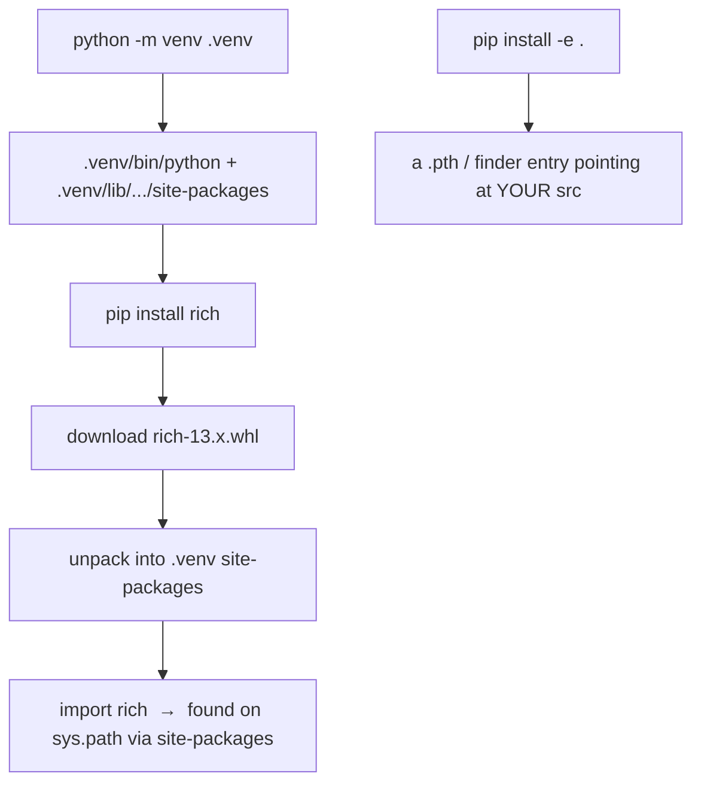

<!-- status: authored -->
# venv, pip, pyproject.toml & wheels

## First principles

- A **virtual environment** is a directory with its own `python` executable and
  its own `site-packages`. Creating it (`python -m venv .venv`) and "activating"
  it just puts that `python` first on `PATH` and points `sys.prefix` into it.
  `sys.prefix != sys.base_prefix` ⇒ you're in a venv.
- **`pip install X`** downloads a **wheel** (`.whl` — a pre-built zip of the
  package) and unpacks it into the *active* environment's `site-packages`. If
  only a **sdist** (`.tar.gz` source) is available, pip builds a wheel first.
- **`pip install -e .`** ("editable") links your *source directory* into
  `site-packages` instead of copying — edits take effect without reinstalling.
- **`pyproject.toml`** is the standard project file:
  - `[build-system]` — how to build the package (`requires`, `build-backend`);
  - `[project]` — `name`, `version`, `requires-python`, `dependencies`,
    `[project.optional-dependencies]` (extras).
  Parse it with **`tomllib`** (stdlib since 3.11 — read-only, binary mode).
- The **import name ≠ the distribution name**: `import yaml` ← `PyYAML`,
  `import bs4` ← `beautifulsoup4`, `import cv2` ← `opencv-python`.

## The mechanism



## Practice

```bash
python code/foundations/27_environments_and_packaging/demo.py
```

```python title="code/foundations/27_environments_and_packaging/demo.py"
--8<-- "code/foundations/27_environments_and_packaging/demo.py"
```

## Scenarios

```bash
python code/foundations/27_environments_and_packaging/scenarios.py
```

### 1 — A local file shadows an installed package

!!! example "🔨 Build"
    No file named after a dependency. `import requests` finds the real package in
    `site-packages`.

!!! failure "💥 Break"
    A `requests.py` (or `click.py`, `email.py`) in your project root. `sys.path`
    checks the script dir first → your file wins, the package is unreachable.

!!! success "🔧 Fix"
    Rename your module. Use a `src/` layout so your package isn't importable from
    the repo root by accident.

!!! quote "🧠 Why it behaved that way"
    `sys.path[0]` is the script directory / cwd, ahead of `site-packages`.

### 2 — `tomllib.load` needs binary mode

!!! example "🔨 Build"
    `with open(path, "rb") as f: tomllib.load(f)`.

!!! failure "💥 Break"
    `open(path)` (text mode) → `TypeError: File must be opened in binary mode`.

!!! success "🔧 Fix"
    `"rb"`, or `tomllib.loads(text)` if you already have a string.

!!! quote "🧠 Why it behaved that way"
    TOML is defined as UTF-8; `tomllib` reads bytes and decodes them itself.

### 3 — `tomllib` has no writer

!!! example "🔨 Build"
    Template the TOML string yourself for simple output; `tomllib.loads` to read
    it back.

!!! failure "💥 Break"
    `tomllib.dump(...)` → `AttributeError: module 'tomllib' has no attribute
    'dump'`.

!!! success "🔧 Fix"
    String templating for simple cases; `tomli-w` or `tomlkit` (third-party) for
    real serialization.

!!! quote "🧠 Why it behaved that way"
    The stdlib deliberately shipped only the parser.

### 4 — Import name vs distribution name

!!! example "🔨 Build"
    Map the import name to its distribution first:
    `packages_distributions()["_pytest"]` → `["pytest"]`, then
    `metadata.version("pytest")`.

!!! failure "💥 Break"
    `metadata.version("_pytest")` → `PackageNotFoundError`. `_pytest` is an
    *import* package; the *distribution* that ships it is `pytest`. (In the wild:
    `import yaml` ← `PyYAML`, `import cv2` ← `opencv-python`, `import PIL` ←
    `Pillow`.)

!!! success "🔧 Fix"
    `importlib.metadata.packages_distributions()` to translate, then query the
    distribution name.

!!! quote "🧠 Why it behaved that way"
    The name you import and the name pip installs are independent metadata.

## Pitfalls & idioms

- Always work in a venv (`python -m venv .venv && source .venv/bin/activate`).
  One per project.
- `python -m pip install ...` — the `-m` guarantees you hit *this* interpreter's
  pip, not some other Python's on `PATH`.
- Declare dependencies in `pyproject.toml` `[project.dependencies]`. Use
  `requirements.txt` (or a lock file: `pip-tools`, `uv`, `poetry`) for
  **reproducible** installs with pinned versions.
- Version specifiers: `>=1.2,<2` (compatible range), `~=1.4.2` (`>=1.4.2,<1.5`),
  `==1.4.*`. Avoid bare `package` in anything you need to reproduce.
- `pip install -e .` for the package you're developing, so imports resolve the
  same way installed and local.
- `src/` layout keeps the repo root off `sys.path` and catches "works locally,
  fails when installed" bugs.
- `importlib.metadata` (stdlib) for version/requires/entry-points at runtime —
  don't hardcode `__version__` in two places.
- `pipx` for installing CLI *applications* in isolation; `uv` / `hatch` /
  `poetry` as faster all-in-one workflow tools.

## See also

- [The execution & import model](01-execution-and-import-model.md) — `sys.path`, `.pyc`
- [Modules, packages & circular imports](26-modules-packages-imports.md) — package layout, `-m`
- [Serialization: json, pickle, csv, struct](29-serialization-stdlib.md) — `tomllib` alongside `json`
- [Type hints, typing & mypy](23-type-hints-and-typing.md) — dev dependencies / extras

## Check yourself

1. How can you tell from Python whether you're running inside a virtual
   environment?
2. `pip install foo` "works" but `import foo` in your script fails. Name two
   likely causes.
3. `tomllib.load(open("pyproject.toml"))` raises `TypeError`. What's the fix?
4. You want to write a `pyproject.toml` from a dict. Why can't `tomllib` do it,
   and what can?
5. `import PIL` works but `pip show PIL` says "not found". What's the
   distribution actually called, and how would you find that programmatically?
