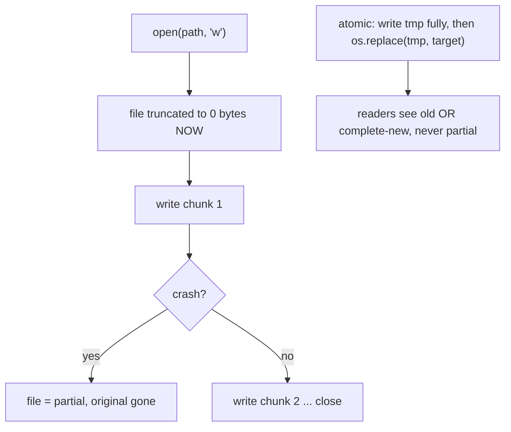

<!-- status: authored -->
# File I/O & pathlib

## First principles

`open(path, mode, encoding=...)` returns a **file object**. The mode decides
everything:

| Mode | You get | Newlines | Bytes ↔ text |
|---|---|---|---|
| `"r"` / `"w"` / `"a"` (text) | `str` | translated (`\r\n` ↔ `\n`) | decoded/encoded with `encoding` |
| `"rb"` / `"wb"` / `"ab"` (binary) | `bytes` | untouched | raw |

- **Text mode** requires an `encoding` (default is platform-dependent — always
  pass `encoding="utf-8"`). Feeding it non-UTF-8 bytes → `UnicodeDecodeError`.
- **Iterating a file yields lines lazily** — `for line in f:` reads one at a time.
  `f.read()` / `f.readlines()` load the whole file into memory.
- **A relative path is resolved against `os.getcwd()`** — the directory the
  process was launched from, *not* where the script lives. Anchor paths to
  `Path(__file__).resolve().parent` (for files shipped with code) or an explicit
  configured directory.
- **`open("w")` truncates the file immediately** — before you write anything. A
  crash mid-write leaves a partial file and no original. Write to a temp file,
  then `os.replace(tmp, target)` (atomic).

`pathlib.Path` is the modern API: `Path("a") / "b" / "c.txt"`, `.name`, `.stem`,
`.suffix`, `.parent`, `.with_suffix()`, `.read_text()` / `.write_text()`,
`.read_bytes()` / `.write_bytes()`, `.exists()`, `.glob()` / `.rglob()`,
`.mkdir(parents=True, exist_ok=True)`, `.resolve()`.

## The mechanism



## Practice

```bash
python code/foundations/28_file_io_and_pathlib/demo.py
```

```python title="code/foundations/28_file_io_and_pathlib/demo.py"
--8<-- "code/foundations/28_file_io_and_pathlib/demo.py"
```

## Scenarios

```bash
python code/foundations/28_file_io_and_pathlib/scenarios.py
```

### 1 — Relative path vs the cwd

!!! example "🔨 Build"
    `Path(__file__).resolve().parent / "config.ini"` — anchored, works from any
    directory.

!!! failure "💥 Break"
    `open("config.ini")`. Fine from the repo root; run from elsewhere →
    `FileNotFoundError`.

!!! success "🔧 Fix"
    Build every path from a fixed anchor (`__file__` dir, or a configured data
    dir).

!!! quote "🧠 Why it behaved that way"
    Relative paths resolve against `os.getcwd()`, which is set by whoever
    launched the program.

### 2 — Binary file in text mode

!!! example "🔨 Build"
    `path.read_bytes()` — exact bytes, round-trips.

!!! failure "💥 Break"
    `path.read_text(encoding="utf-8")` on binary content → `UnicodeDecodeError`
    (and newline translation would corrupt it even if it didn't raise).

!!! success "🔧 Fix"
    `"rb"` / `"wb"` / `read_bytes` / `write_bytes`.

!!! quote "🧠 Why it behaved that way"
    Text mode decodes and translates newlines; binary data isn't valid text.

### 3 — Non-atomic write

!!! example "🔨 Build"
    Write the full new content to `target.tmp`, then `os.replace(tmp, target)`.
    A crash during serialization leaves the original file untouched.

!!! failure "💥 Break"
    `with target.open("w"):` then crash after the first write. The file is
    truncated and half-written; the original is gone.

!!! success "🔧 Fix"
    Temp file in the same directory + `os.replace`.

!!! quote "🧠 Why it behaved that way"
    `"w"` truncates on open. `os.replace` swaps names in one indivisible step.

### 4 — Parent directory missing

!!! example "🔨 Build"
    `path.parent.mkdir(parents=True, exist_ok=True)` before writing.

!!! failure "💥 Break"
    `path.write_text(...)` into `a/b/c.txt` where `a/b` doesn't exist →
    `FileNotFoundError`.

!!! success "🔧 Fix"
    Create the tree first.

!!! quote "🧠 Why it behaved that way"
    Opening a file for writing creates the file, never its containing
    directories.

## Pitfalls & idioms

- `with open(path, encoding="utf-8") as f:` — both arguments, every text file.
- `newline=""` when using the `csv` module.
- Iterate for lines; `read()` only for small files.
- Anchor paths: `HERE = Path(__file__).resolve().parent`.
- Atomic writes for anything a reader might see concurrently or after a crash:
  temp file + `os.replace` (same filesystem).
- `path.parent.mkdir(parents=True, exist_ok=True)` before writing to a new tree.
- `tempfile.NamedTemporaryFile` / `TemporaryDirectory` for scratch space that
  cleans itself up.
- `Path.glob("*.txt")` is one directory level; `Path.rglob("*.txt")` or
  `glob("**/*.txt")` recurses. `glob` returns a generator.
- `shutil.copy` / `move` / `rmtree` for tree operations; `path.stat().st_size`,
  `st_mtime` for metadata.
- `os.path` still works but `pathlib` is preferred for new code.

## See also

- [Strings, bytes & Unicode](06-strings-bytes-unicode.md) — encodings, text vs bytes
- [Context managers & with](18-context-managers.md) — `with open(...)` guarantees close
- [Serialization: json, pickle, csv, struct](29-serialization-stdlib.md) — reading/writing structured files
- [The execution & import model](01-execution-and-import-model.md) — `__file__`, `sys.path[0]`
- [Exceptions: EAFP, chaining, groups](17-exceptions.md) — `FileNotFoundError`, atomic-write rollback

## Check yourself

1. Your script reads `data/input.csv` and works when you run it from the project
   root but fails in CI. Why, and the fix?
2. `path.read_text()` on a `.png` raises `UnicodeDecodeError`. What mode should
   you use?
3. A power cut during your log-rotation code left a zero-length log. What write
   pattern prevents that?
4. `open("out/report.txt", "w")` raises `FileNotFoundError` even though you're
   creating the file. What's missing?
5. `Path("logs").glob("*.log")` returns nothing but you know there are `.log`
   files in `logs/2024/`. What pattern do you need?
