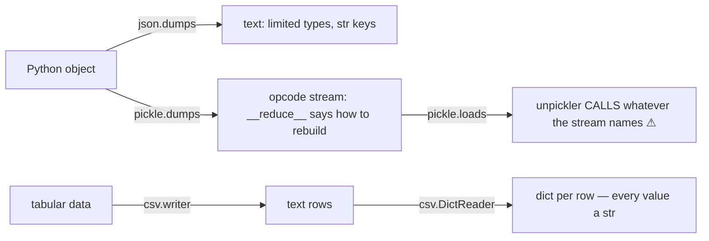

<!-- status: authored -->
# Serialization: json, pickle, csv, struct

## First principles

**Serialization** turns objects into bytes/text you can store or transmit;
**deserialization** rebuilds them. The stdlib gives you four, and choosing right
matters:

| Format | Encoding | Types | Cross-language | Safe on untrusted input? |
|---|---|---|---|---|
| **json** | text | dict, list, str, int/float, bool, None | yes | yes (data only) |
| **pickle** | binary | almost any Python object | no | **NO — runs code** |
| **csv** | text (tabular) | strings only (no inference) | yes | yes |
| **struct** | binary (fixed layout) | numbers, fixed bytes | yes (with a spec) | yes |

Sharp edges:

- **json** knows only that fixed type set. `datetime`, `set`, `Decimal`,
  `bytes`, dataclasses → `TypeError` unless you pass `default=` or convert first.
  **Object keys are always strings** — `{1: "a"}` round-trips as `{"1": "a"}`.
  Tuples become lists.
- **pickle** is a stack program. `__reduce__` can name *any callable* for the
  unpickler to invoke. `pickle.loads(untrusted_bytes)` = arbitrary code
  execution. Only for data you fully control (your own caches, IPC between your
  own processes).
- **csv** does no type inference. Every value from `csv.DictReader` is a `str`.
- **struct** packs/unpacks fixed binary records via a format string
  (`">I f 4s"` = big-endian uint, float, 4 bytes).

## The mechanism



## Practice

```bash
python code/foundations/29_serialization_stdlib/demo.py
```

```python title="code/foundations/29_serialization_stdlib/demo.py"
--8<-- "code/foundations/29_serialization_stdlib/demo.py"
```

## Scenarios

```bash
python code/foundations/29_serialization_stdlib/scenarios.py
```

### 1 — json can't serialize a `datetime`

!!! example "🔨 Build"
    `json.dumps(event, default=str)` — the `default` callback handles unknown
    types.

!!! failure "💥 Break"
    `json.dumps({"at": datetime(...)})` → `TypeError: Object of type datetime is
    not JSON serializable`.

!!! success "🔧 Fix"
    `default=`, or convert first (`dt.isoformat()`, `list(myset)`, `str(dec)`).

!!! quote "🧠 Why it behaved that way"
    JSON has a fixed type set; `datetime` isn't in it.

### 2 — JSON keys are strings

!!! example "🔨 Build"
    Serialize a list of `[key, value]` pairs to keep integer keys.

!!! failure "💥 Break"
    `json.loads(json.dumps({2020: 15}))` → `{"2020": 15}`. An int-keyed lookup
    now misses.

!!! success "🔧 Fix"
    `{int(k): v for k, v in loaded.items()}`.

!!! quote "🧠 Why it behaved that way"
    JSON objects only have string keys — the format has no other kind.

### 3 — pickle executes code on load

!!! example "🔨 Build"
    Use json (or msgpack/protobuf) for anything from outside. `json.loads` never
    calls a function.

!!! failure "💥 Break"
    `pickle.loads(hostile_bytes)` where the object's `__reduce__` names a
    callable → that callable runs **during unpickling**.

!!! success "🔧 Fix"
    Never unpickle untrusted data. Pickle is fine for your own internal caches
    and same-app IPC.

!!! quote "🧠 Why it behaved that way"
    The pickle byte stream tells the unpickler which callable to invoke to
    rebuild each object, and it complies.

### 4 — csv values are all strings

!!! example "🔨 Build"
    `sum(int(row["salary"]) for row in reader)` — convert, then compute.

!!! failure "💥 Break"
    `max(row["age"] for row in rows)` compares strings (`"9" > "63"`) and returns
    a `str`.

!!! success "🔧 Fix"
    Convert at the boundary: `int`, `float`, `datetime.fromisoformat`, or use
    pandas/Polars.

!!! quote "🧠 Why it behaved that way"
    CSV is untyped text; `DictReader` refuses to guess.

## Pitfalls & idioms

- **json** for config, APIs, logs, anything cross-language. `indent=` for
  humans, `sort_keys=True` for stable diffs, `default=` for custom types.
  `json.load(f)` / `json.dump(obj, f)` for files.
- **Never** `pickle.load`/`loads` data you didn't create. Prefer json; for
  binary efficiency use `msgpack` or protobuf. `pickle` protocol `-1` /
  `HIGHEST_PROTOCOL` for your own caches; the class must be importable by
  qualified name (no local classes).
- **csv**: `open(path, newline="", encoding="utf-8")`, always. `DictReader` /
  `DictWriter` (with explicit `fieldnames`). Values are `str` — convert.
  `csv.Sniffer` to detect the delimiter.
- **struct**: pin the byte order (`>` / `<`), never native (`@`), for portable
  files. `struct.calcsize` to check the layout.
- Other stdlib: `tomllib` (read-only TOML, [packaging topic](27-environments-and-packaging.md)),
  `configparser` (INI), `shelve` (dict-like pickle store — same trust caveat),
  `xml.etree` (XML — beware entity-expansion attacks; use `defusedxml`).
- For schema'd data with validation, look at `pydantic` /
  `dataclasses.asdict` + json.

## See also

- [Strings, bytes & Unicode](06-strings-bytes-unicode.md) — text vs bytes, encodings
- [File I/O & pathlib](28-file-io-and-pathlib.md) — reading/writing the files
- [Dates & times: aware vs naive, zoneinfo](30-dates-and-times.md) — `isoformat` round-tripping
- [Numeric types](05-numeric-types.md) — converting csv/json text to numbers
- [dataclasses & __slots__](21-dataclasses-and-slots.md) — `asdict` / `astuple` for json

## Check yourself

1. `json.dumps(my_obj)` raises `TypeError: Object of type set is not JSON
   serializable`. Two ways to fix it.
2. You store `{year: count}` as json and later `data[2021]` returns `KeyError`.
   Why, and the fix?
3. A teammate wants to `pickle.load` a `.pkl` a user uploaded. What do you tell
   them?
4. `total = sum(row["amount"] for row in csv.DictReader(f))` gives a wrong answer
   with no error. What happened?
5. Why must a `struct` format string for an on-disk file specify `>` or `<`?
