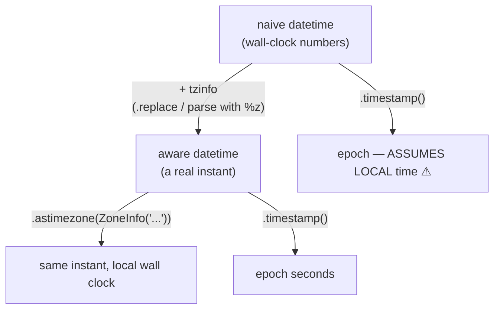

<!-- status: authored -->
# Dates & times: aware vs naive, zoneinfo

## First principles

A `datetime` is one of two kinds:

- **Naive** — no `tzinfo`. Just wall-clock numbers. It does **not** identify a
  moment in time. `datetime.now()` is naive local.
- **Aware** — has a `tzinfo`. It denotes a real instant. `datetime.now(timezone.utc)`
  is aware.

**Never mix them.** Comparing or subtracting a naive and an aware datetime raises
`TypeError`.

The professional pattern:

> Work in **aware UTC** everywhere internally. Convert to a local zone
> (`zoneinfo.ZoneInfo("Area/City")`) only at the edges — displaying to a user,
> parsing user input.

Time-zone facts that bite:

- `datetime.utcnow()` returns the UTC time but as a **naive** value (deprecated
  since 3.12). Use `datetime.now(timezone.utc)`.
- `ZoneInfo` handles DST. `zoneinfo` needs the IANA tz database — present on
  Linux/macOS, install `tzdata` on Windows / minimal images.
- `timedelta` is an **absolute duration**. Aware `dt + timedelta` does wall-clock
  field arithmetic (keeps the local time, changes the elapsed time across DST).
- Subtracting two aware datetimes that share **the same `tzinfo` object** ignores
  the offset and compares wall-clock fields — so across a DST transition you get
  the *displayed* difference, not the *real* elapsed time. Normalise to UTC
  first.
- `strptime` without `%z` (or an ISO string without an offset) → naive.

## The mechanism



## Practice

```bash
python code/foundations/30_dates_and_times/demo.py
```

```python title="code/foundations/30_dates_and_times/demo.py"
--8<-- "code/foundations/30_dates_and_times/demo.py"
```

## Scenarios

```bash
python code/foundations/30_dates_and_times/scenarios.py
```

### 1 — Subtracting naive and aware

!!! example "🔨 Build"
    Both operands aware (`tzinfo=timezone.utc`). Difference is `2.0` hours.

!!! failure "💥 Break"
    `aware - naive` → `TypeError: can't subtract offset-naive and offset-aware
    datetimes`.

!!! success "🔧 Fix"
    Attach the zone you know the naive value is in
    (`naive.replace(tzinfo=timezone.utc)`), or parse it as aware.

!!! quote "🧠 Why it behaved that way"
    A naive value has no zone, so the difference would depend on an assumption
    Python won't make.

### 2 — `utcnow()` is naive

!!! example "🔨 Build"
    `datetime.now(timezone.utc)` — aware.

!!! failure "💥 Break"
    A naive "UTC" value (what `datetime.utcnow()` returns). `.timestamp()` on it
    assumes **local** time, so on a non-UTC machine the epoch is off by the local
    offset.

!!! success "🔧 Fix"
    `datetime.now(timezone.utc)` everywhere.

!!! quote "🧠 Why it behaved that way"
    `utcnow()` gives the right numbers with the wrong (missing) `tzinfo`, and
    `.timestamp()` on a naive datetime interprets it as local.

### 3 — Subtracting two aware datetimes with one shared `tzinfo`

!!! example "🔨 Build"
    `a.astimezone(utc) - b.astimezone(utc)` → `1.0` hour (the real elapsed time).

!!! failure "💥 Break"
    `a - b` where both carry the same `ZoneInfo("America/New_York")` object,
    across spring-forward → `2.0` hours (the wall-clock difference; the skipped
    hour is ignored).

!!! success "🔧 Fix"
    Convert both to UTC before duration arithmetic.

!!! quote "🧠 Why it behaved that way"
    When both datetimes are aware **and** share the same `tzinfo` object, Python
    subtracts the wall-clock fields directly and skips the offset calculation.

### 4 — Parsing without a timezone

!!! example "🔨 Build"
    `datetime.fromisoformat("2024-06-01T12:00:00+00:00")` — offset present →
    aware.

!!! failure "💥 Break"
    `strptime("2024-06-01 12:00", "%Y-%m-%d %H:%M")` → naive. Comparing it to
    `datetime.now(utc)` raises.

!!! success "🔧 Fix"
    Include the offset in the data and parse it (`%z` / `fromisoformat`), or
    attach the known zone right after parsing.

!!! quote "🧠 Why it behaved that way"
    Without `%z`, `strptime` has no zone to attach.

## Pitfalls & idioms

- Store and compute in **aware UTC**: `datetime.now(timezone.utc)`,
  `dt.astimezone(timezone.utc)`.
- Convert to `ZoneInfo("Region/City")` only for display / parsing at the edges.
- `.isoformat()` / `datetime.fromisoformat()` for round-tripping (3.11+ accepts
  `Z` and more).
- `timedelta` = elapsed time. For "one calendar month later" / "same local time
  next day", change the fields or use `dateutil.relativedelta`.
- Normalise to UTC before subtracting aware datetimes if a DST transition could
  sit between them.
- `date` when there is no time-of-day (birthdays, report days) — no zone issues.
- DST edge cases: `fold=1` disambiguates the repeated hour in autumn; a
  nonexistent spring-forward time is "imaginary" — validate user input.
- Benchmarking: `time.monotonic()` / `time.perf_counter()`, never `datetime.now()`
  ([Profiling](37-profiling-and-dis.md)).

## See also

- [Numeric types](05-numeric-types.md) — epoch seconds are floats; precision
- [Serialization: json, pickle, csv, struct](29-serialization-stdlib.md) — `isoformat` in JSON
- [Strings, bytes & Unicode](06-strings-bytes-unicode.md) — `strftime` locale issues
- [venv, pip, pyproject.toml & wheels](27-environments-and-packaging.md) — the `tzdata` package
- [Profiling: timeit, cProfile, dis](37-profiling-and-dis.md) — monotonic clocks for timing

## Check yourself

1. `event_time < datetime.now()` raises `TypeError: can't compare offset-naive
   and offset-aware`. What are the two datetimes, and how do you reconcile them?
2. Why is `datetime.utcnow()` a footgun, and what replaces it?
3. Two log timestamps in `America/New_York`, one before and one after the March
   DST change. You subtract them and the gap is an hour too long. Why?
4. `datetime.strptime("2024-06-01 09:00", "%Y-%m-%d %H:%M")` — is the result
   aware or naive? How do you get the other one?
5. You want "the same wall-clock time exactly one week from now" for a recurring
   meeting. Is `dt + timedelta(weeks=1)` correct?
