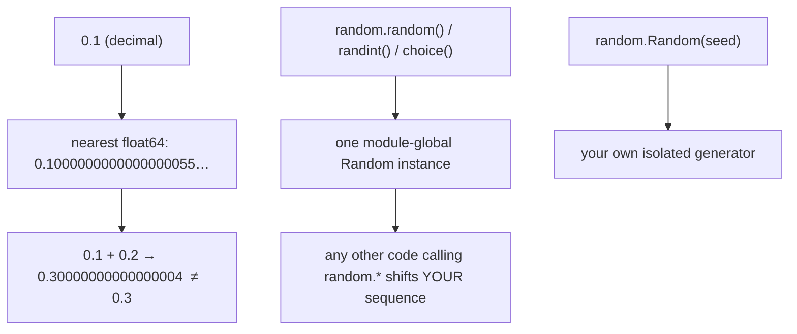

<!-- status: authored -->
# Floating point, random & reproducibility

## First principles

A `float` is an **IEEE-754 64-bit binary fraction**: a sign, an 11-bit exponent,
and a 52-bit mantissa — roughly 15–17 significant decimal digits. Two failure
modes:

- **Representation error** — most decimal fractions (`0.1`, `0.2`, `0.3`) have no
  exact binary form. `0.1 + 0.2 == 0.3` is `False`.
- **Accumulation / cancellation** — `1e16 + 1.0 == 1e16` (the `1.0` is smaller
  than the gap between representable values near `1e16`). Summing values of very
  different magnitudes loses the small ones.

`round()` uses **banker's rounding** — round half to *even*: `round(0.5) == 0`,
`round(2.5) == 2`. Reduces cumulative bias; surprises people expecting "round
half up".

`random` is a **pseudo-random generator** (Mersenne Twister). Same seed → same
sequence — that's what makes an experiment reproducible. It draws from **one
hidden module-global generator**, so anything else in the process that calls
`random.*` advances it. `random` is **not** cryptographically secure — use
`secrets` for tokens, passwords, keys.

## The mechanism



## Practice

```bash
python code/foundations/31_floating_point_and_random/demo.py
```

```python title="code/foundations/31_floating_point_and_random/demo.py"
--8<-- "code/foundations/31_floating_point_and_random/demo.py"
```

## Scenarios

```bash
python code/foundations/31_floating_point_and_random/scenarios.py
```

### 1 — Accumulated float error

!!! example "🔨 Build"
    `math.fsum([1e16, 1, -1e16, 1, 1])` → `3.0` (exact running compensation).

!!! failure "💥 Break"
    A manual `for v in vals: total += v` loop → `2.0`. `1e16 + 1.0` rounds back
    to `1e16` and a `1.0` is lost.

!!! success "🔧 Fix"
    `math.fsum`. (The built-in `sum` also compensates for floats since Python
    3.12.)

!!! quote "🧠 Why it behaved that way"
    Near `1e16`, the spacing between representable float64 values exceeds `1`, so
    a small addend disappears.

### 2 — Shared global random generator

!!! example "🔨 Build"
    `rng = random.Random(123)` — your own generator; other code can't disturb it.

!!! failure "💥 Break"
    `random.seed(123)` then any code (a library, a helper) calls `random.*`. Your
    "reproducible" sequence shifts because they consumed a draw from the shared
    generator.

!!! success "🔧 Fix"
    A dedicated `random.Random(seed)` instance; use only its methods.

!!! quote "🧠 Why it behaved that way"
    `random.randint`, `random.choice`, etc. are bound methods of one global
    `Random` instance.

### 3 — `sample` larger than the population

!!! example "🔨 Build"
    `random.choices(pool, k=10)` — sampling **with** replacement, any `k`.

!!! failure "💥 Break"
    `random.sample(pool, k=10)` with `len(pool) == 3` → `ValueError: Sample
    larger than population`.

!!! success "🔧 Fix"
    `random.choices` for repeats-allowed, or clamp `k` to `len(pool)`.

!!! quote "🧠 Why it behaved that way"
    `sample` returns **distinct** items — without replacement — so it can't
    exceed the population.

### 4 — `round()` is banker's rounding

!!! example "🔨 Build"
    `Decimal("2.5").quantize(Decimal("1"), rounding=ROUND_HALF_UP)` → `"3"`.

!!! failure "💥 Break"
    `round(0.5), round(1.5), round(2.5)` → `(0, 2, 2)`, not `(1, 2, 3)`.

!!! success "🔧 Fix"
    `Decimal(str(x)).quantize(..., rounding=ROUND_HALF_UP)`.

!!! quote "🧠 Why it behaved that way"
    Python 3 rounds halves to the nearest **even** integer.

## Pitfalls & idioms

- Compare floats with `math.isclose(a, b)`, never `==`. Especially in tests.
- Money / exact decimals: integers (cents) or `decimal.Decimal`
  ([Numeric types](05-numeric-types.md)).
- Summing many / wide-ranging floats: `math.fsum`.
- `round()` half-to-even; `Decimal.quantize` when you need a specific rounding
  mode.
- Reproducibility checklist: one seeded `random.Random` (or `np.random.Generator`)
  per component; pin dependency versions; avoid relying on set-iteration order
  across processes (string hashing is randomised — `PYTHONHASHSEED`); log the
  seed.
- `random` for simulations/sampling; `secrets` for anything an attacker
  shouldn't predict.
- `float("nan")`, `float("inf")` — `nan != nan`; detect with `math.isnan` /
  `math.isinf`.

## See also

- [Numeric types](05-numeric-types.md) — `int` / `Decimal` / `Fraction`, floor division
- [The GIL, threads & race conditions](33-gil-threads-races.md) — a `Random` instance isn't thread-safe; give threads their own
- [Testing with pytest & hypothesis](38-testing-with-pytest.md) — `pytest.approx`, seeding fixtures
- [Profiling: timeit, cProfile, dis](37-profiling-and-dis.md) — monotonic clocks

## Check yourself

1. Your test `assert compute() == 0.3` is flaky. Why, and the fix?
2. `sum([1e16, 1, 1, -1e16])` — why might a hand-written accumulation loop give a
   different answer than `math.fsum`?
3. You seed `random` at the top of your script but the output still varies run to
   run. Name two possible causes.
4. `random.sample(users, k=5)` raises `ValueError` in production. What input, and
   what should you use instead?
5. `round(2.5)` returns `2`. Bug or feature? How do you get `3`?
