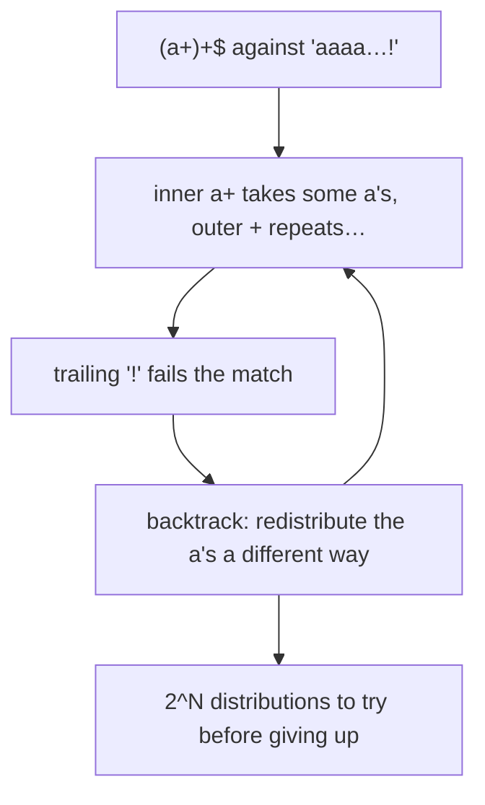

<!-- status: authored -->
# Regular expressions & catastrophic backtracking

## First principles

A regex is a pattern language compiled to a matching engine. Python's `re` uses a
**backtracking** engine: when a match fails partway, it rewinds and tries other
possibilities.

| Function | Behaviour |
|---|---|
| `re.match(p, s)` | anchored at the **start** of `s` |
| `re.search(p, s)` | first match **anywhere** in `s` |
| `re.fullmatch(p, s)` | must match the **entire** string |
| `re.findall` / `finditer` | all non-overlapping matches |
| `re.sub(p, repl, s)` | replace (repl can be a string with `\1` or a function) |
| `re.split(p, s)` | split on the pattern |

Quantifiers `*` `+` `?` `{m,n}` are **greedy** — match as much as possible, then
give back only as needed. Add `?` for **lazy** (`*?` `+?` `??`) — match as little
as possible.

**Always use raw strings** (`r"\bword\b"`). In a normal string, `\b` is the
backspace character and `\d` is an invalid escape.

**Catastrophic backtracking**: a pattern with **nested quantifiers over the same
text** — `(a+)+`, `(.*)*`, `(\d+)*` — has exponentially many ways to divide the
input between the quantifiers. On input that ultimately *fails* to match, the
engine tries them all. A 30-character string can take minutes. This is a real
denial-of-service vector ("ReDoS").

## The mechanism



## Practice

```bash
python code/foundations/32_regex/demo.py
```

```python title="code/foundations/32_regex/demo.py"
--8<-- "code/foundations/32_regex/demo.py"
```

## Scenarios

```bash
python code/foundations/32_regex/scenarios.py
```

### 1 — `re.match` anchors at the start

!!! example "🔨 Build"
    `re.search(r"\d+", "order abc123def")` → `"123"`.

!!! failure "💥 Break"
    `re.match(r"\d+", "order abc123def")` → `None`. The string doesn't *start*
    with a digit.

!!! success "🔧 Fix"
    `re.search`, or add explicit anchors when you mean them.

!!! quote "🧠 Why it behaved that way"
    `re.match` only attempts a match at position 0.

### 2 — Catastrophic backtracking

!!! example "🔨 Build"
    `a+$` — no nesting. Matches in linear time even on 1000 characters.

!!! failure "💥 Break"
    `(a+)+$` on `"aaaaaaaaaaaaaaaaaaaaaa!"` (22 `a`s, then `!`). Exponential —
    dozens to thousands of times slower than the safe pattern, and it grows with
    each extra character.

!!! success "🔧 Fix"
    Remove the nesting (`a+$`), use a more specific pattern, use possessive
    quantifiers / atomic groups (`(?>...)`, 3.11+), or a linear engine like
    `re2`.

!!! quote "🧠 Why it behaved that way"
    The engine can split N `a`s between the inner and outer `+` in ~2^N ways, and
    a failing match forces it to try them all.

### 3 — Forgetting the raw string

!!! example "🔨 Build"
    `re.findall(r"\bcat\b", text)` → `["cat"]`.

!!! failure "💥 Break"
    `re.findall("\bcat\b", text)` → `[]`. `"\b"` is the backspace character, so
    the pattern is `<BS>cat<BS>`, which never appears.

!!! success "🔧 Fix"
    `r"..."`.

!!! quote "🧠 Why it behaved that way"
    String-literal escape processing turns `\b` into `0x08` before `re` ever sees
    it.

### 4 — A greedy quantifier grabs too much

!!! example "🔨 Build"
    `r'"[^"]*"'` — the negated class can't cross a `"`. → `['"alpha"', '"beta"']`.

!!! failure "💥 Break"
    `r'".*"'` on `'"alpha" and "beta"'` → one match: `'"alpha" and "beta"'`. `.*`
    ran to the last `"`.

!!! success "🔧 Fix"
    `".*?"` (lazy) or `"[^"]*"` (negated class — also avoids backtracking).

!!! quote "🧠 Why it behaved that way"
    `.*` is greedy; it takes everything, then backtracks only enough for the
    trailing `"` to match — which is the *last* one.

## Pitfalls & idioms

- `re.compile(pattern)` once, reuse — especially in loops.
- Raw strings always; `re.VERBOSE` (`re.X`) for anything non-trivial (whitespace
  and `#` comments ignored).
- `re.search` unless you specifically want start-anchoring; `re.fullmatch` for
  validation.
- Avoid nested quantifiers over overlapping text. Prefer negated character
  classes (`[^,]+`) over `.*?`. Validate user-supplied patterns or don't accept
  them.
- Named groups `(?P<name>...)` + `.groupdict()` for readable extraction;
  `(?:...)` for grouping without capturing.
- Flags: `re.I` (ignore case), `re.M` (`^`/`$` per line), `re.S` (`.` matches
  newline).
- For fixed strings use `str` methods (`in`, `startswith`, `split`,
  `replace`) — faster and clearer. For structured formats (HTML, JSON, CSV) use a
  real parser, not regex.
- `re.escape(user_text)` before interpolating literal text into a pattern.

## See also

- [Strings, bytes & Unicode](06-strings-bytes-unicode.md) — raw strings, `str` methods
- [Iterators & the iterator protocol](10-iterators-and-the-iterator-protocol.md) — `re.finditer`
- [Profiling: timeit, cProfile, dis](37-profiling-and-dis.md) — spotting a regex hot spot
- [The GIL, threads & race conditions](33-gil-threads-races.md) — a slow regex blocks the thread (and the GIL)

## Check yourself

1. `re.match(r"[A-Z]{3}", "code ABC")` returns `None`. Why, and the fix?
2. A regex that validates usernames occasionally pins a CPU core at 100%. What
   pattern shape should you look for?
3. `re.sub("\t", " ", text)` works but `re.sub("\d", "#", text)` raises a
   warning and doesn't do what you want. Why?
4. `re.findall(r"<(.+)>", "<a><b>")` gives `['a><b']`. What did `.+` do, and how
   do you get `['a', 'b']`?
5. When should you *not* use a regex?
