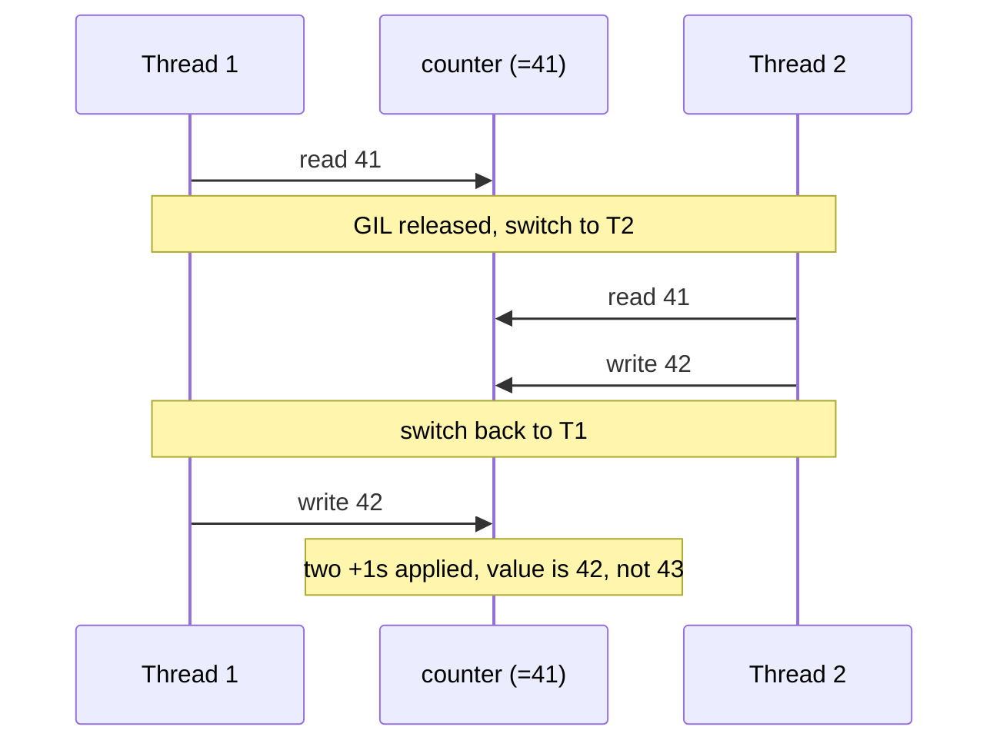

<!-- status: authored -->
# The GIL, threads & race conditions

## First principles

A **race condition** is a bug whose outcome depends on the order in which
concurrent operations happen to interleave. The classic one:

```python
counter += 1
```

This is not one step. It is: **read** `counter`, **add** 1, **write** the result
back. If two threads read `41` before either writes, both write `42`. Two
increments happened; the counter moved by one. That lost update is the race.

Now the part that trips people up. CPython has a **Global Interpreter Lock
(GIL)**: only one thread executes Python bytecode at any instant. It is tempting
to conclude "so my code is thread-safe." It is not, for two reasons:

1. The GIL protects *one bytecode instruction*, not your *line of source*.
   `counter += 1` is several bytecodes.
2. The interpreter **releases the GIL periodically** — every few milliseconds,
   and around I/O, `time.sleep`, and C-extension calls — and hands it to another
   thread. That hand-off can land between your read and your write.

So the GIL gives you: no interpreter crashes from concurrent access, and a few
operations that happen to be atomic (`list.append`, `dict.__setitem__` on
existing keys). It does **not** give you: safe read-modify-write, safe
check-then-act, or freedom from deadlocks. For those you use `threading.Lock`.

What the GIL costs you: CPU-bound Python threads do not run in parallel — they
take turns. Use [`multiprocessing`](34-multiprocessing-and-futures.md) for CPU
work; threads are for I/O-bound work, where the waiting thread releases the GIL
anyway.

## The mechanism



`dis.dis("counter += 1")` shows the four steps directly:

```text
LOAD_NAME    counter
LOAD_CONST   1
BINARY_OP    += 
STORE_NAME   counter
```

A `Lock` fixes this by forcing every thread to `acquire()` the *same* lock object
before its read-modify-write and `release()` after. Only one thread can hold it,
so the three steps run without interference.

## Practice

Pure language behaviour — no data files. The demo disassembles `+=`, then races a
counter (watch the lost count vary run to run), then does it safely:

```bash
python code/foundations/33_gil_threads_races/demo.py
```

```python title="code/foundations/33_gil_threads_races/demo.py"
--8<-- "code/foundations/33_gil_threads_races/demo.py"
```

## Scenarios

```bash
python code/foundations/33_gil_threads_races/scenarios.py
```

Each "break" widens the race window with an explicit read/write split and
`time.sleep(0)` so it reproduces every run. The bug is real at full speed too.

### 1 — Lost updates on a shared counter

!!! example "🔨 Build"
    Single-threaded, incrementing `hits` a fixed number of times gives exactly
    that number.

!!! failure "💥 Break"
    Eight threads each increment the shared `hits` `N` times with no lock. Final
    value is **less** than `8·N` — some updates vanished.

!!! success "🔧 Fix"
    Wrap the read-modify-write in `with lock:`. Final value is exact.

!!! quote "🧠 Why it behaved that way"
    Two threads load the same value, both add one, both store — one increment
    lost. The GIL serialises *bytecodes*, not your *statement*, and it is
    released between them. The lock makes the whole sequence atomic w.r.t. other
    threads.

### 2 — Check-then-act: a cache initialised twice

!!! example "🔨 Build"
    `if "key" not in cache: cache["key"] = expensive()` — single-threaded, the
    expensive init runs once.

!!! failure "💥 Break"
    Many threads run that snippet. Two of them evaluate `"key" not in cache` as
    `True` before either writes, so `expensive()` runs more than once — wasted
    work, or worse if the init has side effects.

!!! success "🔧 Fix"
    Hold one lock across **both** the check and the act. (Or use a structure
    built for it: `dict.setdefault`, `functools.lru_cache`,
    `threading.local`.)

!!! quote "🧠 Why it behaved that way"
    "Check" and "act" are two operations with a GIL-release point available
    between them. Atomicity has to span the whole invariant ("initialise exactly
    once"), not each individual statement.

### 3 — Deadlock from inconsistent lock ordering

!!! example "🔨 Build"
    Two threads that both need locks `a` and `b` acquire them in the **same
    order** (`a` then `b`). One waits for the other, then proceeds. No deadlock.

!!! failure "💥 Break"
    Thread 1 takes `a` then wants `b`; thread 2 takes `b` then wants `a`. Each
    holds one and waits forever for the other. (The demo uses `acquire(timeout=)`
    so it reports the deadlock instead of hanging CI.)

!!! success "🔧 Fix"
    Impose a global order — e.g. always acquire the lock with the lower `id()`
    first — so a wait-for cycle cannot form. Or use `contextlib.ExitStack` /
    higher-level constructs.

!!! quote "🧠 Why it behaved that way"
    Deadlock needs a cycle in the "who waits for whom" graph. Opposite
    acquisition orders create exactly that cycle. The GIL is irrelevant here:
    the threads are blocked in `lock.acquire()`, not executing bytecode.

### 4 — "It's one line, so it's atomic"

!!! example "🔨 Build"
    Many threads doing `sink.append(1)`. `len(sink)` is exactly `8·N` — CPython
    implements `list.append` as a single bytecode whose C code does not release
    the GIL mid-call.

!!! failure "💥 Break"
    Same shape, but `total = total + 1`. Same line count; final value is short.

!!! success "🔧 Fix"
    Lock the `+=`. Do not rely on which operations happen to be atomic — that
    list is an implementation detail and differs on free-threaded builds.

!!! quote "🧠 Why it behaved that way"
    Atomicity is about whether a value is read and written back across *multiple*
    interruptible instructions, not about source-line count. `append` = one
    instruction; `x = x + 1` = several.

## Pitfalls & idioms

- Threads for **I/O-bound** work; `multiprocessing` for **CPU-bound** work.
- A `Lock` protects data only if *every* accessor uses the *same* lock object.
- Prefer `queue.Queue` (thread-safe) for handing work between threads over shared
  mutable state + locks.
- `with lock:` over `lock.acquire()` / `lock.release()` — exceptions still
  release it.
- Keep critical sections tiny; never do I/O or call unknown code while holding a
  lock.
- Python 3.13+ ships an experimental **free-threaded** build with no GIL — races
  become *more* likely, not less. Correct locking is the portable answer.

## See also

- [multiprocessing & concurrent.futures](34-multiprocessing-and-futures.md) — real parallelism for CPU work
- [asyncio](35-asyncio.md) — single-threaded concurrency, a different model
- [Profiling](37-profiling-and-dis.md) — `dis` to see the bytecodes; measuring contention

## Check yourself

1. Why can `counter += 1` lose updates but `some_list.append(x)` (usually) does
   not?
2. The GIL means only one thread runs at a time. Give a concrete race that still
   occurs. Why does the GIL not prevent it?
3. You have a dict shared by threads, read often, written rarely. What is the
   minimum locking that is still correct?
4. Two locks, two threads, occasional hangs in production. What is the most
   likely cause and the standard fix?
5. When would moving from `threading` to `multiprocessing` actually make a
   CPU-bound program faster, and what new cost does it add?
