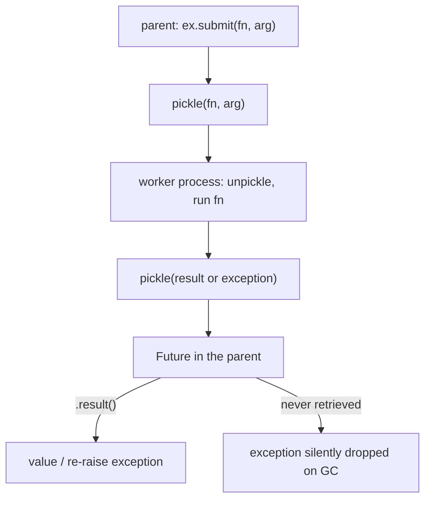

<!-- status: authored -->
# multiprocessing & concurrent.futures

## First principles

- **Threads** share memory but are serialised by the [GIL](33-gil-threads-races.md)
  for CPU-bound Python code. Great for **I/O-bound** work (a blocked thread
  releases the GIL).
- **Processes** each have their own interpreter and GIL, so they run Python
  bytecode **truly in parallel**. The right tool for **CPU-bound** work.
- The cost of processes: arguments and return values cross the boundary by
  **pickling**, startup isn't free, and there is **no shared memory** — coordinate
  via return values, `Queue`, `Pipe`, `Value`/`Array`, or a `Manager`.
- **Start methods**: `fork` (fast, copies the parent — Linux historically),
  `spawn` (fresh interpreter — macOS/Windows default, and where a `forkserver`
  isn't used). `spawn` **re-imports your module** in every worker, so
  multiprocessing code needs an `if __name__ == "__main__":` guard or it
  recursively spawns.

**`concurrent.futures`** is the high-level API:

| | For | |
|---|---|---|
| `ThreadPoolExecutor` | I/O-bound | shares memory |
| `ProcessPoolExecutor` | CPU-bound | pickles across processes |

`.submit(fn, *args)` → a `Future`. `.result()` returns the value **or re-raises
the worker's exception**. `.map(fn, iterable)` re-raises on iteration.
`as_completed(futures)` yields them as they finish.

## The mechanism



## Practice

```bash
python code/foundations/34_multiprocessing_and_futures/demo.py
```

```python title="code/foundations/34_multiprocessing_and_futures/demo.py"
--8<-- "code/foundations/34_multiprocessing_and_futures/demo.py"
```

## Scenarios

```bash
python code/foundations/34_multiprocessing_and_futures/scenarios.py
```

### 1 — Threads vs processes for CPU work

!!! example "🔨 Build"
    `ProcessPoolExecutor` over four CPU-bound tasks — runs them in parallel.

!!! failure "💥 Break"
    `ThreadPoolExecutor` for the same work. Four threads take turns under the
    GIL → wall time ≈ running them one after another.

!!! success "🔧 Fix"
    `ProcessPoolExecutor` for CPU-bound; keep `ThreadPoolExecutor` for I/O-bound.

!!! quote "🧠 Why it behaved that way"
    Only one thread executes Python bytecode at a time. Separate processes each
    have their own GIL.

### 2 — Unpicklable argument

!!! example "🔨 Build"
    A module-level function and plain data.

!!! failure "💥 Break"
    Pass a `lambda` (or a nested function, an open file, a DB connection) to
    `ProcessPoolExecutor.map` → a pickling error.

!!! success "🔧 Fix"
    Module-level functions; `functools.partial` of one; picklable data only.

!!! quote "🧠 Why it behaved that way"
    The callable and its args are pickled to reach the worker; lambdas and local
    functions aren't picklable.

### 3 — Global not shared across processes

!!! example "🔨 Build"
    Return results from `map` and combine them in the parent.

!!! failure "💥 Break"
    Workers do `global COUNTER; COUNTER += 1`. Back in the parent, `COUNTER` is
    still `0`.

!!! success "🔧 Fix"
    Return values and reduce, or use `multiprocessing.Value`/`Manager`/`Queue`
    for genuinely shared state.

!!! quote "🧠 Why it behaved that way"
    Each process has its own copy of every module global.

### 4 — Unretrieved worker exception

!!! example "🔨 Build"
    `fut.result()` — retrieving re-raises the worker's exception.

!!! failure "💥 Break"
    `ex.submit(fn)` and never touch the Future. The exception is trapped inside
    it and lost on garbage collection.

!!! success "🔧 Fix"
    Iterate `as_completed` (or use `map`) and call `.result()` on every future.

!!! quote "🧠 Why it behaved that way"
    A `Future` holds the result *or* the exception until you ask for it.

## Pitfalls & idioms

- **Decision**: I/O-bound → `ThreadPoolExecutor` (or [`asyncio`](35-asyncio.md)).
  CPU-bound → `ProcessPoolExecutor`. Mixed → processes each running async loops.
- **Always** guard multiprocessing entry points:
  `if __name__ == "__main__": main()`. Under `spawn`, top-level pool creation
  causes recursive process spawning.
- Worker functions and their arguments must be **picklable** — module-level, no
  closures, no open resources.
- No shared memory between processes. Return values, or `Queue` / `Value` /
  `Manager`.
- **Always retrieve every result** (`as_completed` + `.result()`, or `map`) so
  exceptions surface.
- `chunksize=` for `map` when you have many small tasks (reduces IPC overhead).
- Pool sizes: `os.cpu_count()` for CPU-bound; higher (tens–hundreds) for
  I/O-bound threads.
- `ProcessPoolExecutor` overhead (startup + pickling) can exceed the benefit for
  small/fast tasks — measure.
- Free-threaded builds (3.13+, experimental) change the threads-vs-processes
  calculus; correct code still works.

## See also

- [The GIL, threads & race conditions](33-gil-threads-races.md) — why threads don't parallelise CPU work
- [asyncio](35-asyncio.md) — single-threaded concurrency for I/O
- [The execution & import model](01-execution-and-import-model.md) — why `spawn` re-imports and needs the guard
- [Serialization: json, pickle, csv, struct](29-serialization-stdlib.md) — pickle, and what isn't picklable
- [Exceptions: EAFP, chaining, groups](17-exceptions.md) — `Future.result()` re-raising

## Check yourself

1. You parallelise a CPU-bound loop with `ThreadPoolExecutor` and see no
   speedup. Why, and the fix?
2. `ProcessPoolExecutor().submit(lambda x: x, 1)` raises a pickling error. What
   are two ways to make the callable work?
3. Workers append to a module-level `list`; the parent's list is empty
   afterwards. Explain and fix.
4. A batch job "succeeds" but silently skips failed items. What did the code
   forget to do with the futures?
5. Why does a multiprocessing script need `if __name__ == "__main__":` on
   Windows/macOS but often "works" without it on Linux?
