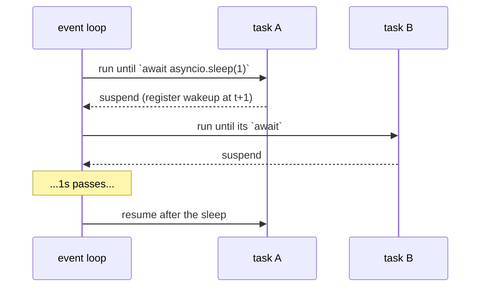

<!-- status: authored -->
# asyncio: the event loop & coroutines

## First principles

`asyncio` is **single-threaded concurrency**. One thread, one **event loop**,
running many coroutines by switching between them — but only ever at an `await`.

- `async def f(): ...` is a **coroutine function**. `f()` returns a **coroutine
  object** and runs **nothing**.
- `await x` **suspends** the current coroutine and returns control to the loop
  until `x` is ready, then resumes.
- `asyncio.run(main())` starts the loop, runs `main` to completion, stops the
  loop.
- **Concurrency comes from tasks**, not from `await` alone. `await coro` runs
  that coroutine to completion first. To overlap work you schedule tasks:
  `asyncio.gather(*coros)` or `asyncio.TaskGroup` (3.11+) with
  `tg.create_task(...)`.
- **The loop is single-threaded**: any synchronous blocking call — `time.sleep`,
  `requests.get`, a heavy CPU loop — freezes *every* coroutine. Use async
  equivalents, or `loop.run_in_executor(None, blocking_fn, ...)`.

Use `asyncio` for **lots of I/O-bound work** (thousands of sockets). For a
handful of blocking calls, `ThreadPoolExecutor`
([topic 34](34-multiprocessing-and-futures.md)) is simpler. For CPU-bound work,
processes.

## The mechanism



A blocking call inside `A` never hands control back — `B` waits the whole time.

## Practice

```bash
python code/foundations/35_asyncio/demo.py
```

```python title="code/foundations/35_asyncio/demo.py"
--8<-- "code/foundations/35_asyncio/demo.py"
```

## Scenarios

```bash
python code/foundations/35_asyncio/scenarios.py
```

### 1 — Coroutine never awaited

!!! example "🔨 Build"
    `await record()` — the body executes.

!!! failure "💥 Break"
    `record()` with no `await`. Returns a coroutine object; the body never runs;
    `RuntimeWarning: coroutine 'record' was never awaited`.

!!! success "🔧 Fix"
    `await`, or `asyncio.create_task(record())`, or pass it to `gather`.

!!! quote "🧠 Why it behaved that way"
    Calling an `async def` just constructs the coroutine. It runs only when the
    loop drives it.

### 2 — Blocking call freezes the loop

!!! example "🔨 Build"
    `await asyncio.sleep(0.1)` in each of 5 tasks → all overlap, ~0.1s total.

!!! failure "💥 Break"
    `time.sleep(0.05)` in each task. The loop can't switch, so they run back to
    back — ~0.25s.

!!! success "🔧 Fix"
    Async equivalent (`asyncio.sleep`, an async HTTP client), or
    `loop.run_in_executor(None, blocking_fn, ...)`.

!!! quote "🧠 Why it behaved that way"
    Synchronous code in a coroutine never yields to the loop.

### 3 — Awaiting one at a time

!!! example "🔨 Build"
    `asyncio.gather(coro_a, coro_b, coro_c)` — concurrent, ~0.1s.

!!! failure "💥 Break"
    `for coro in coros: await coro` — sequential, ~0.3s.

!!! success "🔧 Fix"
    `gather`, or `asyncio.TaskGroup` + `tg.create_task`.

!!! quote "🧠 Why it behaved that way"
    `await` drives its coroutine to completion before moving to the next
    statement. Tasks run at the same time; awaits don't.

### 4 — Fire-and-forget task

!!! example "🔨 Build"
    `async with asyncio.TaskGroup() as tg:` — every child is awaited and errors
    propagate.

!!! failure "💥 Break"
    `asyncio.create_task(slow())` then return. `asyncio.run` stops the loop when
    `main` returns; `slow` is cancelled, its result and exception lost.

!!! success "🔧 Fix"
    Keep a reference and `await` it, or use `TaskGroup`.

!!! quote "🧠 Why it behaved that way"
    `asyncio.run` runs the loop only until *your* coroutine returns; leftover
    tasks are cancelled. The loop keeps only weak references to tasks.

## Pitfalls & idioms

- Never call a coroutine without `await` / scheduling it.
- Never put a blocking call in a coroutine. Async library, or `run_in_executor`.
- `asyncio.TaskGroup` (3.11+) over bare `create_task` + `gather` — structured,
  cancels siblings on error, re-raises as an `ExceptionGroup`.
- `asyncio.gather(*coros)` when you want all results (add
  `return_exceptions=True` to collect failures instead of raising).
- `async with` / `async for` for async context managers and iterators.
- `asyncio.timeout(seconds)` (3.11+) / `asyncio.wait_for` to bound an await.
- One `asyncio.run` per program, at the top. Don't nest loops; don't call
  `run_until_complete` from inside a running loop.
- Don't mix: an `async def` that never `await`s anything is just a slow function.
- Debug with `PYTHONASYNCIODEBUG=1` / `asyncio.run(main(), debug=True)`.

## See also

- [Generators & yield from](11-generators-and-yield-from.md) — coroutines evolved from generators
- [The GIL, threads & race conditions](33-gil-threads-races.md) — single-threaded means no data races *within* the loop
- [multiprocessing & concurrent.futures](34-multiprocessing-and-futures.md) — `run_in_executor`, when to use threads/processes instead
- [Exceptions: EAFP, chaining, groups](17-exceptions.md) — `except*`, `ExceptionGroup` from `TaskGroup`
- [Context managers & with](18-context-managers.md) — `async with`

## Check yourself

1. `fetch_all()` prints a `RuntimeWarning` about a coroutine never being awaited
   and does nothing. What's the bug?
2. Five "concurrent" `await`ed tasks each take 100ms and the whole thing takes
   500ms. What's inside them?
3. `for url in urls: await download(url)` is slow. Rewrite it to download
   concurrently.
4. You `asyncio.create_task(background_job())` and the job never finishes. Why,
   and two fixes?
5. When is `asyncio` the wrong tool, and what would you use instead?
