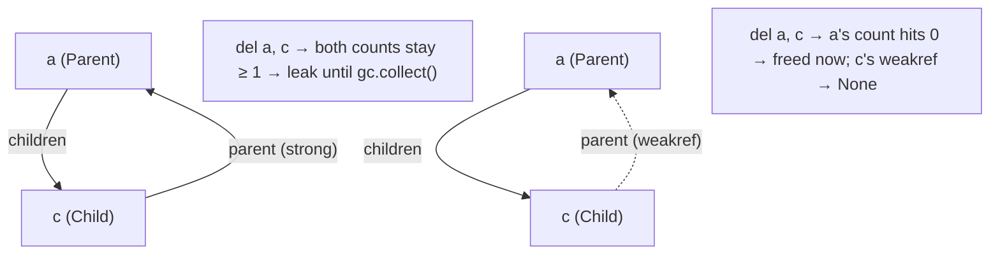

<!-- status: authored -->
# The memory model & weakref

## First principles

CPython manages memory with **two mechanisms**:

1. **Reference counting.** Every object counts how many references point at it.
   Binding a name, appending to a list, passing as an argument — each `+1`;
   rebinding, `del`, going out of scope — each `-1`. **When the count hits 0, the
   object is freed immediately.**
2. **A cyclic garbage collector** (the `gc` module). Reference counting cannot
   free a **cycle** — `a.other = b; b.other = a` keeps both counts ≥ 1 forever.
   The cyclic collector periodically scans for unreachable cycles and frees them.
   You can trigger it with `gc.collect()`.

A **`weakref`** points at an object **without incrementing its count**, so it
does not keep the object alive. When the last *strong* reference goes, the object
is freed and the weakref resolves to `None`. Uses: caches that shouldn't leak,
child→parent back-references (avoid the cycle), observer lists.
`weakref.WeakKeyDictionary` / `WeakValueDictionary` are dicts whose entries
disappear when the key/value object is collected.

`__del__` runs **when the object is collected** — which is *not* when the
variable leaves scope. In a cycle, at shutdown, or on a hard kill it may run late
or never. Don't use it for cleanup.

## The mechanism



## Practice

```bash
python code/foundations/36_memory_model_and_weakref/demo.py
```

```python title="code/foundations/36_memory_model_and_weakref/demo.py"
--8<-- "code/foundations/36_memory_model_and_weakref/demo.py"
```

## Scenarios

```bash
python code/foundations/36_memory_model_and_weakref/scenarios.py
```

### 1 — Reference cycle leaks without `gc`

!!! example "🔨 Build"
    Child→parent link is a `weakref`. No cycle → freed immediately by
    refcounting.

!!! failure "💥 Break"
    Strong back-reference. With `gc` disabled, `del parent, child` frees
    nothing — they hold each other. Only `gc.collect()` reclaims them.

!!! success "🔧 Fix"
    Make the back-reference a `weakref`.

!!! quote "🧠 Why it behaved that way"
    Refcounting can never bring a cycle's counts to 0. The cyclic collector can,
    but it runs periodically, not on `del`.

### 2 — `weakref` to an unreferenced object

!!! example "🔨 Build"
    Bind the object first, *then* take a weakref. `ref()` returns it.

!!! failure "💥 Break"
    `weakref.ref(Parent())` — the temporary has no strong reference, so it's
    freed at once and `ref()` is `None`.

!!! success "🔧 Fix"
    Keep a strong reference somewhere.

!!! quote "🧠 Why it behaved that way"
    A weakref doesn't keep anything alive; it needs a strong reference to coexist
    with.

### 3 — Object-keyed dict cache leaks

!!! example "🔨 Build"
    `weakref.WeakKeyDictionary` — entries vanish when the key object is
    collected.

!!! failure "💥 Break"
    A plain `dict` keyed by objects. The dict is a strong reference, so every key
    is pinned alive for the cache's lifetime — a leak that grows with traffic.

!!! success "🔧 Fix"
    `WeakKeyDictionary` / `WeakValueDictionary`.

!!! quote "🧠 Why it behaved that way"
    Dict keys/values are strong references.

### 4 — Relying on `__del__` for cleanup

!!! example "🔨 Build"
    Explicit `close()`, or a context manager. Deterministic.

!!! failure "💥 Break"
    Flush a buffer in `__del__`. Put the object in a cycle → `__del__` is
    deferred to the next `gc` pass; nothing is flushed when you expect.

!!! success "🔧 Fix"
    `with` / explicit `close()`. Use `__del__` only as a safety net.

!!! quote "🧠 Why it behaved that way"
    `__del__` fires on collection, and collection timing isn't tied to scope.

## Pitfalls & idioms

- You rarely manage memory manually — but you cause leaks with: long-lived
  containers/caches, object-keyed dicts, closures capturing large objects,
  reference cycles with `__del__`, and forgotten event-listener lists.
- Break parent↔child / observer cycles with `weakref`.
- Caches: `functools.lru_cache(maxsize=...)` (bounded),
  `weakref.WeakValueDictionary` (auto-evicting), or an explicit LRU. Never an
  unbounded plain dict keyed by request/session objects.
- Deterministic cleanup: context managers ([topic 18](18-context-managers.md)),
  not `__del__`.
- Diagnose: `gc.get_objects()`, `gc.get_referrers(obj)`, `objgraph`,
  `tracemalloc` (stdlib — snapshot and diff allocations).
- `__slots__` removes the per-instance `__dict__` — big memory win for millions
  of small objects ([dataclasses & __slots__](21-dataclasses-and-slots.md)).
- CPython interns small ints (−5…256) and some strings; freed memory isn't always
  returned to the OS (arenas).
- Free-threaded builds use biased/deferred reference counting — the model is the
  same, the internals differ.

## See also

- [Names, objects & references](02-names-objects-references.md) — what a reference is
- [dataclasses & __slots__](21-dataclasses-and-slots.md) — `__slots__` and memory
- [Context managers & with](18-context-managers.md) — deterministic cleanup vs `__del__`
- [functools](14-functools.md) — `lru_cache` bounds; `cache` doesn't
- [Generators & yield from](11-generators-and-yield-from.md) — streaming to keep peak memory low

## Check yourself

1. `del obj` and the memory isn't reclaimed. Give a reason and how you'd
   confirm it.
2. Why does a `parent`/`child` pair with mutual references need `gc`, and how do
   you avoid needing it?
3. `weakref.ref(build_thing())()` returns `None` immediately. What's wrong?
4. A web app's memory grows all day. It has `SESSIONS: dict = {}` keyed by user
   object. Diagnosis and fix?
5. You put a `flush()` in `__del__` and sometimes data is lost. Why, and the
   correct pattern?
