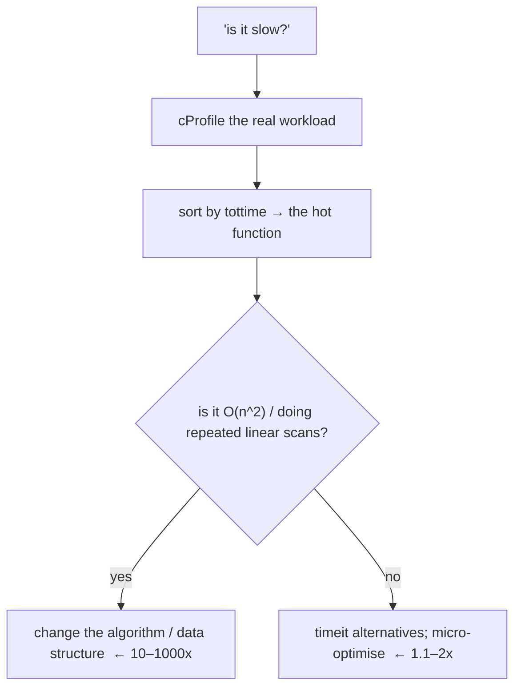

<!-- status: authored -->
# Profiling: timeit, cProfile, dis

## First principles

**Never guess about performance. Measure, then change the biggest thing.**

| Tool | Question it answers |
|---|---|
| `time.perf_counter()` around a block | how long does *this* take right now? |
| `timeit` | which of two small snippets is faster (isolated, repeated)? |
| `cProfile` + `pstats` | in a whole program, *where* does the time go? |
| `dis` | what bytecode does this compile to? |
| `tracemalloc` | where is memory being allocated? |

`timeit` details that matter:

- It runs the **statement** `number` times and the **`setup`** *once*. Put
  fixtures in `setup=`.
- The statement/setup strings run in a namespace `timeit` controls — pass
  `globals=globals()` or `setup="from mod import fn"` for your names.
- It **disables the cyclic GC** during measurement (more repeatable, but hides GC
  cost).
- `repeat` gives several totals — take the **minimum** (least disturbed).
  `Timer.autorange()` picks `number`.

`cProfile`: **`tottime`** = time *in* the function excluding sub-calls (what to
optimise); **`cumtime`** = including sub-calls (where time flows). Sort by
`tottime` to find the hot function.

**The big wins are algorithmic.** `x in list` → `x in set` inside a loop turns
O(n²) into O(n). Caching a local variable turns O(n²) into… O(n²).

## The mechanism



## Practice

```bash
python code/foundations/37_profiling_and_dis/demo.py
```

```python title="code/foundations/37_profiling_and_dis/demo.py"
--8<-- "code/foundations/37_profiling_and_dis/demo.py"
```

## Scenarios

```bash
python code/foundations/37_profiling_and_dis/scenarios.py
```

### 1 — `timeit` runs the statement N times

!!! example "🔨 Build"
    `timeit("sorted(data)", setup="data = build()")` — `build` runs once.

!!! failure "💥 Break"
    `timeit("sorted(build())")` — `build` runs on every one of the `number`
    iterations; you're timing the builder.

!!! success "🔧 Fix"
    Move fixtures into `setup=` (string or callable).

!!! quote "🧠 Why it behaved that way"
    `number` applies to the statement; `setup` runs exactly once.

### 2 — `timeit` string can't see your locals

!!! example "🔨 Build"
    `timeit("my_func(10)", globals=locals())`.

!!! failure "💥 Break"
    `timeit("my_func(10)")` where `my_func` is a local → `NameError`.

!!! success "🔧 Fix"
    `globals=locals()` / `globals=globals()`, or
    `setup="from mymodule import my_func"`.

!!! quote "🧠 Why it behaved that way"
    The snippet runs in a namespace `timeit` builds, not your function's.

### 3 — `timeit` disables the GC

!!! example "🔨 Build"
    `setup="import gc; gc.enable()"` when GC cost is part of the picture.

!!! failure "💥 Break"
    Default `timeit` — `gc.isenabled()` is `False` during the run. Allocation-
    heavy code looks faster than in production.

!!! success "🔧 Fix"
    Re-enable GC in `setup`, or time the real workload with `perf_counter`.

!!! quote "🧠 Why it behaved that way"
    `timeit` turns off the cyclic collector for repeatability.

### 4 — Micro-tweaks vs the algorithm

!!! example "🔨 Build"
    Replace the nested `for i: for j:` scan with one pass + a `set`. ~80,000
    comparisons → ~400.

!!! failure "💥 Break"
    "Optimise" by slicing and caching locals. Still ~n²/2 comparisons — the same
    order of magnitude.

!!! success "🔧 Fix"
    Change the complexity (hash set / dict / sort), then measure again.

!!! quote "🧠 Why it behaved that way"
    Constant-factor tweaks don't change growth; at scale, growth dominates.

## Pitfalls & idioms

- Profile the **real workload** with representative data. A microbenchmark of the
  wrong thing is worse than no benchmark.
- `python -m cProfile -s tottime script.py`, or `cProfile.Profile()` around a
  block; `pstats.Stats(...).sort_stats("tottime").print_stats(10)`.
- `snakeviz` / `py-spy` for flame graphs; `py-spy` can profile a *running*
  process without instrumenting it.
- `line_profiler` (`@profile`) for line-by-line; `memory_profiler` /
  `tracemalloc` for memory.
- `timeit -n N -r R "stmt"` on the command line; `%timeit` / `%%timeit` in
  IPython/Jupyter.
- `time.perf_counter()` (monotonic, high-res) for timing; never `time.time()`
  (wall clock, can jump).
- `dis.dis(fn)` and `fn.__code__.co_consts` to understand a hot loop's bytecode.
- Before optimising: is it actually slow *for the user*? Is the data size
  realistic? Is the fix an index / cache / better query, not Python at all?

## See also

- [list, tuple, dict, set: internals & complexity](07-builtin-containers-and-complexity.md) — the O(n²)→O(n) move
- [The execution & import model](01-execution-and-import-model.md) — bytecode, `-X importtime`
- [functools](14-functools.md) — `lru_cache` as an optimisation
- [Generators & yield from](11-generators-and-yield-from.md) — memory profile, not speed
- [Numeric types](05-numeric-types.md) — vectorising is an algorithm change

## Check yourself

1. `timeit("process(load_file())")` says your function is slow. What did you
   actually measure?
2. `timeit("my_helper()")` raises `NameError`. Two fixes.
3. You benchmark a function with `timeit` and it's 3× faster than in production.
   Name one reason.
4. A colleague sped up a function by "using local variables" and the endpoint is
   still slow. What should they have profiled and changed?
5. `tottime` vs `cumtime` in `cProfile` — which do you sort by to find the
   function to optimise?
