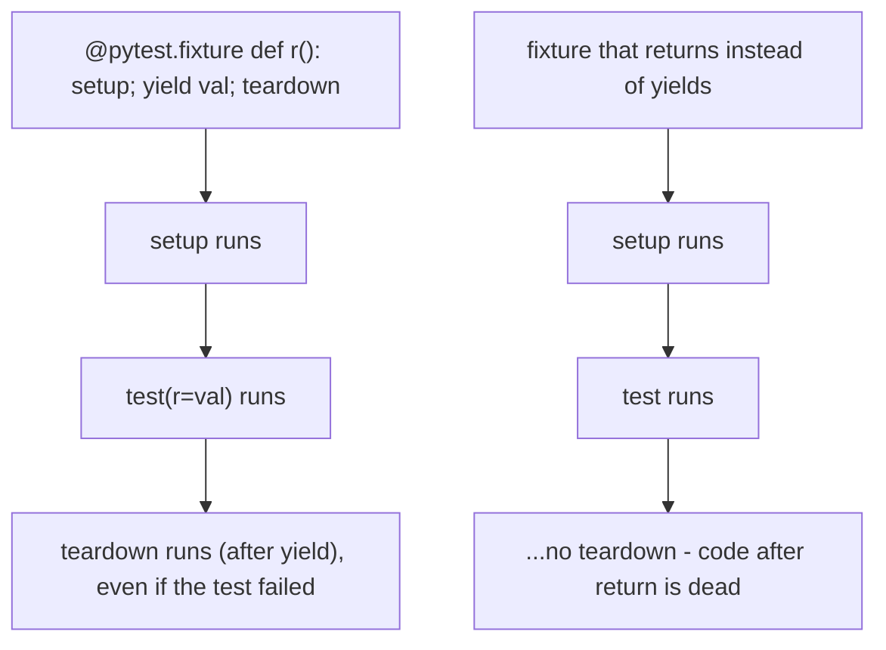

<!-- status: authored -->
# Testing with pytest & hypothesis

## First principles

A test states an **observable fact** about your code and `assert`s it. pytest
rewrites `assert` so a failure shows both sides — no `assertEqual` needed.

- **Discovery**: files `test_*.py`, functions `test_*`. Structure each test as
  **Arrange → Act → Assert**.
- **Fixtures** (`@pytest.fixture`) provide inputs and clean up. A fixture that
  **`yield`s** hands the value to the test, then **resumes after the `yield`** to
  run teardown — pass or fail. Request a fixture by naming it as a parameter
  (dependency injection). Scopes: `function` (default), `class`, `module`,
  `session`.
- `@pytest.mark.parametrize("a,expected", [...])` runs one body over many inputs.
- `with pytest.raises(ValueError, match="regex"):` asserts an exception.
- `pytest.approx(x)` for floats. `tmp_path`, `monkeypatch`, `capsys` are
  built-in fixtures.
- **Tests must be independent** — any order, in isolation. Shared mutable state
  is the #1 source of flaky suites.

**Hypothesis** is *property-based* testing: `@given(st.text())` generates many
inputs and checks a **property** that must always hold (round-trips,
idempotence, invariants), then **shrinks** any failure to a minimal example.

## The mechanism



## Practice

```bash
python code/foundations/38_testing_with_pytest/demo.py
```

```python title="code/foundations/38_testing_with_pytest/demo.py"
--8<-- "code/foundations/38_testing_with_pytest/demo.py"
```

## Scenarios

```bash
python code/foundations/38_testing_with_pytest/scenarios.py
```

### 1 — Shared state between tests

!!! example "🔨 Build"
    A fixture returns a fresh `{}` per test.

!!! failure "💥 Break"
    `STORE = {}` at module level. `test_a` writes to it; `test_b` assumes it's
    empty — passes alone, fails in the suite.

!!! success "🔧 Fix"
    Per-test state via a fixture, `tmp_path`, `monkeypatch`, or explicit
    setup/teardown.

!!! quote "🧠 Why it behaved that way"
    Tests share the module namespace. Order-dependent tests are broken tests.

### 2 — Comparing floats with `==`

!!! example "🔨 Build"
    `assert result == pytest.approx(0.3)`.

!!! failure "💥 Break"
    `assert 0.1 + 0.2 == 0.3` → fails (`0.30000000000000004`).

!!! success "🔧 Fix"
    `pytest.approx` (tolerance-based).

!!! quote "🧠 Why it behaved that way"
    Float arithmetic rarely equals a decimal literal exactly
    ([Floating point](31-floating-point-and-random.md)).

### 3 — Fixture teardown without `yield`

!!! example "🔨 Build"
    `setup; yield value; teardown`. Cleanup runs after every test.

!!! failure "💥 Break"
    `setup; return value; teardown`. The teardown line is unreachable; resources
    leak between tests.

!!! success "🔧 Fix"
    `yield` instead of `return` whenever there's cleanup.

!!! quote "🧠 Why it behaved that way"
    `return` ends the fixture function. `yield` suspends it so pytest can resume
    it for teardown.

### 4 — A test with no assertion

!!! example "🔨 Build"
    `assert add(2, 3) == 5` — checks the result.

!!! failure "💥 Break"
    `add(2, 3)` with no `assert`. The test is **green** even though `add` is
    buggy — it only proved "didn't raise".

!!! success "🔧 Fix"
    Every test asserts at least one observable outcome.

!!! quote "🧠 Why it behaved that way"
    pytest passes a test that returns without raising.

## Pitfalls & idioms

- One logical assertion per test where practical; a clear name that states the
  fact.
- Fixtures for setup/teardown and shared inputs; `yield` for cleanup; pick the
  narrowest scope that's correct.
- `parametrize` instead of loops or copy-paste.
- `pytest.raises(SpecificError, match="...")` — never `pytest.raises(Exception)`.
- `pytest.approx` for floats; `tmp_path` for files; `monkeypatch` for env
  vars/attributes; `capsys` for stdout.
- Don't test private implementation details (exact internal calls, private
  attributes) — test the contract, so refactors don't break the suite.
- Isolate from the outside world: no real network/DB/clock in unit tests — inject
  or fake them.
- `pytest -x` (stop on first failure), `-k expr` (filter), `--lf` (last failed),
  `-q`, `-ra` (show skip/xfail reasons).
- `conftest.py` for shared fixtures; `pytest.ini` / `pyproject.toml` for config.
- Coverage (`pytest-cov`) shows untested lines — a floor, not a goal.
- Property tests (`hypothesis`) for parsers, encoders, data structures,
  invariants.

## See also

- [Exceptions: EAFP, chaining, groups](17-exceptions.md) — `pytest.raises`
- [Floating point, random & reproducibility](31-floating-point-and-random.md) — `approx`, seeding
- [Context managers & with](18-context-managers.md) — `yield` fixtures are `@contextmanager`-shaped
- [Functions: args/kwargs, closures, nonlocal](12-functions-args-closures.md) — fixture injection by name
- [venv, pip, pyproject.toml & wheels](27-environments-and-packaging.md) — dev dependencies

## Check yourself

1. `test_b` passes on its own but fails when you run the whole file. Most likely
   cause?
2. `assert compute() == 0.75` is flaky. Fix it.
3. Your fixture opens a DB connection but it's never closed between tests. What's
   wrong with the fixture?
4. A test calls the function under test but has no `assert`. What does it
   actually verify?
5. When is a Hypothesis property test more valuable than a handful of
   `parametrize` cases?
