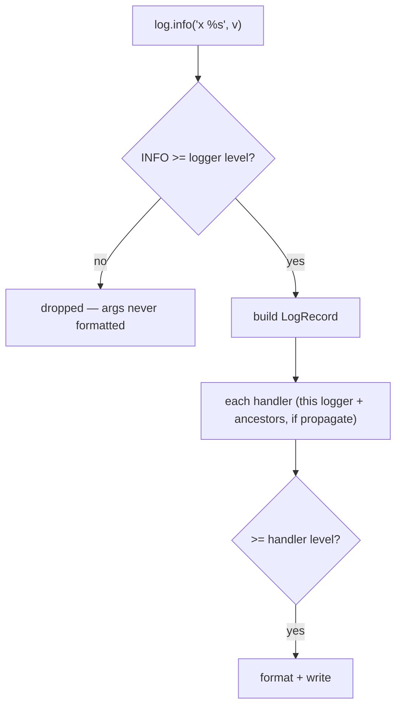

<!-- status: authored -->
# Logging

## First principles

`logging` routes **leveled** diagnostic messages to configurable destinations.

Levels: `DEBUG < INFO < WARNING < ERROR < CRITICAL`. A record is emitted only if
its level ≥ the logger's threshold **and** ≥ the handler's.

Three roles:

- **Logger** — *who* is speaking. Name it by module: `log =
  logging.getLogger(__name__)`. Loggers form a hierarchy on the dotted name;
  records **propagate up** to ancestor loggers and the root.
- **Handler** — *where* it goes: `StreamHandler` (stderr), `FileHandler`,
  `RotatingFileHandler`, `SysLogHandler`, …
- **Formatter** — *how* it looks: `"%(asctime)s %(name)s %(levelname)s
  %(message)s"`.

Key rules:

- **Configure once, at startup.** `logging.basicConfig()` is a **no-op if the
  root already has a handler** — and the first `logging.warning()` call installs
  one. Use `force=True` to override.
- **Pass values as args, not f-strings**: `log.info("user %s did %s", uid,
  action)`. The `%`-formatting (and `str()` of the args) is **skipped** when the
  level is disabled.
- In an `except` block: `log.exception("failed")` (or `exc_info=True`) to record
  the **traceback**.
- **Libraries** just do `logging.getLogger(__name__)` and add **no handler** —
  the application decides where logs go.
- `print` is for program *output*; `logging` is for *diagnostics*.

## The mechanism



## Practice

```bash
python code/foundations/39_logging/demo.py
```

```python title="code/foundations/39_logging/demo.py"
--8<-- "code/foundations/39_logging/demo.py"
```

## Scenarios

```bash
python code/foundations/39_logging/scenarios.py
```

### 1 — `basicConfig` after logging started

!!! example "🔨 Build"
    `basicConfig(level=DEBUG, force=True)` first thing at startup.

!!! failure "💥 Break"
    Something logs a warning (auto-installs a handler), *then* you call
    `basicConfig(level=DEBUG)` — it does nothing; DEBUG stays hidden.

!!! success "🔧 Fix"
    Configure before any logging, or `force=True`.

!!! quote "🧠 Why it behaved that way"
    `basicConfig` is a no-op when the root already has handlers.

### 2 — f-string in a log call

!!! example "🔨 Build"
    `log.debug("value = %s", obj)` — `obj.__str__()` isn't called when DEBUG is
    off.

!!! failure "💥 Break"
    `log.debug(f"value = {obj}")` — the f-string (and `obj.__str__`) runs *now*,
    for a message that's immediately discarded.

!!! success "🔧 Fix"
    Pass args; guard truly expensive work with `if log.isEnabledFor(DEBUG):`.

!!! quote "🧠 Why it behaved that way"
    The f-string is built before `debug()` is even called. `%s` args are
    formatted lazily, inside `logging`, after the level check.

### 3 — Exception without a traceback

!!! example "🔨 Build"
    `log.exception("lookup failed")` in the `except` block.

!!! failure "💥 Break"
    `log.error("lookup failed: %s", exc)` — you get the message, not the stack.

!!! success "🔧 Fix"
    `log.exception(...)` or `log.error(..., exc_info=True)`.

!!! quote "🧠 Why it behaved that way"
    Only `exc_info` attaches the traceback to the record.

### 4 — Duplicate lines from re-adding handlers

!!! example "🔨 Build"
    Configure handlers once (or `if not logger.handlers:`).

!!! failure "💥 Break"
    A function calls `logger.addHandler(...)` every time it runs. N calls → N
    handlers → each message printed N times.

!!! success "🔧 Fix"
    Handler setup once at app init; modules add none.

!!! quote "🧠 Why it behaved that way"
    `addHandler` appends; every handler emits every record.

## Pitfalls & idioms

- `logging.getLogger(__name__)` at module top; never configure handlers in a
  library.
- App entry point: `logging.basicConfig(level=..., format=...)` **once**, or
  `logging.config.dictConfig(...)` for anything real.
- `log.info("%s", value)` — args, not f-strings; `%`-style placeholders.
- `log.exception(...)` inside `except`.
- Don't log secrets/PII. Redact.
- Don't `log.error` *and* re-raise the same exception at every level — log once,
  where you handle it.
- Rotating files (`RotatingFileHandler` / `TimedRotatingFileHandler`) or ship to
  a collector; don't let logs fill the disk.
- Production: **structured (JSON) logs** — `python-json-logger`, `structlog`, or a
  custom formatter — so they're queryable.
- `logging.captureWarnings(True)` routes `warnings` through logging.
- `propagate = False` on a logger you've given its own handler, to avoid
  double-emitting via the root.

## See also

- [Exceptions: EAFP, chaining, groups](17-exceptions.md) — `log.exception`, `exc_info`
- [The execution & import model](01-execution-and-import-model.md) — configure at startup, `__name__`
- [Modules, packages & circular imports](26-modules-packages-imports.md) — the logger hierarchy mirrors the package tree
- [Testing with pytest & hypothesis](38-testing-with-pytest.md) — `caplog` fixture
- [Profiling: timeit, cProfile, dis](37-profiling-and-dis.md) — logging overhead in hot paths

## Check yourself

1. You add `logging.basicConfig(level=logging.DEBUG)` but DEBUG lines still don't
   appear. Why, and two fixes?
2. `log.debug(f"payload={build_payload()}")` shows up in a CPU profile even
   though DEBUG is off in production. Explain and fix.
3. Your error log says "save failed" but not where. What one-line change fixes
   that?
4. Every log line appears three times. What did some code call three times?
5. Why should a library module never call `basicConfig` or `addHandler`?
