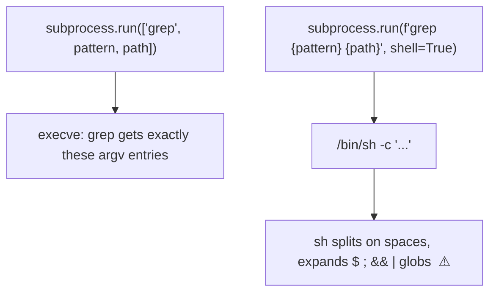

<!-- status: authored -->
# stdlib toolkit: argparse, enum, subprocess

Three tools you reach for constantly, and one sharp edge each.

## First principles

**`argparse`** — declare a command-line interface, then `parse_args()` turns
`sys.argv` into an object.

```python
p = argparse.ArgumentParser()
p.add_argument("path")                          # positional
p.add_argument("--limit", type=int, default=10) # optional, TYPED
p.add_argument("--format", choices=["csv", "json"])
p.add_argument("--verbose", action="store_true")
args = p.parse_args()
```

Everything from the command line is a **string** unless you give `type=`.
Subcommands via `add_subparsers()`.

**`enum`** — a fixed set of named constants. Members are **singletons** — compare
with `is`. `class Color(Enum): RED = "red"` — `Color.RED` is *not* equal to
`"red"`. Variants: `IntEnum` / `StrEnum` (members *are* ints/strings),
`Flag` (combinable bit options: `Perm.READ | Perm.WRITE`), `auto()` for values
you don't care about.

**`subprocess`** — run external programs. `subprocess.run([...], capture_output=True,
text=True, check=True)`.

- **Pass a list of arguments, never a shell string with interpolated input.**
  `shell=True` hands your string to `/bin/sh`, which interprets `;`, `&&`, `$()`,
  globs — command injection.
- `run` **does not raise on non-zero exit** by default. `check=True` →
  `CalledProcessError`.

## The mechanism



## Practice

```bash
python code/foundations/40_stdlib_toolkit/demo.py
```

```python title="code/foundations/40_stdlib_toolkit/demo.py"
--8<-- "code/foundations/40_stdlib_toolkit/demo.py"
```

## Scenarios

```bash
python code/foundations/40_stdlib_toolkit/scenarios.py
```

### 1 — `shell=True` command injection

!!! example "🔨 Build"
    `subprocess.run([prog, arg1, arg2])` — each element is a literal argument.

!!! failure "💥 Break"
    `subprocess.run(f"echo processing {name}", shell=True)` where `name`
    contains `; rm -rf ...` → the injected command runs.

!!! success "🔧 Fix"
    List of args, no `shell=True`.

!!! quote "🧠 Why it behaved that way"
    `shell=True` runs the string through `/bin/sh`, which parses shell
    metacharacters.

### 2 — `subprocess.run` without `check=True`

!!! example "🔨 Build"
    `check=True` — a failing command raises `CalledProcessError`.

!!! failure "💥 Break"
    Without it, `run` returns normally on exit code 1; the caller proceeds with
    empty output.

!!! success "🔧 Fix"
    `check=True`, or inspect `result.returncode`.

!!! quote "🧠 Why it behaved that way"
    `run` reports the exit status; it doesn't act on it.

### 3 — Enum member ≠ its value

!!! example "🔨 Build"
    Compare members (`role is Role.ADMIN`), or use `StrEnum` so `role == "admin"`
    works.

!!! failure "💥 Break"
    `role == "admin"` where `role = Role.ADMIN` (plain `Enum`) → `False`. A
    stringly-typed check silently fails.

!!! success "🔧 Fix"
    `is` on members, `role.value` for the raw value, or `StrEnum` / `IntEnum`.

!!! quote "🧠 Why it behaved that way"
    A plain `Enum` member is its own object, not its value.

### 4 — argparse values are strings

!!! example "🔨 Build"
    `add_argument("--count", type=int)`. `args.count * 2 == 10`.

!!! failure "💥 Break"
    No `type=`. `args.count` is `"5"`, `"5" * 2` is `"55"`.

!!! success "🔧 Fix"
    `type=int` (and a same-typed `default=`).

!!! quote "🧠 Why it behaved that way"
    argparse hands you the raw string; `type=` is the conversion hook.

## Pitfalls & idioms

- **argparse**: `type=` for every non-string arg; `choices=` for enums of values;
  `action="store_true"` for flags; `required=True` for mandatory options;
  subparsers for `git`-style commands. `argparse` is fine; `click` / `typer` are
  nicer for bigger CLIs.
- **enum**: `is` for member comparison; iterate the class; `Color["RED"]` (by
  name), `Color("red")` (by value); `@enum.unique` to forbid aliases;
  `Flag`/`IntFlag` for permission bits; `StrEnum`/`IntEnum` when the member must
  behave as its value (JSON, DB, argparse `choices`).
- **subprocess**: list args, no `shell=True` on anything with external input;
  `check=True`; `text=True` for `str` I/O; `timeout=` to avoid hangs;
  `capture_output=True` (or `stdout=PIPE`); `cwd=` / `env=` as needed. `shlex.split`
  if you truly must parse a command string. Prefer stdlib (`shutil`, `pathlib`,
  `os`) over shelling out.

## See also

- [Serialization: json, pickle, csv, struct](29-serialization-stdlib.md) — csv values are strings too
- [The execution & import model](01-execution-and-import-model.md) — `if __name__ == "__main__"` for CLIs
- [Type hints, typing & mypy](23-type-hints-and-typing.md) — `Literal` vs `Enum`
- [File I/O & pathlib](28-file-io-and-pathlib.md) — `type=Path` in argparse

## Check yourself

1. `subprocess.run(f"convert {infile} {outfile}", shell=True)` — what's the
   vulnerability and the fix?
2. Your deploy script calls a command that fails, but the script reports success.
   What flag is missing?
3. `if status == "active":` never matches even though `status` is
   `Status.ACTIVE`. Why, and two fixes?
4. `args.port + 1` raises `TypeError: can only concatenate str`. What did the
   argparse definition forget?
5. When would you use `IntEnum` / `StrEnum` instead of a plain `Enum`?
