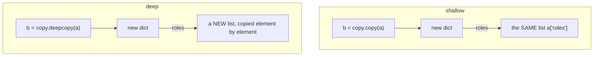

<!-- status: authored -->
# copy: shallow vs deep

## First principles

Building on [Names, objects & references](02-names-objects-references.md):

| Operation | Outer object | Nested objects |
|---|---|---|
| `b = a` | **same** | same |
| **shallow copy** — `copy.copy(a)`, `a.copy()`, `a[:]`, `list(a)`, `dict(a)`, `{**a}` | **new** | **same** (shared) |
| **deep copy** — `copy.deepcopy(a)` | **new** | **new, recursively** |

A shallow copy gives you a fresh container whose elements are still the *same
objects*. Mutating a nested object through the copy mutates it through the
original too.

`copy.deepcopy` recursively copies everything it reaches. It:

- **handles cycles** — a `memo` dict tracks "already copied";
- **preserves internal sharing** — two references to one object *within* the
  copied structure become two references to *one* copy;
- but a **separate `deepcopy` call** starts with a fresh memo, so an object
  referenced from two independently-copied structures gets duplicated;
- **recurses into un-copyable things** — open files, sockets, locks, DB
  connections — and raises.

## The mechanism



## Practice

```bash
python code/foundations/41_copy_shallow_vs_deep/demo.py
```

```python title="code/foundations/41_copy_shallow_vs_deep/demo.py"
--8<-- "code/foundations/41_copy_shallow_vs_deep/demo.py"
```

## Scenarios

```bash
python code/foundations/41_copy_shallow_vs_deep/scenarios.py
```

### 1 — Shallow copy of a nested dict

!!! example "🔨 Build"
    `copy.deepcopy(base)` — the derived config's nested `roles` / `limits` are
    independent.

!!! failure "💥 Break"
    `base.copy()`. `derived["roles"].append(...)` and
    `derived["limits"]["rate"] = ...` both mutate `base`.

!!! success "🔧 Fix"
    `copy.deepcopy` (or build each config fresh; don't share).

!!! quote "🧠 Why it behaved that way"
    A shallow copy shares every nested object.

### 2 — deepcopy of an un-copyable resource

!!! example "🔨 Build"
    `__deepcopy__(self, memo)` copies the data, **shares** the stream.

!!! failure "💥 Break"
    `copy.deepcopy(obj)` where `obj` holds an open file → `TypeError: cannot
    pickle '_io.TextIOWrapper'`.

!!! success "🔧 Fix"
    Custom `__deepcopy__`, or keep files/locks/connections out of copied objects.

!!! quote "🧠 Why it behaved that way"
    `deepcopy` recurses into every attribute, including ones that can't be
    duplicated.

### 3 — deepcopy's `memo` is per-call

!!! example "🔨 Build"
    Deep-copy the whole graph in **one** call — two nodes sharing one config
    still share one (new) config in the clone.

!!! failure "💥 Break"
    Deep-copy `node_a` and `node_b` separately. Their shared config is now **two**
    independent configs.

!!! success "🔧 Fix"
    One `deepcopy` over the whole structure.

!!! quote "🧠 Why it behaved that way"
    The `memo` that preserves aliasing lives for one call only.

### 4 — `copy.copy` shares object attributes

!!! example "🔨 Build"
    `copy.deepcopy(cart)` — `items` / `totals` are independent.

!!! failure "💥 Break"
    `copy.copy(cart)`. `b.items` **is** `a.items`; `__init__` isn't called.

!!! success "🔧 Fix"
    `copy.deepcopy`, or implement `__copy__` to duplicate the mutable attrs.

!!! quote "🧠 Why it behaved that way"
    `copy.copy` on a plain object shallow-copies its `__dict__`.

## Pitfalls & idioms

- Returning or storing a caller's mutable object? Take a **defensive copy** —
  shallow if only the top level matters, deep if nested state does.
- `deepcopy` is **expensive** (recursion + memo). Don't reach for it reflexively:
  prefer immutable data (`tuple`, `frozenset`, `@dataclass(frozen=True)`,
  `NamedTuple`), rebuild fresh, or copy just the layer you mutate.
- `deepcopy` on objects with files/locks/connections → `__deepcopy__`, or exclude
  those attributes.
- Cycles: `deepcopy` is fine; a hand-rolled recursive copy is not.
- `copy.copy(immutable)` may return the original — that's correct, immutables
  can't be mutated.
- `list[:]` / `dict(d)` / `set(s)` are the idiomatic shallow copies; reach for
  `copy.copy` mainly for custom objects.
- `pickle.loads(pickle.dumps(x))` deep-copies too (with pickle's restrictions and
  trust caveats — [Serialization](29-serialization-stdlib.md)).

## See also

- [Names, objects & references](02-names-objects-references.md) — assignment vs copy
- [Mutability & the mutable-default trap](03-mutability-and-the-default-arg-trap.md) — why copies are needed
- [dataclasses & __slots__](21-dataclasses-and-slots.md) — `dataclasses.replace`, frozen dataclasses
- [The data model & dunder methods](04-the-data-model-and-dunders.md) — `__copy__` / `__deepcopy__`
- [The memory model & weakref](36-memory-model-and-weakref.md) — deepcopy and cycles

## Check yourself

1. `new = old.copy(); new["tags"].append("x")` — is `old["tags"]` changed?
2. `copy.deepcopy(session)` raises `TypeError: cannot pickle 'socket'`. Two ways
   to handle it.
3. You `deepcopy` two objects that both reference one shared `Settings`. After,
   changing one's settings doesn't affect the other. Why, and how to keep them
   linked?
4. `b = copy.copy(a)` where `a` is your custom class; `b.cache` and `a.cache` are
   the same list. Why, and the fix?
5. When is `deepcopy` the wrong tool even though it would "work"?
