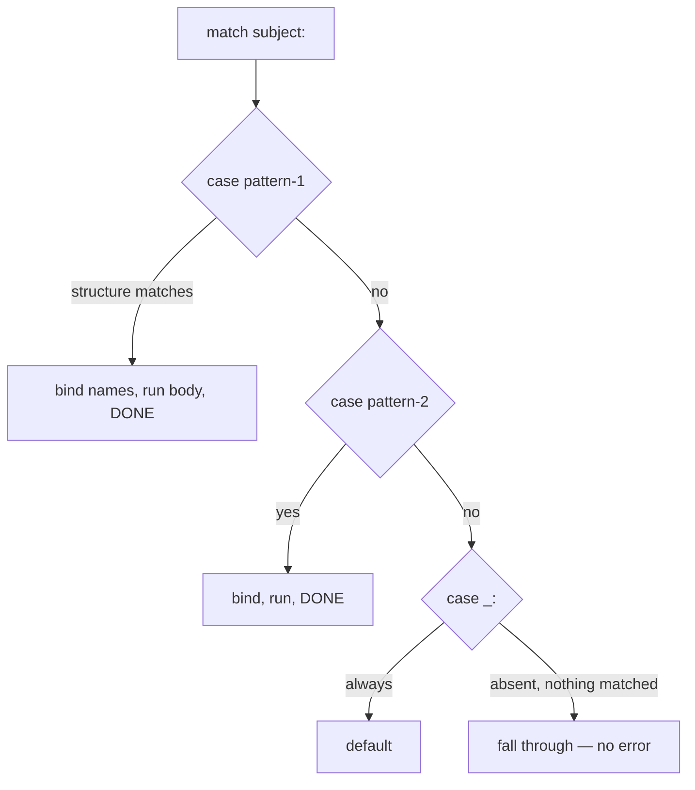

<!-- status: authored -->
# The match statement: structural pattern matching

## First principles

`match` (Python 3.10+) is **not a switch**. A switch compares a value to
constants; `match` **destructures** a value against *patterns* and **binds names
from the pieces**.

```python
match command:
    case ["go", direction]:        # a 2-element sequence; bind the 2nd element
        move(direction)
    case ["drop", *items]:         # "drop" then any number of items
        drop(items)
    case {"action": a, **rest}:    # a mapping with an "action" key
        dispatch(a, rest)
    case Point(x=0, y=y):          # a Point whose x is 0; bind y
        on_axis(y)
    case 1 | 2 | 3:                # or-pattern
        small()
    case n if n > 100:            # guard
        big(n)
    case _:                       # wildcard: matches anything, binds nothing
        default()
```

Pattern kinds: **literal** (`200`, `"GET"` — compared with `==`), **capture**
(`x` — matches anything, binds `x`), **wildcard** (`_`), **sequence** (`[a, b]`,
`[h, *t]` — **not** `str`/`bytes`), **mapping** (`{"k": v}` — extra keys ignored),
**class** (`Point(x=0)`), **or** (`|`), **guard** (`if`), **as** (`p as pair`).

Two rules that trip everyone up:

1. **A bare name is a *capture*, not a comparison.** `case OK:` does **not** mean
   "if value == OK". It matches anything and binds `OK`. To match a value, use a
   **literal** or a **dotted name** (`case Status.OK:`, `case Color.RED:`).
2. **An irrefutable pattern must be last.** A capture or `_` always matches, so
   any `case` after it is unreachable — `SyntaxError` at compile time.

## The mechanism



No fall-through between cases; first match wins; if nothing matches and there's no
`_`, the `match` does nothing.

## Practice

```bash
python code/foundations/42_match_statement/demo.py
```

```python title="code/foundations/42_match_statement/demo.py"
--8<-- "code/foundations/42_match_statement/demo.py"
```

## Scenarios

```bash
python code/foundations/42_match_statement/scenarios.py
```

### 1 — A bare name is a capture

!!! example "🔨 Build"
    `case 200:` (literal) or `case Status.OK.value:` (dotted) to compare.

!!! failure "💥 Break"
    `case OK:` where `OK = 200`. Every subject matches; `OK` is rebound to it.

!!! success "🔧 Fix"
    Literal, dotted name, or a guard (`case c if c == OK:`).

!!! quote "🧠 Why it behaved that way"
    A bare identifier in a `case` is a capture pattern — always matches, binds
    the name.

### 2 — Irrefutable pattern not last

!!! example "🔨 Build"
    Specific cases first, `case other:` / `case _:` last.

!!! failure "💥 Break"
    `case other:` then `case 0:` → `SyntaxError: name capture 'other' makes
    remaining patterns unreachable`.

!!! success "🔧 Fix"
    Reorder — catch-all goes last.

!!! quote "🧠 Why it behaved that way"
    A capture / wildcard always matches, so later cases are dead code; the
    compiler rejects it.

### 3 — Sequence pattern vs a string

!!! example "🔨 Build"
    `match line.split(): case [action, target]:` — match a list of tokens.

!!! failure "💥 Break"
    `match line: case [action, target]:` where `line` is `"move north"` — a
    `str`. It never matches; control falls to `_`.

!!! success "🔧 Fix"
    Split/parse into a real list first.

!!! quote "🧠 Why it behaved that way"
    `str`/`bytes`/`bytearray` are deliberately excluded from sequence patterns —
    otherwise `case [a, b]:` would match the 2-char string `"hi"`.

### 4 — Positional class pattern needs `__match_args__`

!!! example "🔨 Build"
    `@dataclass class Pt: x: int; y: int` — dataclass sets `__match_args__`.
    `case Pt(0, y):` works.

!!! failure "💥 Break"
    A plain class + `case Point(0, 0):` → `TypeError: Point() accepts 0
    positional sub-patterns`.

!!! success "🔧 Fix"
    `@dataclass` / `NamedTuple`, or keyword sub-patterns: `case Point(x=0, y=0)`.

!!! quote "🧠 Why it behaved that way"
    Positional class patterns need the class to declare which attributes the
    positions map to.

## Pitfalls & idioms

- Bare name = capture. Use literals / dotted names to match values.
- Catch-all (`case _:` / `case x:`) always last.
- Sequence patterns don't match strings — `split()` / `parse()` first.
- `case Point(x=0, y=0)` (keyword) is always safe; positional needs
  `__match_args__` (dataclasses, NamedTuples have it).
- Mapping patterns match *any* mapping and *ignore extra keys*; `**rest` captures
  the remainder. `{}` matches every mapping.
- `case [Point(), Point()] as pair:` — `as` binds the whole matched value.
- `match` shines for: parsing (ASTs, tokens, commands), dispatching on tagged
  dicts / JSON, walking recursive structures. For "one value vs a few constants",
  a plain `if`/`elif` or a dict lookup is clearer.
- It's a statement, not an expression — no value; assign inside the cases.

## See also

- [Exceptions: EAFP, chaining, groups](17-exceptions.md) — the other control-flow construct
- [dataclasses & __slots__](21-dataclasses-and-slots.md) — `__match_args__` for free
- [The collections module](08-the-collections-module.md) — `NamedTuple` also supports positional patterns
- [Scope & namespaces (LEGB)](16-scope-legb.md) — capture patterns bind in the current scope
- [Idioms & anti-patterns](43-idioms-and-anti-patterns.md)

## Check yourself

1. `case HTTP_OK:` (where `HTTP_OK = 200`) matches *every* status code. Why, and
   two fixes?
2. `case _: ... case 404: ...` won't compile. What's the rule?
3. `match user_input: case [cmd, *args]:` never matches even for `"run now"`.
   Why?
4. `case Response(200, body):` raises `TypeError`. What does `Response` need, and
   what's the always-safe alternative?
5. When is `match` overkill compared to `if`/`elif` or a dict of handlers?
