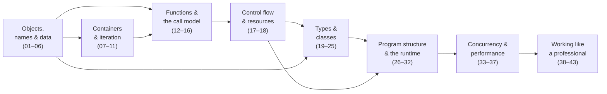

<!-- status: authored -->
# Foundations

The pure-Python core — the part every domain (backend, data engineering, data
science, ML/AI) relies on. Work through it in order; each topic assumes the ones
above it.

No third-party packages: every Foundations demo runs on the standard library
alone. `pip install -e ".[test]"` gets you the test runner and nothing more.

Answers to every "Check yourself" question:
[Check yourself: answers](../appendix/check-yourself-answers.md).

## The path

### Objects, names & data
1. [The execution & import model](01-execution-and-import-model.md)
2. [Names, objects & references](02-names-objects-references.md)
3. [Mutability & the mutable-default trap](03-mutability-and-the-default-arg-trap.md)
4. [The data model & dunder methods](04-the-data-model-and-dunders.md)
5. [Numeric types: int, float, Decimal, Fraction](05-numeric-types.md)
6. [Strings, bytes & Unicode](06-strings-bytes-unicode.md)

### Containers & iteration
7. [list, tuple, dict, set: internals & complexity](07-builtin-containers-and-complexity.md)
8. [The collections module](08-the-collections-module.md)
9. [Comprehensions & generator expressions](09-comprehensions.md)
10. [Iterators & the iterator protocol](10-iterators-and-the-iterator-protocol.md)
11. [Generators & yield from](11-generators-and-yield-from.md)

### Functions & the call model
12. [Functions: args/kwargs, closures, nonlocal](12-functions-args-closures.md)
13. [Decorators](13-decorators.md)
14. [functools](14-functools.md)
15. [itertools](15-itertools.md)
16. [Scope & namespaces (LEGB)](16-scope-legb.md)

### Control flow & resources
17. [Exceptions: EAFP, chaining, groups](17-exceptions.md)
18. [Context managers & with](18-context-managers.md)

### Types & classes
19. [Classes & OOP from first principles](19-classes-and-oop.md)
20. [Inheritance, MRO & super()](20-inheritance-and-mro.md)
21. [dataclasses & __slots__](21-dataclasses-and-slots.md)
22. [ABCs, Protocols & duck typing](22-abcs-protocols-duck-typing.md)
23. [Type hints, typing & mypy](23-type-hints-and-typing.md)
24. [Descriptors](24-descriptors.md)
25. [Metaclasses & __init_subclass__](25-metaclasses.md)

### Program structure & the runtime
26. [Modules, packages & circular imports](26-modules-packages-imports.md)
27. [venv, pip, pyproject.toml & wheels](27-environments-and-packaging.md)
28. [File I/O & pathlib](28-file-io-and-pathlib.md)
29. [Serialization: json, pickle, csv, struct](29-serialization-stdlib.md)
30. [Dates & times: aware vs naive, zoneinfo](30-dates-and-times.md)
31. [Floating point, random & reproducibility](31-floating-point-and-random.md)
32. [Regular expressions & catastrophic backtracking](32-regex.md)

### Concurrency & performance
33. [The GIL, threads & race conditions](33-gil-threads-races.md)
34. [multiprocessing & concurrent.futures](34-multiprocessing-and-futures.md)
35. [asyncio: the event loop & coroutines](35-asyncio.md)
36. [The memory model & weakref](36-memory-model-and-weakref.md)
37. [Profiling: timeit, cProfile, dis](37-profiling-and-dis.md)

### Working like a professional
38. [Testing with pytest & hypothesis](38-testing-with-pytest.md)
39. [Logging](39-logging.md)
40. [stdlib toolkit: argparse, enum, subprocess](40-stdlib-toolkit.md)
41. [copy: shallow vs deep](41-copy-shallow-vs-deep.md)
42. [The match statement: structural pattern matching](42-match-statement.md)
43. [Idioms & anti-patterns](43-idioms-and-anti-patterns.md)

## When you are done

You should be able to pick up an unfamiliar Python file and predict what it does,
where it will be slow, and how it will fail — whether that file is a web service,
an ETL job, a data-science notebook, or a model training loop. That is the point
of this track: it is the part of Python that every one of those has in common.
